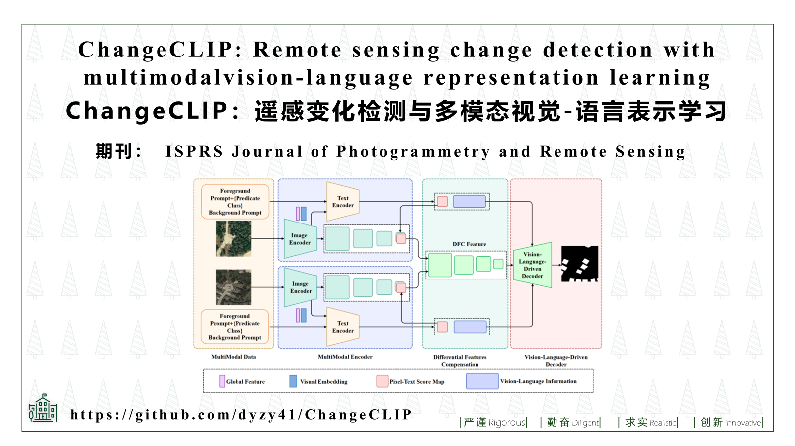
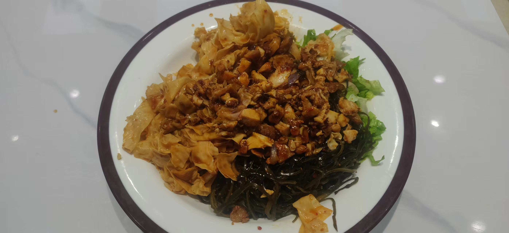
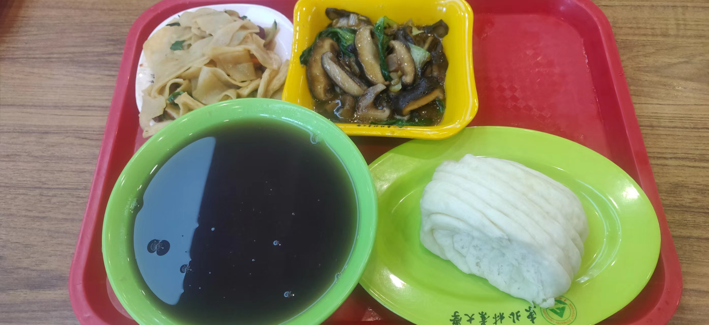
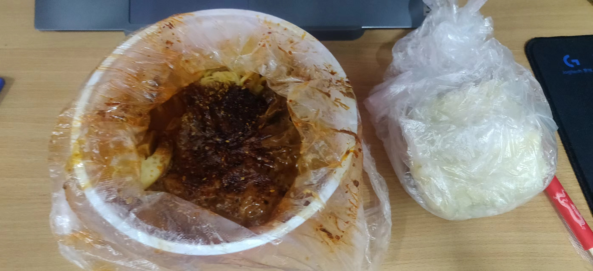
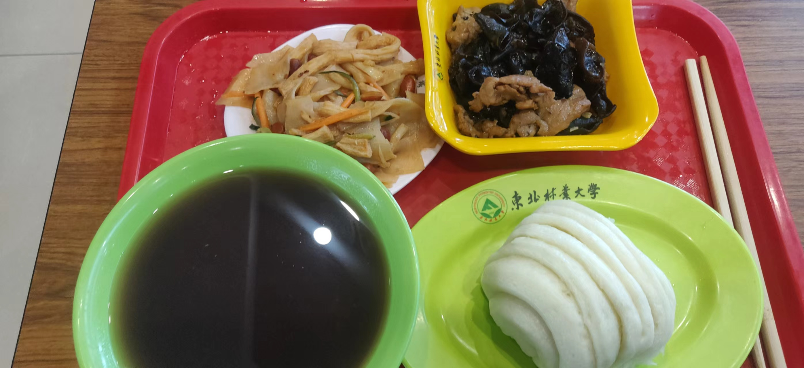
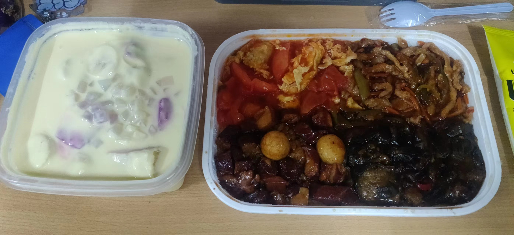
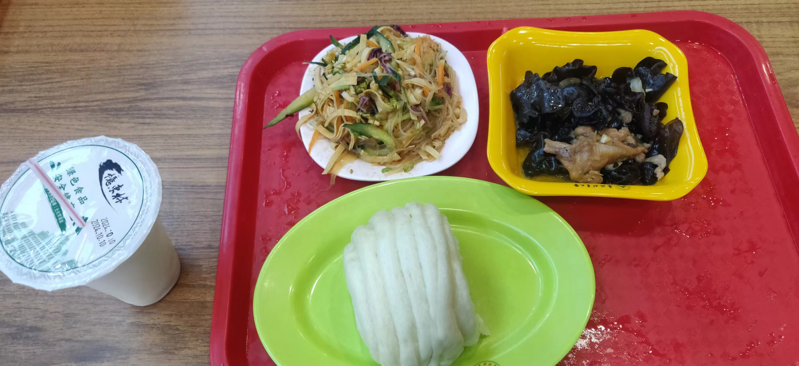
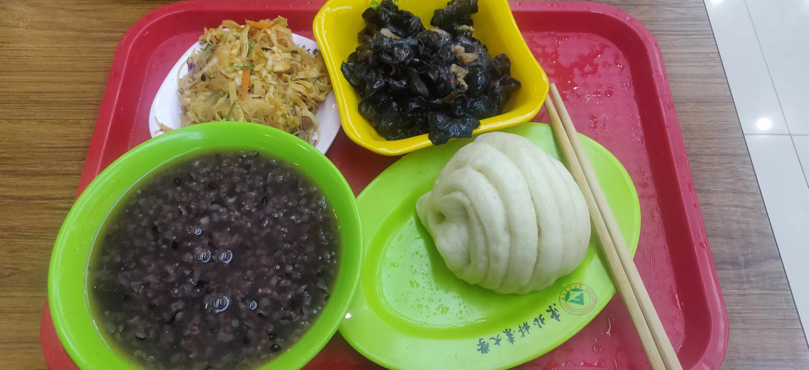
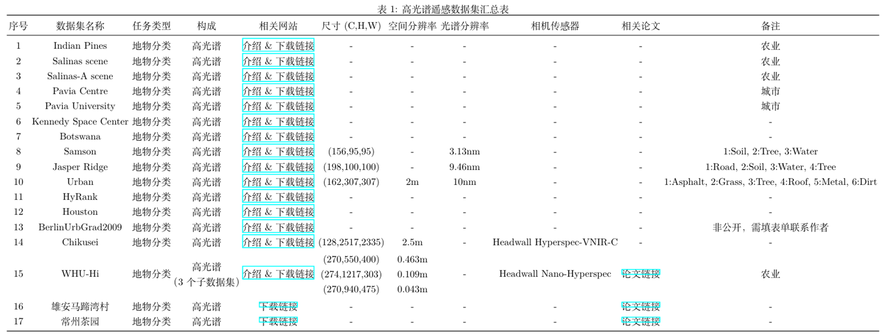
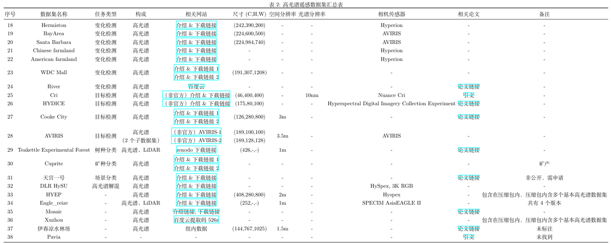

# 10 月 7 日——10 月 8 日

## 漫漫猪

今天早上八点起床，比之前八点二十卡点进步了一点点，由于这二十分钟的提前量导致头脑清醒了很多，所以才能打了卡直接去实验室学习 🥳🥳🥳（之前卡点起床的后果就是打了卡载回宿舍补觉，直接荒废一上午 😥）。
上午补了假期之前看的一篇论文的笔记，发现时间间隔太久了好多内容记不起来，以后尽量及时记笔记 💪。除此之外把之前看过的论文笔记整理了一下（还剩 一篇 😝）
午饭是吕氏疙瘩汤，本来想从他们家小程序用会员卡选外卖结果离我最近的一家门店一直没有开门（但是在美团点外卖那家门店是开着的 😡😡😡），大骗汁！！！
下午第一节课没去上，我坏！第二节课去上了但是没听，我坏坏！话说已经好几年上课不听了，全靠考试周自学，我坏坏坏！抓紧改正（严肃脸），不然小年痴呆了 😭
晚上开始看一篇新论文了，然后发现又忘了 LSTM 那些门是干嘛的了，明天好好看看写个笔记，还有 swimtransformer（不知道打对没）。
晚上回来还运动了一会儿，好久不练，生疏了，但是一个好的开始，下次打算换个跟练视频（阳台太小，施展不开）。
今天表现有好有坏，人无完人，继续努力。

## 筷筷兔

### 10.7

- 工作时间：9:30~17:30 (8h)

假期结束噜，返工第一天，一到实验室就开始看论文，做 PPT，老板十点半来的，约了午饭之后讲，使劲看使劲做，紧赶慢赶，在他们吃饭回来的时候刚好做完，加个结尾页发给老师，附上论文，抓起草稿纸就去办公室讲。

他俩都在，开始讲的时候蛮顺利，讲到复杂的地方开始有点紧张，心跳加速，手脚冰凉。但在探讨了几个技术细节之后就慢慢不紧张了，顺利讲到最后。
之后开始讨论研究方向，多模态遥感，语言+多光谱，但是数据集应该比较难找，这时候公众号科研开始发力了，导在我讲的时候就从公众号上找到了个很贴合的论文并转发给了我（我是讲完回实验室才看到的）
他俩讨论的面红脖子粗的，我瑟瑟发抖。回来之后看到导发的公众号，找到对应论文开始翻数据，饿的不行困得不行，迷迷糊糊跟我妈打了个电话，她的 VISA 卡也不能充 ChatGPT。
打完电话就去吃饭了，回来又折腾一会数据，发现这篇论文的数据可以下载，看了一眼是一条条带，四百多的光谱，比较符合预期。到五点多就快乐的下班啦！晚饭是小零食。

### 10.8

- 工作时间：9:30~18:00 (8.5h)

一大早就被叫去安排新活，国重点 PPT，难整，巨多，DDL 是周天，开摆！
接着看昨天的数据论文，找数据，我在互联网上寻寻觅觅寻宝藏，寻到好多乱七八糟的论文，列了表格，但还没整理完，等明天整理完 show 出来。
今天干饭干饭，找数据找数据，翻了好多文章，把浏览器都弄得乱七八糟的了。清理了浏览器数据，把密码都删没了，改天要把 D 盘的乱七八糟的东西整理整理了，快没空间了。
今天没有学术成果那就看看饭吧$\Downarrow$，吃的真不赖！

# 10 月 9 日——10 月 10 日

## 漫漫猪

### 10.9

今天早上按时到了实验室把昨天没看懂的 LSTM 和 swintransformer（没完全懂，打算看看原文）中午吃了鸡公煲，香拽了但是像小作坊的东西，还好没有拉肚子，话说我好几天没拉肚子了，还是筷筷兔把我养的好呀！想他！中午打了卡又上床睡觉了，还好没有一蹶不振，三点到达实验室，又碰见大黄和小黄了，下次给他俩录个视频 😊。下午把 swinlstm 的笔记写了，晚上在实验室一边刷网课一边记账，怒记了两个月的账而且平了！还发现了随手记的筛选功能，好用！bty，比看论文有意思多了！晚上筷筷兔把我早上提的护肤品找到了，感动 😭，因为我已经忘了但是他还记在心上 😭。晚安，喵！

### 10.10

早八 😴，换老师了，没提问 👍。下课回宿舍记账刷课，打电话给小陈姐姐问他为啥不开门，他说回去收秋了，一个月才能回来 😭，选了一家中式减脂餐，味道还行，但是饭冷了。晚上吃了食堂的番茄肥牛盖饭，好吃爱吃 😋😋 下午晚上又看了 patchTST（patch 没看懂，明天继续看），把 Corrformer 的代码跑起来了。哦对，又补了一个月的账，爽啦。

## 筷筷兔

### 10.9

- 工作时间：12:30~17:30 (5h)

早上睡懒觉，上午上了傻逼的英语课，重返高中了属于是。
又是不想做 PPT 的一天，忙忙碌碌找数据的一天。下午找到一篇很顶的文章《HyperSIGMA: Hyperspectral Intelligence Comprehension Foundation Model》从里面找到好多数据集。发现找大牛的实验室网站也蛮好用的。
晚上去上了政治课，记了不到一个月的帐，回宿舍也记了一会，总共记了差不多一个月吧，还只是微信 :)
晚饭捞了一个，宝没吃，骗我，她坏。
今日没产出，开心的炫饭吧！

<figure class="figure">
    
    <figcaption>
        捞爽啦！
        
    </figcaption>
</figure>

### 10.10

- 工作时间：10:30~20:30 (10h)

下雨啦，呼呼呼，依旧不去早八。
上午又在忙忙碌碌寻宝藏（找数据）。
中午吃完饭一点多收到通知，说老板下午来看 PPT，我还一页都没做！开始使劲做，先把简单的框架上的东西整上去，一顿做到四五点，大体上能看了。老板来看了看说了说，提了点修改意见，不大好改，能啥样就啥样吧。
晚上炫完饭一直在做 PPT，然后就发钱啦，听说是发了 2500，还行吧，反正对不起我的精神损失。
今天是炫饭的一天！（每天都是！）

# 10 月 11 日——10 月 12 日

## 漫漫猪

### 10.11

上午把上课的时候把前两天的日记写了，上课之前老师让我给他看看鼠标为啥连不上，后来发现鼠标是蓝牙的需要把按钮调到蓝牙模式才行，新技能get！中午还是吕氏疙瘩汤，尝了他们的新菜菌菇，有点咸，味道一般。下午在实验楼门口又碰到大黄和小黄啦，大黄还是不让我摸小黄，好想知道为什么。下午看了写了patchtst的笔记。晚上师兄过来说要给我上点压力

### 10.12

看了swintf的原文，又把微信剩下的帐记完了，我真伟大！中午收到了宝给的护手霜，这个男人现在也会准备小惊喜了，奶香奶香的，谢谢筷筷兔

## 筷筷兔

### 10.11

- 工作时间：9:30~21:30 (12h)

做了一天PPT，赶在晚上九点前做完了，总算是有点产出了，虽然不是学术的，但学术相关的产出也快了。

### 10.12

- 工作时间：10:00~18:30 (8.5h)

找了一天数据，东拼西凑记在表格里的也有37个数据集了，找到了好多数据集的网站，但整体乱糟糟的，没整理，得再梳理整理一下。

# 10 月 14 日——10 月 15 日

## 漫漫猪

### 10.14

即使我已经忘了今天是公历生日，筷筷兔还是替我守岁了🥺。晚上睡的很早，新的一岁好好爱自己。上午随机算法想好好听来着，但是由于之前没上课根本听不懂😭。中午尝了新的外卖茄汁面，酸酸甜甜很好吃，下午在离迟到五秒钟的时候极限打卡，刺激！到了实验室看师兄分享的predrnn，还是来自熟悉的课题组，看不懂一直在摸鱼，晚上坐那认真看了挺长时间，在GPT的帮助下基本看完了。还和筷筷兔讨论了端对端和预训练，筷筷兔啥都懂🥰。哦对，今天还发钱了，说明新的一岁财源滚滚呀😋

### 10.15

上午接着看论文，把论文里rss机制搞懂了然后开始记笔记。中午同门帮我带了美食节的糯米鱼，甜甜的好吃😋。下午又去实验室写了会笔记就去上课啦，还是听不懂😅，翻了翻账本发现九月花了三千块钱😅吓拥了。本来晚上想洗澡剪头的，突然发现要去当助教😅，随便扒拉两口就去实验室了，然后就去看本科生了，想起大一晚自习学长答疑的时候觉得他们好厉害，转眼自己也当上助教了😧。

## 筷筷兔

### 10.14

- 工作时间：9:00~20:30 (11.5h)

来的最早的一次，PPT还有几页要改一下，有点小麻烦。
该把数据集整理整理了，打算汇总成一篇博文。
晚上有个老师在腾讯会议讲多模态大模型，会议是18:30~20:00，又要晚下班了。

ppt做完咯，数据没整理，开会竟然还要发言，电脑没麦，用手机多端入会发言的，好尴尬。
那老师讲的确实蛮好的，但让我发言我说没麦确实有点尴尬。

### 10.15

- 工作时间：9:30~22:30 (13h)
- 工作计划
  - [x] 整理数据
  - [ ] 完善ChangeCLIP PPT
  - [ ] 英语作业
    - 介绍菜系
    - 描述特色菜
    - 背单词

手机烧屏了，把数据整理完了

晚上改组会的PPT改到很晚，结果推迟到周五了，6
