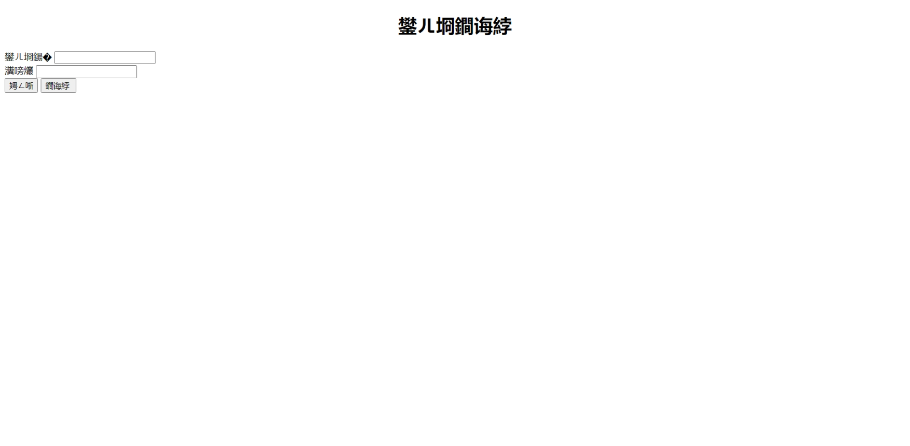
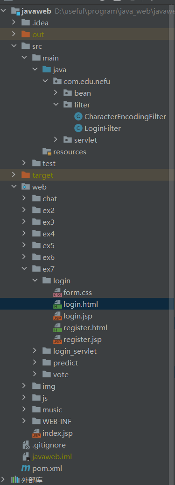

# 问题描述

某一页面乱码

项目目录结构


字符编码过滤器 CharacterEncodingFilter.java

```java
package com.edu.nefu.filter;

import javax.servlet.*;
import javax.servlet.annotation.WebFilter;
import java.io.IOException;

@WebFilter(filterName = "CharacterEncodingFilter")
public class CharacterEncodingFilter implements Filter {

    FilterConfig cofigF = null;
    private String encoding;
    private boolean forceEncoding;

    public void init(FilterConfig config) throws ServletException {
        this.cofigF = config;
        encoding = config.getInitParameter("encoding");
        forceEncoding = Boolean.parseBoolean(config.getInitParameter("forceEncoding"));
    }

    public void destroy() {
        cofigF = null;
        encoding = null;
    }

    @Override
    public void doFilter(ServletRequest request, ServletResponse response, FilterChain chain) throws ServletException, IOException {
//        response.setCharacterEncoding("utf-8");
//        request.setCharacterEncoding("utf-8");
//        response.setContentType("text/html;charset=utf-8");
        if (this.encoding != null && (this.forceEncoding || request.getCharacterEncoding() == null)) {
            request.setCharacterEncoding(this.encoding);
            if (this.forceEncoding) {
                response.setCharacterEncoding(this.encoding);
            }
        }
        chain.doFilter(request, response);
    }
}
```

乱码文件 login.html

```html
<!DOCTYPE html>
<html lang="en">
<head>
    <meta charset="UTF-8">
    <title>登录</title>
    <link rel="stylesheet" href="form.css"/>
    <script src="../../js/jquery-3.6.1.js"></script>
    <script>
        function check() {
            let formData = $(".information");
            let submit = true;
            formData.each(function (idx, ele) {
                if (ele.value === "") {
                    ele.focus();
                    alert("不可为空");
                    submit = false;
                    return false;
                }
            });
            return submit;
        }
    </script>
</head>
<body>
<h1 style="text-align: center">用户登录</h1>
<div class="box">
    <form action="login.jsp" method="post" onsubmit="return check();">
        <div class="item">
            <label class="label" for="un">用户名</label>
            <input class="information" type="text" name="un" id="un">
        </div>
        <div class="item">
            <label class="label" for="pw">密码</label>
            <input class="information" type="password" name="pw" id="pw">
        </div>
        <div class="item div-button">
            <input type="button" id="button-register" onclick="location.href='register.html'" value="注册">
            <input type="submit" id="button-login" value="登录 ">
        </div>
    </form>
</div>
</body>
</html>
```

web.xml

```xml
<?xml version="1.0" encoding="UTF-8"?>
<web-app xmlns="http://xmlns.jcp.org/xml/ns/javaee"
         xmlns:xsi="http://www.w3.org/2001/XMLSchema-instance"
         xsi:schemaLocation="http://xmlns.jcp.org/xml/ns/javaee http://xmlns.jcp.org/xml/ns/javaee/web-app_4_0.xsd"
         version="4.0">

<!--    &lt;!&ndash;登录 Servlet&ndash;&gt;-->
<!--    <servlet>-->
<!--        <servlet-name>LoginServlet</servlet-name>-->
<!--        <servlet-class>com.edu.nefu.servlet.LoginServlet</servlet-class>-->
<!--    </servlet>-->
<!--    <servlet-mapping>-->
<!--        <servlet-name>LoginServlet</servlet-name>-->
<!--        <url-pattern>/LoginServlet</url-pattern>-->
<!--    </servlet-mapping>-->

<!--    &lt;!&ndash;注册 Servlet&ndash;&gt;-->
<!--    <servlet>-->
<!--        <servlet-name>RegisterServlet</servlet-name>-->
<!--        <servlet-class>com.edu.nefu.servlet.RegisterServlet</servlet-class>-->
<!--    </servlet>-->
<!--    <servlet-mapping>-->
<!--        <servlet-name>RegisterServlet</servlet-name>-->
<!--        <url-pattern>/RegisterServlet</url-pattern>-->
<!--    </servlet-mapping>-->

<!--    &lt;!&ndash;登录 filter&ndash;&gt;-->
<!--    <filter>-->
<!--        <filter-name>LoginFilter</filter-name>-->
<!--        <filter-class>com.edu.nefu.filter.LoginFilter</filter-class>-->
<!--    </filter>-->
<!--    <filter-mapping>-->
<!--        <filter-name>LoginFilter</filter-name>-->
<!--        <url-pattern>/LoginServlet</url-pattern>-->
<!--    </filter-mapping>-->

    <!--编码 filter-->
    <filter>
        <filter-name>characterEncodingFilter</filter-name>
        <filter-class>com.edu.nefu.filter.CharacterEncodingFilter</filter-class>
        <init-param>
            <param-name>encoding</param-name>
            <param-value>UTF-8</param-value>
        </init-param>
        <init-param>
            <param-name>forceEncoding</param-name>
            <param-value>true</param-value>
        </init-param>
    </filter>
    <filter-mapping>
        <filter-name>characterEncodingFilter</filter-name>
        <url-pattern>/*</url-pattern>
    </filter-mapping>

</web-app>
```
