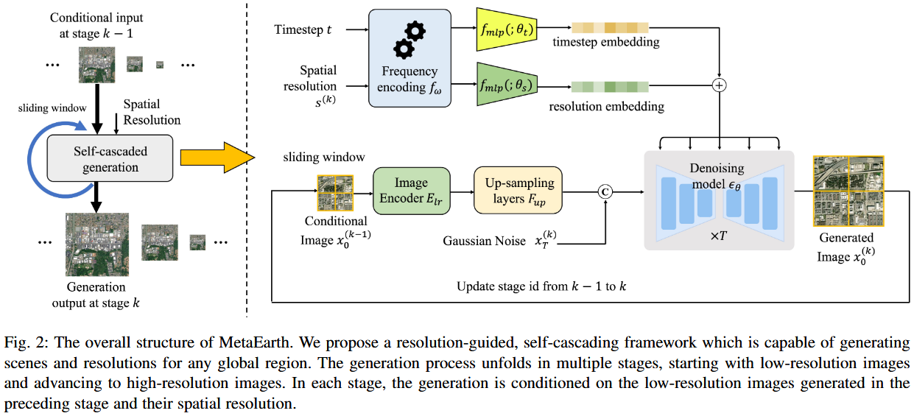
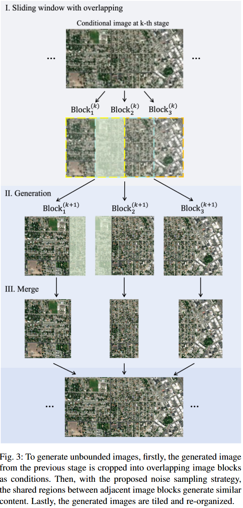
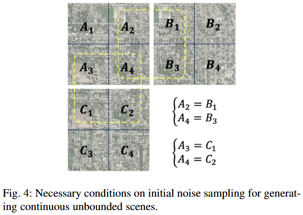
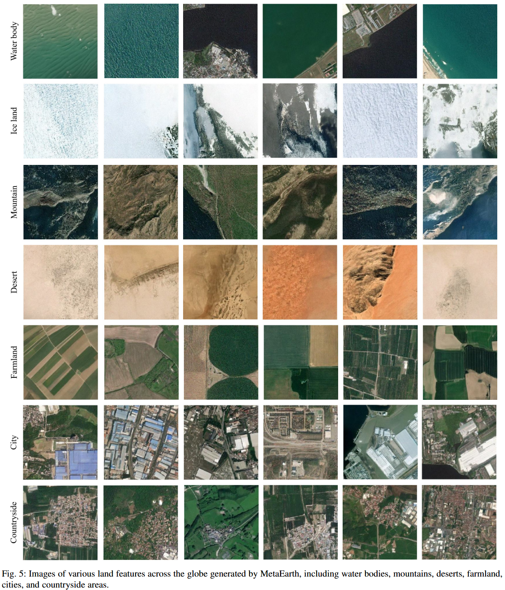
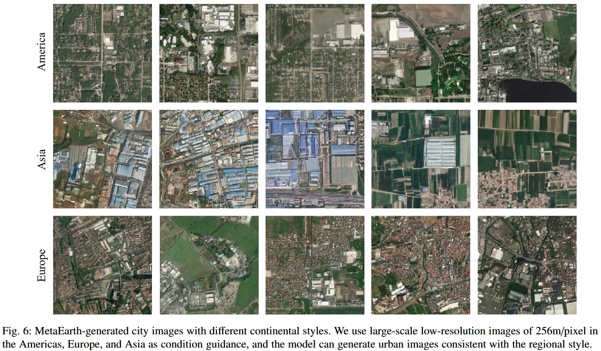
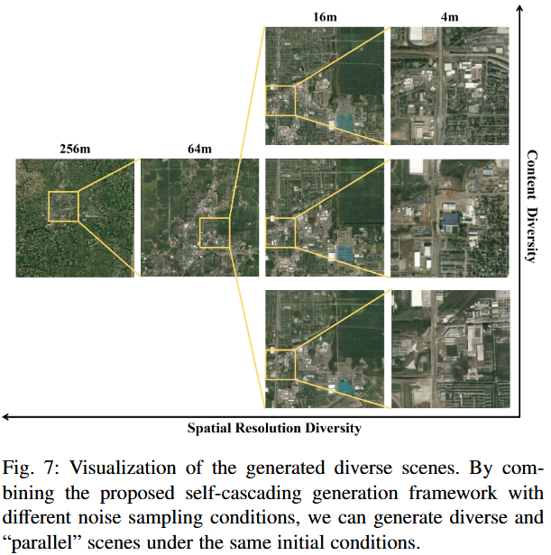
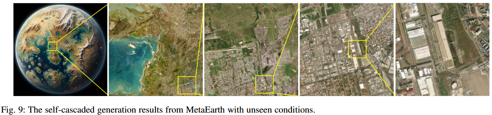
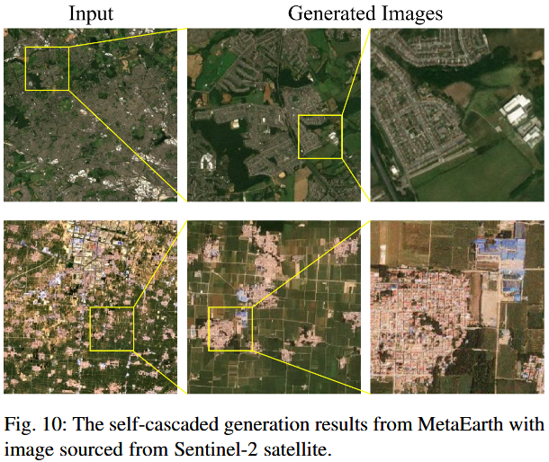
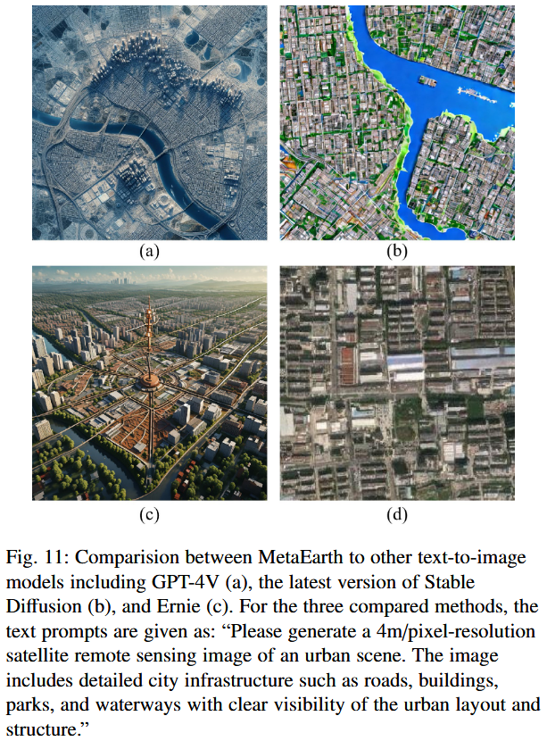
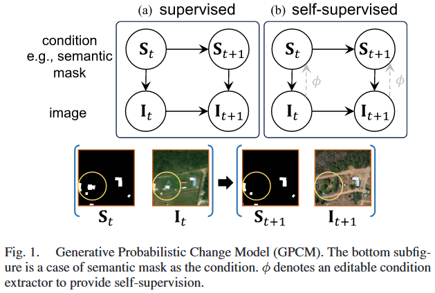

# TPAMI 25 | MetaEarth: A Generative Foundation Model for  Global-scale Remote Sensing Image Generation

> 论文链接：https://ieeexplore.ieee.org/document/10768939/
> 代码链接：https://jiupinjia.github.io/metaearth/
> 作者单位：北京航空航天大学

## 背景（为什么要研究）

生成式基础模型迅猛发展，能够为下游任务提供丰富的高质量样本。目前生成模型多针对自然图像场景，缺乏对遥感图像的适配，分辨率和信息密度有限。本研究致力于拓展生成模型的边界，将其从日常生活场景拓展到全球尺度的遥感观测场景。

## 问题（现有方法不足）

- 模型容量有限，无法支持全球的尺度的遥感生成
- 生成图像的分辨率不可控或固定
- 无法生成连续无界影图像

## 动机（从问题到方法的思考过程）

- 提高模型容量：基于denoising diffusion范式构造了600M参数量的生成模型
- 生成分辨率可控：收集了大范围的遥感影像与对应地理信息的多分辨率数据集。提出自级联生成框架，逐级从低分辨率生成高分辨率
- 连续无界图像生成：由于生成所固有的随机性，逐块生成后拼接的方案易产生视觉不连续。因此设计了一种噪声采样策略，通过分析生成条件和初始化噪声以保证风格连续性

## 方法

- 自级联框架：使用多阶段策略逐步提高生成的遥感图像的空间分辨率
  - 整体流程：第k+1阶段，接收第k阶段生成的低分辨率图像 $x_0^{(k)} \in \mathbb{R}^{H \times W}$ 和空间分辨率 $s_0^{(k)}$，以 $N=4$ 为倍数提升分辨率，则生成的高分辨率图像大小为 $NH \times NW$ 。第k+m阶段生成的图像大小为 $N^m H \times N^m W$
  - 单个阶段流程：
    - 编码低分辨率图像 $x_0^{(k)}$ 后上采样，与 $x_t^{(k+1)}$ 对齐并拼接，得到图像条件
    - 用Transformer论文中的正余弦编码方式分别编码分辨率 $s_0^{(k)}$ 和时间步 $t$，分别送入MLP后相加，得到时间和分辨率条件
    - 以上条件变量参与diffusion生成过程

- 无界图像生成
  - 滑动窗口：重叠1/2，合并时各去掉1/4
  - 噪声采样策略：参考DDIM的生成条件方程 
    $$ x_{t-1}^{(k)} = \sqrt{\alpha_{t-1}} (\frac{x_t^{(k)} - \sqrt{1-\alpha_t} \epsilon_{\theta}(x_t^{(k)},c_t^{(k)})}{\sqrt{\alpha_{t}}})+\sqrt{1-\alpha_{t-1}-\sigma_{t}^{2}}\cdot\epsilon_{\theta}(x_{t}^{(k)},c_{t}^{(k)})+\sigma_{t}\epsilon_{t} $$
    $$ \sigma_{t}=\eta\sqrt{(1-\alpha_{t-1})/(1-\alpha_{t})}\sqrt{1-\alpha_{t}/\alpha_{t-1}}. $$
    当 $\eta=1$ 时为 DDPM，当 $\eta=0$ 时生成的图像完全由初始噪声和条件变量决定，具体实现中设置所有图像块的初始噪声均相同

- 具体实现
  - 去噪网络
    - 网络结构：U-Net-like，600M 参数
    - linear schedule [0.0015, 0.0155]
    - sampling steps：训练 1000，推理使用 DDIM 加速设为 50
    - 低分辨率图像编码器：RRDBNet
  - 数据集：成对低-高分辨率数据集不易构建，对原始图像连续两次劣化生成低分辨率图像，单次劣化过程包括：高斯模糊、缩放、加噪、JPEG压缩（参考文献：ICCV 21 | Real-esrgan: Training realworld blind super-resolution with pure synthetic data）
  - 损失函数：添加感知优先权重（参考文献：CVPR 22 | Perception prioritized training of diffusion models）
  - AdamW lr=2e-6 epochs=30 batch_size=1 gradient_accumulation=8
  - 多卡并行，2000 GPU 小时，4090（若为8卡，需10天10小时）

## 实验

- 数据集（不公开）
  - GEE搜集
  - 分辨率：60m 16m 4m
  - 256*256，3,100,000张图片训练，其中约1,000,000张无重叠，70,000张验证，70,000张测试
- 评价指标
  - FID，越低越好，评价模型Inception v3

- 全球尺度图像生成
  - 自然场景生成多样
  - 遵循各大洲初始条件图像风格

- 多分辨率图像生成
  - 自级联多分辨率生成
  - 不同噪声采样，不同内容场景并行生成

- 任意尺度图像生成
  - 大尺度滑动窗口生成，证明接缝问题已被解决

- 未见场景生成
  - 证明模型泛化能力
  - GPT-4V 生成潘多拉星球图，逐级生成高分辨率图像
  - Sentinel-2 未见场景低分辨率图像，逐级生成仿传感器风格高分辨率图像

- 对比实验
  - 对比模型：GPT-4V、Stable Diffusion、Ernie、

- 消融实验
  - 自级联结构必要性：变体模型：接收 4\*4（256m） 输出256\*256（4m）
  - 分辨率引导有效性：变体模型：移除分辨率编码分支
  - 噪声采样策略验证：变体模型：滑动窗口有无重叠、是否使用相同噪声采样
  - 连续劣化有效性：对比方法：连续三次卷积插值

- 下游任务
  - 遥感分类
    - 原始数据集：7类，每类150张
    - 增强数据集：输入原始数据集，扩展出5倍结果

# TPAMI 25 | Changen2: Multi-Temporal Remote Sensing  Generative Change Foundation Model

## 背景（为什么要研究）

变化检测是地球视觉中最基础的任务之一，目标是理解地球表面随时间的动态变化。在遥感与计算机视觉领域的联合发展下，变化检测取得巨大进展。近年来，基于孪生网络的深度学习变化检测模型占据主导地位。它们成功的关键在于大规模标记训练数据集。然而，构建大规模遥感变化检测数据集既困难又昂贵，因为收集（识别发生变化事件的图像序列）、预处理（例如需要额外的图像注册）和注释遥感图像时间序列，相比单图像任务准备数据集需要更多的专业知识和精力。

## 问题（现有方法不足）

- 基于图的合成数据：3D建模是劳动密集型
- 基于数据增强的合成数据：受限于现有变化检测数据集的规模，贵么和多样性不足
- 合成数据的质量和多样性与特征的可迁移性的关系尚不明确

## 动机（从问题到方法的思考过程）

- 根本目标：构建基于变化生成建模的可扩展多时相变化数据生成器：通过模拟变化过程，从单时相图像和其标注（语义分割掩码、目标计数结果）生成真实且丰富多样的多时相图像及其密集标签
- 问题定义：设变化事件前后图像及其对应的条件（如：语义分割掩码）为 $<I_t, S_t>, <I_{t-1}, S_{t-1}>$。
  - 如上图所示，事后数据由事前数据驱动，若假设为生成任务，则图像内容取决于其条件
  - 问题拆分：条件级别的变化事件模拟、图像级别的语义变化合成

## 方法

## 实验
