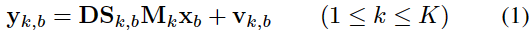
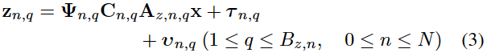

## 摘要

本文提出了一个遥感图像时空谱融合集成框架。主要有两个优点：它可以基于单个统一模型完成不同类型的融合任务，如多视图空间融合、空谱融合和时空融合，并且可以实现多源观测的集成融合，以获得高时空分辨率的图像，而不受遥感传感器数量的限制。

## 介绍

一般来说，现有图像融合方法有三个处理级别：数据级、特征级和决策级。本文聚焦数据级。根据不同目的，有几种遥感图像融合：多视角空间融合，空谱融合，时空融合。其各自独立，少有人研究其关系，因此融合框架缺乏通用性。

在所提出的融合框架中，利用最大后验（MAP）理论来描述逆融合问题。然后深入分析期望图像与多源遥感观测图像之间的空间、时间和光谱关系，构建集成关系模型。最后，通过经典的共轭梯度优化算法求解融合图像。

## 相关工作

### 多视角空间融合

多视角空间融合（多帧超分辨率重建）：融合来自同一成像系统的多视角低分辨率遥感图像，生成高分辨率图像。已用于提升遥感传感器硬件性能。聚焦于多时相多角度图像序列。现存大多多视角空间融合方法是基于考虑遥感传感器成像过程的观测模型，利用多帧退化观测的互补信息来提高空间分辨率，但由于缺乏辅助的更高空间分辨率图像，空间分辨率提高的效果并不显著。

### 空谱融合

空谱融合：PAN/MS、PAN/HS、MS/HS。

空谱融合：

- CS
- MRA
- MBO：不适定问题，建模期望融合图像和观察图像的关系
- SR（稀疏重构）：重构信号是稀疏的，可表示为几个基本元素的线性组合。主要依赖于字典结构。

PAN/HS、MS/HS比PAN/MS难，因为光谱波段数更多，波长范围更广。

### 时空融合

时空融合：

- 基于滤波：利用输入的观测图像的相邻相似像素的加权和来重建融合图像
- 基于解混
- 基于学习

### 集成融合框架

意义：

- 致力于探索不同类型图像融合方法之间的关系，制定统一的融合框架。
- 旨在融合来自多传感器观测图像的更多互补信息，以获得比单传感器或双传感器融合更好的融合结果。

## 提出的融合框架

### 框架描述

### 关系模型

空间降解模型，如公式1所示，

时空谱关系模型：Z为多源、不同空间尺寸、不同光谱分辨率和光谱范围，不同时间分辨率和成像时间。

### 集成融合模型

MAP：常用于不适定反问题，如去噪、去条纹和修复缺陷，模型化简结果如公式6所示。

融合模型：

- p(Y|x)：
- p(Z|x)：
- p(x)：

## 优化选择和参数确定

### 最优化程序

### 光谱和时间相关性的确定

光谱相关系数：

时间相关系数：

## 实验

### 数据集和实验设置

### 实验结果和分析

## 结论

集成框架优势：

- 首先，所提出的集成融合框架可以基于单一统一模型完成不同类型的图像融合任务，包括多视图空间融合、空谱融合（PAN/MS融合、PAN/HS融合和MS/HS融合）和时空融合。
- 其次，所提出的综合融合框架可以充分利用多源观测的互补信息，获得有希望的高时空谱融合图像。
- 此外，它对遥感传感器的数量没有限制。

集成框架优化方向：

- 第一个限制是算法的效率，特别是当有相当多的传感器图像要融合时。因此，可以将更快的最优化算法和并行计算等加速策略纳入集成融合框架。
- 其次，所提出的集成融合框架只能用于同质光学遥感图像。多源异构数据（光学、热红外、雷达等）的融合是一项更具挑战性的任务。
- 此外，可以考虑新的计算框架，包括稀疏表示、低秩逼近和张量分析，以进一步提高所提出的融合框架的稳健性。
