## Abstract
>
> 全色锐化是一项基础且重要的工作在遥感图像处理领域，其中全色图像的高分辨率空间细节被应用于增强多光谱（MS）图像的空间分辨率。因为低空间分辨率MS影像到高空间分辨率MS影像的转变复杂且高度非线性，受启发于深度神经网络的强大非线性关系表征能力，我们将多尺度特征提取和残差学习融入基础的卷积神经网络（CNN）结构中，并且提出多尺度多深度卷积神经网络应用于遥感影像的全色锐化中。定量和视觉评估结果都能确定提出的网络所生成的高分辨率MS图像由于所对比的SOTA方法产生的图像。
>
> Index Terms：遥感，全色锐化，卷积神经网络，多尺度特征学习

## INTRODUCTION

在遥感图像中，全色（PAN）图像有非常高的空间分辨率，以缺乏光谱波段多样性为代价，然而MS图像拥有丰富的光谱信息但是空间分辨率低。但是由于传感器的技术限制和其他的因素，高空谱分辨率的遥感影像目前不可得，但在很多遥感应用领域都有大量的需求。因此，研究者努力融合PAN图像和MS图像，以生产高空谱分辨率图像，此过程被成为“全色锐化”。

至今为止，已经提出了各种全色锐化方法，其中大多数可以被分为以下主要几类：

- 基于组分替换（CS）的方法。这种方法传统上将MS图像转换到一个合适的域。代表MS图像空间信息的特定组分被PAN图像代替，通过逆变换得到重建的融合图像。基于CS的方法的有：典型的强度-色调-饱和度（IHS）融合方法、主成分分析融合方法、施密特正交化（GS）融合方法、基于自适应组分替代的部分替代卫星图像融合。值得注意的是，在这组方法中分析被替换的MS组件与PAN图像的相关性对融合结果有巨大影像
- 基于多分辨率分析（MRA）的方法。相比于传统的基于CS的方法，基于MRA的方法通常有更多的光谱信息被保留。通常这类方法先通过小波变换、拉普拉斯金字塔等提取PAN图像的空间结构，然后注入上采样的MS图像中，以获得融合的图像。此类方法有：基于小波变换或曲波变换的融合方法、对调制传递函数（MTF）的分析、基于平滑滤波器的强度调制（SFIM）方法。最近，CS和MRA组合的方法被提出，以增强融合图像的空谱利用的保真度。然而，这些类型的方法通常产生空间失真，并且严格依赖于PAN和上采样MS图像的配准准确度。
- 基于建模优化（MBO）的方法。这些类型的方法都基于图像观察模型并且将融合图像的求解视为不适定的逆问题。通常，融合图像可以通过最小化一个具有先验约束的损失函数来解决，从被用于形成 Band-Dependent Spatial Detail（BDSD）模型的最小均方误差（MMSE），基于 k-means 聚类的非局部优化，到高级正则化算子，如贝叶斯后验概率、基于标准化高斯分布的自适应正则化、总变差（TV）算子，以及基于稀疏重建（SR）的融合方法。其中基于SR的融合方法是通用信号处理任务中最先进的算法之一。基于SR的方法的基本思想是将低空间分辨率的MS图像和高空间分辨率的PAN图像分解成不同尺度的字典（高空间分辨率字典和低空间分辨率字典），以及一些稀疏系数。后者可以在目标分辨率水平的重建过程中共享，以获取融合图像。

尽管已经提出了各种全色锐化方法，以上四种主要类型方法的缺点很难忽视。在基于CS和基于MRA的融合方法中，观察图像到融合目标的转换并不是完全建模的，并且光谱失真很常见。在基于MBO的方法中光谱失真能够被被更好的转换建模所减小，带来更高的准确率，但是从观察图像到融合图像的线性仿真仍然是一个限制，特别是当PAN和MS的光谱覆盖不能完全重叠并且导致融合过程高度非线性时。进一步说，在基于MBO的方法中最佳融合能量函数的设计严重依赖于先验知识，并且当图像具有不同分布并且质量下降时，这些方法的鲁棒性不佳。进一步说，解决正则化模型通常需要迭代计算，是耗时的且可能导致偶然误差，尤其在图像尺寸较大时。

为了克服这些缺点，近几年提出了一些先进的算法，其中深度学习模型是最有前途的方法。深度学习模型使用多个转换层构建，并且在每一个层中，其输入被线性滤波以产生输出，并且多层堆叠形成一个总体高度非线性的转换器。深度学习模型最突出的优势是模型包含的所有参数能够在训练样本的监督下更新，并且因此对于先验知识的需求被减小并且具有更高的拟合准确度。

对于自然图像和遥感图像在大多数低级别视觉任务中，比如图像去噪、去模糊、超分辨率、修复等，基于深度学习的方法在近几年以达到SOTA的准确度，并且他们的表现正在持续提高。然而，在泛锐化领域，近年来只有有限的研究引入了深度学习模型。例如：稀疏深度神经网络和全色锐化神经网络（PNN），后者实现了令人印象深刻的性能提升。然而，因为PNN的设计完全借鉴于超分辨率CNN（SRCNN），相比于后续的衍生网络，其结构相对简单且结构较浅，仍然有很大的进步空间。为了利用深度学习的优势并且克服当前方法的缺点，我们提出了一个为全色锐化特制的原始的网络，并且他也能够被广泛应用于其他类型的图像分辨率问题。此框架包含一个PNN和一个更深的多尺度神经网络（MSNN），前者网络进行单特征提取，后者网络包含多尺度特征提取层，并且建立一个深层次结构。我们认为，由于来自多个传感器的不同地物的特征尺度差异很大，引入多尺度特征提取器可以帮助学习更强健的卷积滤波器，从而将融合精度从当前的SOTA水平进一步提升。这一假设得到了实验结果的充分支持，详见第四节。

本文剩余的部分被按照以下方式组织。全色锐化和最近的深度学习工作的背景知识在第二节介绍。提出的多尺度并且多深度卷积神经网络（MSDCNN）的结构细节在第三节介绍。全色锐化准确率的评估结果在第四节介绍。最后，第五节给出讨论和结论。

## BACKGROUND

### 基于线性建模的全色锐化

假设低分辨率MS图像被视作降质观测 $g_{MS}$ ，与 $g_{MS}$ 相匹配的PAN图像 $g_{PAN}$ 被用于指导预测真值的高分辨率空间细节。全色锐化的主要目标是保留融合图像的统一的空谱保真度。对于拥有S个光谱的低分辨率MS图像 $g_{MS}$ ，定义全色锐化结果为 $F_{MS}$ ，其是对 $f_{MS}$ 的估计，对于MS图像全色锐化的约束函数被定义为公式（1）

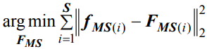

$F_{MS}$ 通过公式2融合函数获取

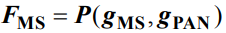

在公式2中 $P(.)$ 代表全色锐化过程。在传统MBO方法中 $g_{MS}$ 和 $g_{PAN}$ 都被认为是 $f_{MS}$ 在相对域中的降质，融合过程可以被模拟为公式3所示线性框架

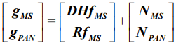

$D$ 是空间域的下采样矩阵， $R$ 是传感器PAN通道的光谱响应矩阵，其沿着频谱方向对潜在的GT下采样。 $H$ 是模糊矩阵， $N_{MS}$ 和 $N_{PAN}$ 是假定为高斯分布的加性噪声。因此公式2通过求解优化函数线性拟合为公式4

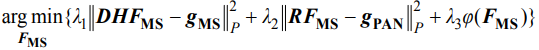

其中 $\lambda_i(i=1,2,3)$ 代表权重，控制三部分的贡献度，约束算子 $\varphi(F_{MS})$ 基于合理估计和先验知识以减少问题的不适定性。

然而，值得注意的是，在全色锐化的过程中PAN的MS图像的带宽并不保证完全重叠。比如，WorldView-2的MS带宽从400nm到1040nm，被分为八个波段，其PAN带宽覆盖450-800nm。因此，如果我们继续模拟以线性的视角去模拟转换 $P(.)$ ，在公式4中将很难将PAN图像的下采样的光谱合并到MS图像的光谱中，同时保留后者的保真度。这些线性模型的缺点能用以下观点解释。首先，使用线性函数去拟合复杂的变换很难达到一个满意的准确度，尤其是对于不适定的反问题。其次，先验知识被人工引入该问题中，比如 $\varphi(F_{MS})$ 的设计不能保证适合一般任务，并且可能增加系统误差。进一步讲，对于来自不同传感器有着许多复杂情况的图像来说， $\lambda_i$ 的值需要依靠经验选择，缺乏一个鲁棒性强的解决方法。因此线性优化模型的能力有点局限

为了克服线性模型的缺点，需要使用非线性函数拟合融合过程，要求我们采用一个不同的视角去探讨 $g_{MS}$ ， $g_{PAN}$ 和 $f_{MS}$的对应关系。因此采用深度学习的想法，这将在下一子节介绍。

### 深度学习全色锐化

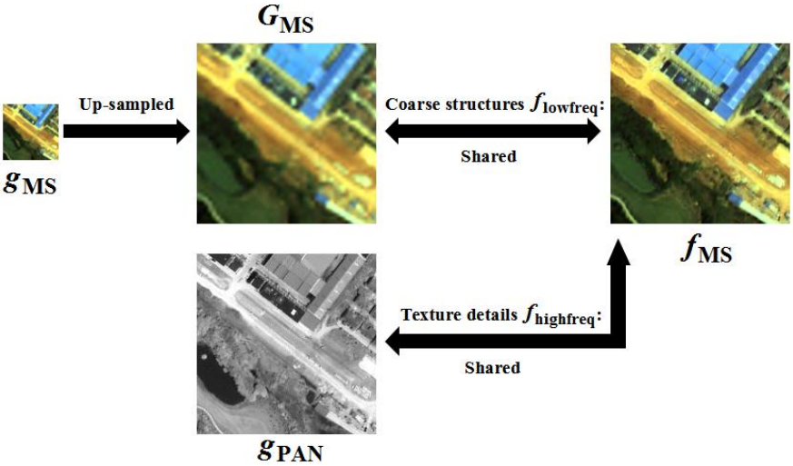

如图1所示，我们将 $g_{PAN}$ 所包含的纹理细节视作 $f_{MS}$ 的高频分量， $G_{MS}$ 的粗空间结构视作视作低频分量。因此我们可以使用一个滤波器函数提取特征 $f_{lowfreq}$ 和 $f_{highfreq}$ ，然后合并生成高分辨率估计 $F_{MS}$ 。

我们如何在不引起光谱失真的情况下，获取能够从各种地面场景中准确提取复杂特征的滤波器组？最近发展的深度学习方法是对此问题最先进的答案之一。在不同的深度学习网络中卷积神经网络（CNN）是一个在近几年横扫计算机视觉和图像处理领域的深度学习模型分支。在本文中其被作为我们提出的方法的原型进行介绍。相比于传统的手工制作的特征提取器，CNN模型的优势可以被解释为以下两个概念——“深度”和“学习”。

深度：CNN的结构被定义为多个卷积层的堆叠。尽管每一层函数化为一个线性滤波过程，但是整个网络能够拟合一个从${G_{MS},g_{MS}}$到$f_{MS}$的非常复杂的非线性映射变换。CNN的非线性和拟合能力并不受限于某一特定级别，因为网络深度能够沿着层堆叠的方向无线扩展。

学习：为了从 $G_{MS}$ 和 $g_{PAN}$ 中提取特征，在CNN的每一个卷积层中滤波过程由卷积核执行。在作为目标的 $f_{MS}$ 的监督下，网络迭代更新所有的核，来寻找一个最有分配，因此其被定义为“学习”过程。当 $f_{MS}$ 和 $F_{MS}$ 之间的损失收敛，网络的学习结束，得到了一个准确的端到端的全色锐化函数。图2展示了在训练数据集上训练深度CNN的流程图。

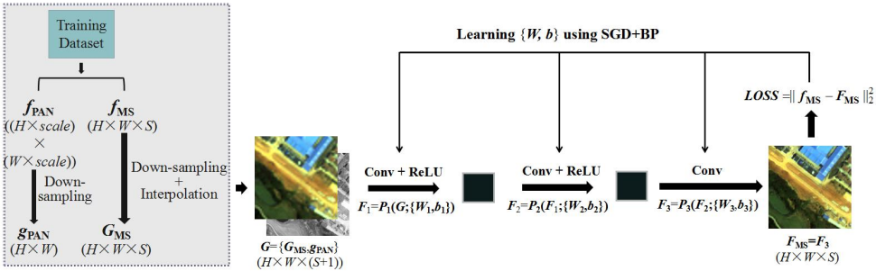

使用基本CNN进行全色锐化：如上文所说， $G_{MS}$ 和 $g_{PAN}$ 被直接送入CNN以产生融合图像 $F_{MS}$ 。在网络中输入图像通过 $L$ 层。第n层的滤波过程可以被表述为公式5

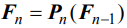

$F_n$ 是第n层的输出。因此，融合过程可以被表述为公式6-8

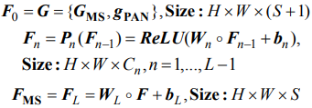

$\circ$代表3维卷积，是 $P_n(F_{n-1})$ 中的特征提取器， $W_n$ 包含 $C_n$ 组卷积核，每一组的大小为 $h_n \times w_n \times C_{n-1}$ ，$b_n$是 $1 \times 1 \times C_{n}$ 的偏差向量。因此对于第n层来说， $C_n$ 代表可以被人工设置的输出的光谱维度。整流线性单元（ReLU）被用于在函数中引入非线性

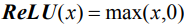

## PROPOSED NETWORK: MSDCNN

基于一个有三个卷积层的全色锐化的基本CNN结构，如上文所述，我们引入两个概念来提升网络的结构：多尺度特征提取模块和跳跃连接。提出的MSDCNN包含两个子网络：一个基本的三层CNN，一个带有两个多尺度卷积模块的更深的CNN。图3展示了MSDCNN的整个结构。

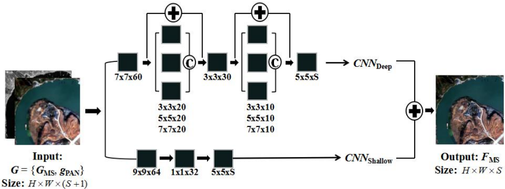

### 多尺度特征提取模块

如上所述，粗的结构特征和纹理细节是需要从地物和场景中提取。在米级和亚米级遥感图像中，地物的尺寸从非常小的街区到大到包含数千像素的区域，一个地面场景可能包含很多不同尺寸的物体。从图4所示的特征图可以看出小尺度特征，如建筑物的段边缘和植被的纹理，更易被小的卷积滤波器捕捉，然而粗的结构更倾向于被大的滤波器提取。

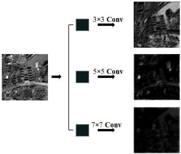

为了充分利用高分辨率图像的丰富的空间信息，并且提高特征提取器在各种复杂地面场景的鲁棒性，引入多尺度卷积层模块，其在图像超分辨和分类中都有应用。

如图5所示，在第n层，多尺度卷积层模块包含三种尺寸的卷积核：$3 \times 3$ ， $5 \times 5$ 和 $7 \times 7$。对于每个尺寸， $N$ 组卷积核产生 $N$ 个特征图，沿着光谱维度级联形成输出。

### 跳跃连接

如上所述，在CNN中堆叠更多的层能够导致更高的非线性，并且能够帮助更准确的拟合复杂的变换。可视化的特征图显示，当一个图片通过一个深度网络，其特征提取能变得更加抽象且更具有代表性。然而，在深度CNN的训练过程中有一个重要的问题，在从输出到输入的反向传播过程中，损失中网络参数的梯度急剧减小。因此在靠近输入的层中，对于所有参数来说，卷积核和偏置向量的更新太慢达到最优的分配。

在其他研究中，CNN的基础结构， $L=3$ 是网络深度的上限，增加更多的层并不再提高准确率性能，然而训练时间的增加也变得不可接受。为了解决问题，残差学习被认为是训练深度CNN最有效的解决方法之一，其中卷积滤波过程 $F_n=P_n(F_{n-1})$ 被替换为 $F_n=F_{n-1}+P_n(F_{n-1})$ ，因此，残差  $F_n-F_{n-1}$ 成了预测的目标。这个简单而有效的结构被称作“跳跃连接”。这假设在残差图中特征分布非常稀疏并且大多数像素值都接近零。因此，残差学习函数的损失参数表面变得比常规CNN的表面平滑得多，缩短了从局部最小点到全局最小值的距离。

在其他文献中，端到端的跳跃连接 $F=G+P$ 被设计为训练一个用以图像超分辨率的非常深的CNN，旨在使用整个网络从输入的低分辨率图像 $G$ 直接预测残差图 $f-G$ 。然而，对于全色锐化任务，由于 $G={G_{MS},g_{PAN}} (H \times W \times (S+1))$ 和 $f_{MS} (H \times W \times S)$ 不同的尺寸，端到端的结构不合适。因此，如图6所示，在提出的网络中，为模块设置只跳过一层的连接。

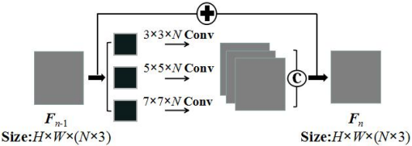

### MSDCNN联合学习

如图三所示，MSDCNN的两个子网络的输出加和作为最终的估计，如公式10

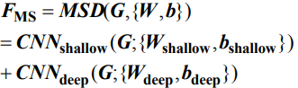

如公式11，MSDCNN的所有参数联合学习

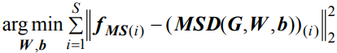

反向传播、随机梯度下降、动量算法、L2归一化防止梯度爆炸  

## EXPERIMENTAL RESULTS AND DISCUSSION

### Experimental Settings

数据集：QuickBird和WorldView-2的原始多光谱作为GT，然后使用双三次插值下采样作为 $G_{MS}$ ，PAN下采样作为 $G_{PAN}$ ，因此三者尺寸比例与真是情况相同。

数据集细节如表1。测试样本包含来自两个数据集的240张图像比其他引文大得多。

对于真实数据实验，从IKONOS收集一个较小的数据集来测试网络，从WorldView-2带有8波段的数据进行测试

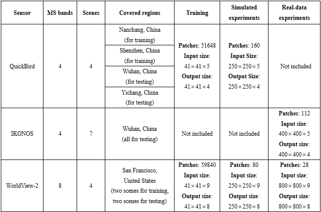

模型实现：epochs=300，batch_size=64，p=0.9，lr=0.1

对比算法：为了数值和视觉的评估，对比7个传统和SOT方法

- CS：GS、PRACS
- MRA：MTF-GLP、SFIM、AWLP
- 模型优化：TSSC
- DL：PNN

### Simulated Experiments

全色和多光谱下采样模拟输入，原始多光谱作为GT来评估全色锐化结果的质量。5个数值评价指标：PSNR、Q、ERGAS、SAM、Q2n。实验结果如表2所示

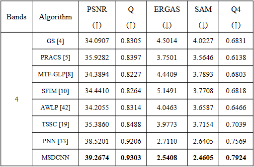

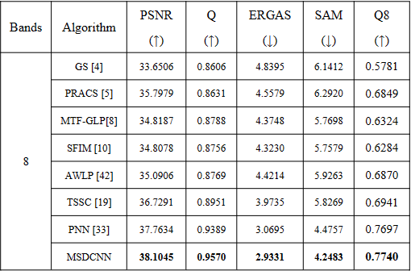

两个基于CNN的方法性能突出，MSDCNN领先于PNN。多尺度卷积层模块限制提高特征提取的鲁棒性和沿光谱维度的所有波段聚合。

由于数值度量被应用于从可量化的角度评估融合图像的质量，因此还需要仔细地视觉检查来识别逃避定量分析的伪影和失真。真彩色图像在图7-8中显示。

对比结果有力支持了我们的说法，即对于光谱域不完全重叠的多源遥感图像，基于DL的非线性模型能够更好的解决融合任务。同样值得注意的是，相比于PAN图像和一些过锐化融合结果，GT和MSDCNN融合结果也带有稍微模糊的外观，这表明提出的网络没有收到人为给出的先验的约束，能够拟合不同类型的变换。

### Real-Data Experiments

原始多光谱和全色图像也被输入到模型中，以生成全分辨率的结果。有三个无参考的数值评价指标能够衡量全色锐化图像，如：QNR、 $D_s$ 、 $D_{\lambda}$，对真实数据实验进行定量评估，结果如表4所示。

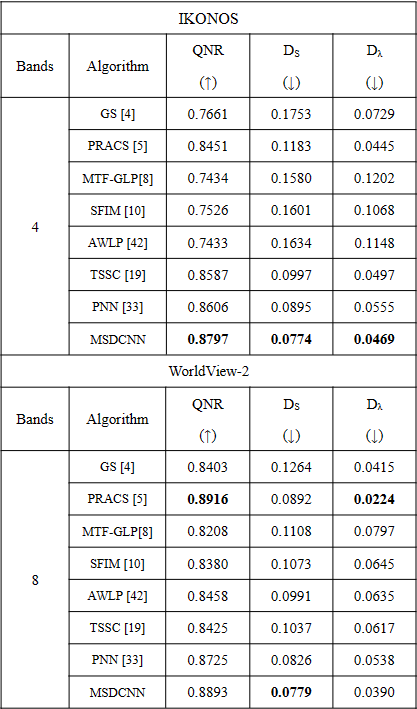

然而，考虑到这些指标是以 $G_{MS}$ 和 $g_{PAN}$ 为参考计算的，而不是无法得到的GT，我们应该注意到这些指标能够量化的是融合图像中某些成分与低分辨率观测的相似性，而不是高分辨率水平上的真实保真度。表4中的比较结果也支持我们的假设，因为PRACS的结果与低分辨率MS图像非常相似，并且在空间域中几乎没有锐化，但通过相似性，它们获得了非常高的 $D_{\lambda}$ 值，并同时将其QNR指数提高到SOTA水平。

因此，在下面的讨论中，主要基于视觉检查讨论真实数据实验，而不是三个数值指标。从待研究的全色锐化全分辨率图像中选择三个地面区域，如图9-11所示。

通过比较图9的图像，能够发现趋势与模拟实验相同，MSDCNN和PNN返回的图像有最好的频谱保真和合适的空间锐化细节，提出的方法在小尺寸细节保留方面性能稍微更好。MSDCNN能够避免从上采样的多光谱图像中引入伪影并防止频谱失真。尽管多光谱插值后严重损坏，MSDCNN也能在全色的引导下进行良好的融合。

### Further Discussion
