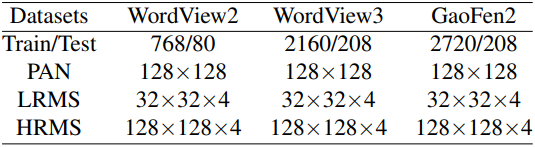

## Abstract
>
> 全色锐化是重要的一套干预处理步骤，尽管DL方法很有效，但是当前的上采样方法仅仅利用了LRMS的局部信息，忽视了LRMS的全局信息和PAN的跨模态指导信息。本文提出了一种空谱融合中的基于概率的全局跨模态上采样方法，设计一种网络实现并考虑通道异质性。PGCU模块包含三个部分：IE信息提取、DEE分布和期望估计、FA微调。实验对比了其他上采样方法，并提升SOTA的DL全色锐化方法
>
> <https://github.com/Zeyu-Zhu/PGCU>

## Introduction

全色锐化旨在在PAN的指导下从LRMS重建HRMS，是重要的遥感预处理步骤

典型的方法：

- 传统：CS组分替代，MRA多分辨率分析，VO变分优化
- DL：几乎所有方法都会先将LRMS上采样，再进行其他超分操作。上采样是一个基本的操作。PanNet等直接将上采样结果加到残差网络输出，上采样结果很大程度上影像着最终结果

全色锐化中很少有方法设计一个合理的上采样方法，只是简单的使用双三次插值、转置卷积等，其他任务中的上采样方法并不适用于全色锐化，比如ABIU基于注意力的上采样、ESPCNN。几乎所有上述方法都只有局部感受野。局部插值的方法很难在有很多非局部相似的图像块的遥感场景中使用。几乎所有上述方法没有能力有效利用PAN的结构信息，ABIU忽略了通道异质性，即在相同的位置使用了相同用的权重对所有通道，故不适用于全色锐化。综上，已存在的上采样方法无法利用LRMS全局信息和PAN结构信息，因为通道异质性的原因不能完全建模全色锐化问题

将全色锐化看作不适应逆问题，概率模型可以有效适用于该问题，具体而言，针对每个通道从像素值空间中抽样了一个近似的全局离散分布值，从而能够描述每个通道的共同特性以及不同通道的独特特性。因此本文使用LRMS和PAN为HRMS的每一个像素都构建了一个特征向量和离散分布值。启发于Transformer，使用向量相似度计算每个像素在其通道分布上的概率值

IE从LRMS和PAN提取空间和时间信息，生成通道分布值和跨模态信息。DEE为每个上采样后的像素构建跨模态特征向量，生成分布值。估计每个像素的分布概率。FA补充局部信息和通道相关性。

使用信息理论分析像素分布，使用JS divergence聚类上采样得到的图的像素，可以看到非布局相关性，可视化信息熵，看到每个通道的不同，也证明了PGCU的确学习了不同通道的信息。

综上，本文贡献

- 提出一个新的全色锐化中使用的基于概率的上采样模型，模型假设上采样后的每个像素符合基于LMRS和PAN的概率分布
- 设计一个新的上采样网络模块实现基于概率的上采样模型，模块能够利用LRMS全局信息和PAN跨模态信息
- 实验证明PGCU能够嵌入SOTA的全色锐化网络中，提升性能，即插即用。作为通用的上采样方法能够有潜力用于其他有指导性图像的超分任务中

## Related Work

### Pansharpening Method

基于建模的方法

- CS组分替代：分解PAN和LRMS图像，融合PAN空间信息和LRMS光谱信息，生成HRMS
  - PCA
  - Brovey
  - intensity–hue-saturation (IHA)
  - Gram-Schmidt（GS）
- MRA多分辨率分析：为了减少光谱失真，注入PAN结构信息到上采样的LRMS中
  - highpass filter (HPF)
  - indusion method
  - smoothing filter-based intensity modulation (SFIM)
- VO变分优化：将全色锐化看作变分优化问题
  - Bayesian methods
  - variational approaches

DL方法：直接学习LRMS和PAN到HRMS的映射方法。典型的方法主要包含两种网络结构：

- 残差结构：把上采样的LRMS加到网络输出，以回归残差的形式得到HRMS
  - PanNet
  - FusionNet
  - SRPPNN
- 双分支结构：构建PAN和LRMS的特征提取器，融合特征，重建HRMS
  - GPPNN
  - Proximal PanNet
  - SFIIN
所有方法先上采样LRMS在进行其他操作

### Image Upsampling Method

经典方法：基于局部插值的方法常用于获得大尺度MS，适应性差？？

- nearest interpolation
- bilinear interpolation
- bicubic interpolation method

DL方法：

- transposed convolution：学习局部插值的自适应权重
- 基于注意力的上采样方法：深度图像超分任务，使用transformer，忽视通道异质性，不适用于全色锐化
- Pu-Net
- ESPCNN：单一图像超分，通过多卷积层扩大感受野

以上方法有三个问题

- 几乎所有方法只有局部感受野，不能捕获LRMS的全局信息
- 大多数方法不能利用PAN信息作为指导
- 这些方法没有考虑通道异质性

## Proposed Upsampling Method

### Probabilistic Modeling

符号定义H，L，P，hcij，用概率直接建模hcij

hcij看作随机变量，利用L和P建模概率分布。利用离散分布的期望近似连续分布。使用采样的方法近似数值积分。离散分布满足公式2。wi表示hi的重要性。hcij服从离散分布（vc，pcij）。vc是n个变量值，pcij概率向量参数，即样本和样本重要性。考虑事实，v和p都是L和P的函数。v和p可知则d可知。同一通道的像素共享同一分布值向量vc，不同通道有不同vc，可以表征每个通道的相同特征和不同通道的差异特征

采用三个函数V,G,F生成vc，pcij。V生成vc，利用P的结构信息和L的光谱信息。对于pcij，生成两个特征向量fcij、gck。F在为每个像素在局部图像块中提取跨模态信息，fcij捕获对应像素的跨模态信息。G使用跨模态的局部图像块vc的捕获分布值，gck是另一个表征vc对应的概率密度函数的的信息的特征向量。pcij是fcij与gck的余弦相似度，再进行softmax归一化形成概率值。求期望得到每个hcij

### Network Architecture

PGCU容易嵌入当前全色锐化网络

#### Information Extraction

IE接收PAN和LRMS，输出上采样H的hcij像素的离散分布变量值vc、跨模态的特征。同时利用PAN和LRMS，同时在两个上面提取特征。V,G函数实现：P、LRMS分别进行N和M次下采样，拼接起来再进行卷积。下采样模块由一个步长s的卷积层和一个 2*2最大池化层组成

LRMS的每一个像素可以看作HRMS的最近相应点的降解。故用最近邻上采样构建大尺寸MS，在提取特征之前。F被实现为公式13

#### Distribution and Expectation Estimation

DEE为每一个像素估计一个概率分布并且计算期望值，以得到上采样图片的像素的预测值。从IE得到的F、G被输入到通道投影模块，用来建模通道异质性。每个通道投影模块包含一个linear层和一个LayerNorm。Linear层被用于将输入向量（F、G）映射到对应通道的新的特征空间。LayerNorm用于凸显每个单独特征向量的差异。每个通道的通道投影可以被规定为公式14、公式15。F包含上采样后图片的每个位置的特征向量（没有通道异质性）。G包含分布值的每个位置上的特征向量（没有通道异质性）。用公式8计算相似矩阵，并用公式9归一化，得到概率分布。最终计算期望得到像素值。

#### Fine Adjustment

FA由一个卷积层实现，能够更好的利用局部信息和通道间的依赖性，为全集特征和通道异质性做补偿

## Experiments

通过实验证明方法有效性。选择5个有代表性的基于DL的全色锐化方法，PanNet、MSDCNN、FusionNet、GPPNN、SFIIN，作为骨干网络，替换其上采样方法为PGCU。其中PanNet采用转置卷积上采样，其他的采用双三次插值。为了进一步证明性能提升并不是由参数增加带来的，进行了等参数实验。讲PGCU与其他5个主流的上采样方法进行对比，传统的双三次插值、最近邻插值、基于DL的转置卷积、基于注意力的图像上采样方法、ESPCNN。进行消融实验。可视化分析学习的上采样图像的像素分布。超参数，s,N,M,L=2,3,2,128。3090Ti 24GB训练

### Datasets and Evaluation Metrics

WordView2、WordView3和GaoFen2生成三个数据集，每个被分为训练和测试两部分。基本信息见表1。所有数据集基于4倍双三次插值下采样HRMS，生成LRMS图像。并且为了数值稳定性每个像素被归一化到0 1之间。选择5个主流评价指标对每个方法进行性能评估，SAM、ERGAS、SSIM、SCC、PSNR。

### Component Replacement Experiment

为了验证方法有效性，采用即插即用的方式直接替换基于DL的SOTA全色锐化方法中的上采样方法为PGCU。每一对方法采用相同的实验条件。实验结果见表2。替换为PGCU后所有的五个骨干网络在所有的数据集上都取得了性能提升。图4进行了可视化对比。

为了进一步证实性能的提升并不来自于模型复杂性的提升，而是源自于PGCU的设计，我们将PanNet和GPPNN两个骨干网络的参数数量提升到组件替换后相同的水平。增加了PanNet的ResNet模块，GPPNN的Pan-Ms模块，使参数量稍大于或等于组件替换后的网络。实验结果如表3所示。增加参数量后只有轻微的性能提升。但是与组件替换后下相比仍然有巨大的性能差距，这表明性能提升来自于PGCU的贡献。

### Comparison with Other Upsampling Methods

为了进一步揭示PGCU方法的先进性，我们将PGCU与5个主流的上述上采样方法进行比较。与之前的实验相似，选用PanNet和GPPNN骨干网络，使用WorldView2和GaoFen2数据集。

实验结果如表4所示。带有PGCU的骨干网络具有最优的性能。所有对比的方法不能利用LRMS的全局信息。前四个方法也忽视了来自PAN的跨模态信息。对于ABIU方法来说，尽管他利用了跨模态信息，但是相同位置的样本权重对所有通道一致，忽视了通道间的差异性。相比于这些方法，我们的PGCU逼近能够有效利用跨模态信息和全局信息，还对通道差异性充分建模，这就是为什么我们的方法性能最好。

### Parameter Analysis and Ablation Study

在我们提出的PGCU中，分布值和上采样图像中的像素特征向量 $D$ 的长度是一个非常重要的超参数，其决定了对每个像素的代表能力。参数分析实验结果如表5所示。短向量导致无法表征像素信息，长向量将导致信息冗余。

进行消融实验来探讨不同信息源和操作的功能。采用PanNet骨干网络，GaoFen2数据集，实验结果如表6所示。为了研究PAN信息的重要性，只在LRMS上进行特征提取。性能显著下降，表明跨模态信息的利用很关键。此外为了研究通道异质性建模的重要性，移除了通道投影模块。性能同样显著下降，这证明了通道建模的重要性。

### Visualization Analysis

为了进一步研究PGCU的结果，我们基于信息理论分析像素分布并且发现了一下有趣的现象。可视化结果如图5所示。第一行展示每个通道的HRMS图像。第二行显示了使用像素分布和以JS散度为距离度量的K均值进行不同通道像素的聚类的结果。同类像素被染为相同颜色，能够发现很多非局部图像块为同样颜色。第三行展示了每个通道归一化像素信息熵的结果。不同通道差异巨大的信息熵图显示了不同通道相同位置的不确定性具有多样性。PGCU能够自适应的充分考虑每个通道的信息。

## Conclusion and Future Work

本文提出了一个新的从概率视角的全色锐化上采样方法，通过引入全局的和PAN的信息到上采样过程中，同时充分建模通道异质性。设计了一个网络去实现本方法，并且这个模块能用即插即用的方式帮助提升当前SOTA方法性能。在未来，我们将把我们的上采样模块应用到更多的有指导图像的超分辨率任务中，比如，的深度图像超分辨、MRI超分辨等。
