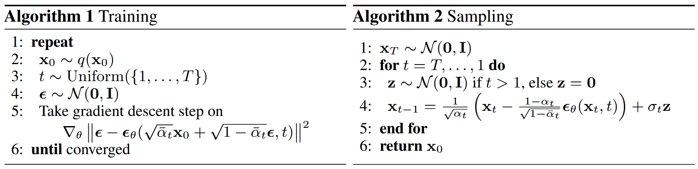

# NeurIPS 20 | Denoising Diffusion Probabilistic Models

> 论文链接：https://proceedings.neurips.cc/paper/2020/hash/4c5bcfec8584af0d967f1ab10179ca4b-Abstract.html
> 代码链接：https://github.com/hojonathanho/diffusion
> 作者单位：加州大学伯克利分校

## 背景知识

> - 高斯分布重参数化公式：$x \sim \mathcal{N}(\mu,\sigma^2) \Rightarrow x=\mu+\sigma\epsilon, \epsilon \sim \mathcal{N}(0,1)$

前向过程：
$$
\begin{aligned}
x_0 &\sim q(x_0)\\
q(x_{1:T} \mid x_0) &:= \prod_{t=1}^T q(x_t \mid x_{t-1})\\
q(x_t \mid x_{t-1}) &:= \mathcal{N}(x_t; \sqrt{1-\beta_t} x_{t-1}, \beta_t I)\\
\end{aligned}
$$
令 $\alpha_t := 1-\beta_t$，$\bar{\alpha}_t := \prod_{s=1}^t \alpha_s$，边缘分布为：
$$
q(x_t \mid x_0) := \mathcal{N}(x_t; \sqrt{\bar{\alpha}_t}x_0, (1-\bar{\alpha}_t)I)
$$
经重参数化后，可得**一步加噪公式**为：
$$
x_t=\sqrt{\bar{\alpha}_t}x_0+\sqrt{1-\bar{\alpha}_t}\epsilon, \epsilon \sim \mathcal{N}(0,1)
$$

后向过程：
$$
\begin{aligned}
p(x_T) &= \mathcal{N}(x_T;0,I)\\
p_\theta(x_{0:T}) &:= p(x_T)\prod_{t=1}^T p_\theta(x_{t-1} \mid x_t)\\
p_\theta(x_{t-1} \mid x_t) &:= \mathcal{N}(x_{t-1}; \mu_\theta(x_t,t), \Sigma_\theta(x_t,t))\\
\end{aligned}
$$

## 训练目标

> 期望公式：
> - 连续变量：$E[X] = \int xp(x)\mathrm{d}x$
> - 函数：$E[g(X)] = \int g(x)p(x)\mathrm{d}x$

$$
\begin{aligned}
\mathbb{E}_{x_0 \sim q(x_0)}[-\log p_\theta(x_0)] &\le L\\
&= \mathbb{E}_{x_{0:T} \sim q(x_{0:T})}[-\log \frac{p_\theta(x_{0:T})}{q(x_{1:T} \mid x_0)}]\\
&= \mathbb{E}_{q}[-\log p(x_T) \prod_{t=1}^T \frac{p_\theta(x_{t-1} \mid x_t)}{q(x_t \mid x_{t-1})}]\\
&= \mathbb{E}_{q}[-\log p(x_T) - \sum_{t=1}^T \log \frac{p_\theta(x_{t-1} \mid x_t)}{q(x_t \mid x_{t-1})}]\\
&= \mathbb{E}_{q}[-\log p(x_T) - \sum_{t=2}^T \log \frac{p_\theta(x_{t-1} \mid x_t)}{q(x_t \mid x_{t-1})} - \log \frac{p_\theta(x_0 \mid x_1)}{q(x_1 \mid x_0)}]\\
&= \mathbb{E}_{q}[-\log p(x_T) - \sum_{t=2}^T \log \frac{p_\theta(x_{t-1} \mid x_t)}{q(x_t \mid x_{t-1}, x_0)} - \log \frac{p_\theta(x_0 \mid x_1)}{q(x_1 \mid x_0)}] && 马尔戈夫性质\\
&= \mathbb{E}_{q}[-\log p(x_T) - \sum_{t=2}^T \log \frac{p_\theta(x_{t-1} \mid x_t)}{q(x_{t-1} \mid x_t, x_0)} \cdot \frac{q(x_{t-1} \mid x_0)}{q(x_t \mid x_0)} - \log \frac{p_\theta(x_0 \mid x_1)}{q(x_1 \mid x_0)}] && 贝叶斯公式\\
&= \mathbb{E}_{q}[-\log p(x_T) - \sum_{t=2}^T \log \frac{p_\theta(x_{t-1} \mid x_t)}{q(x_{t-1} \mid x_t, x_0)} - \log \prod_{t=2}^T \frac{q(x_{t-1} \mid x_0)}{q(x_t \mid x_0)} - \log \frac{p_\theta(x_0 \mid x_1)}{q(x_1 \mid x_0)}]\\
&= \mathbb{E}_{q}[-\log p(x_T) - \sum_{t=2}^T \log \frac{p_\theta(x_{t-1} \mid x_t)}{q(x_{t-1} \mid x_t, x_0)} - \log \frac{q(x_1 \mid x_0)}{q(x_T \mid x_0)} - \log \frac{p_\theta(x_0 \mid x_1)}{q(x_1 \mid x_0)}]\\
&= \mathbb{E}_{q}[- \log \frac{p(x_T)}{q(x_T \mid x_0)} - \sum_{t=2}^T \log \frac{p_\theta(x_{t-1} \mid x_t)}{q(x_{t-1} \mid x_t, x_0)} - \log p_\theta(x_0 \mid x_1)]\\
&= \mathbb{E}_{q}[D_{KL}(q(x_T \mid x_0) || p(x_T)) + \sum_{t=2}^T D_{KL}(q(x_{t-1} \mid x_t, x_0) || p_\theta(x_{t-1} \mid x_t)) - \log p_\theta(x_0 \mid x_1)]\\
\end{aligned}
$$
其中 $q(x_{t-1} \mid x_t, x_0)$，有如下推导：
$$
\begin{aligned}
q(x_{t-1} \mid x_t, x_0) &= \frac{q(x_t \mid x_{t-1}, x_0)q(x_{t-1} \mid x_0)}{q(x_t \mid x_0)} && 贝叶斯\\
&= \frac{q(x_t \mid x_{t-1})q(x_{t-1} \mid x_0)}{q(x_t \mid x_0)} && 马尔可夫\\
& 消除分母不影响目标分布的均值方差\\
&= q(x_t \mid x_{t-1})q(x_{t-1} \mid x_0)\\
&= \frac{1}{C}\exp(-\frac{(x_t-\sqrt{\alpha_t}x_{t-1})^2}{2\beta_t I} - \frac{(x_{t-1}-\sqrt{\bar{\alpha}_{t-1}}x_0)^2}{2(1-\bar{\alpha}_{t-1}) I})\\
\end{aligned}
$$
以 $x_{t-1}$ 为变量构建高斯分布公式可得：
$$
\begin{aligned}
& q(x_{t-1} \mid x_t, x_0) = \mathcal{N}(x_{t-1};\tilde{\mu}_t(x_t,x_0),\tilde{\beta}_tI)\\
& \tilde{\mu}_t(x_t,x_0) = \frac{\sqrt{\bar{\alpha}_{t-1}}\beta_t}{1-\bar{\alpha}_t}x_0+\frac{\sqrt{\alpha_t}(1-\bar{\alpha}_{t-1})}{1-\bar{\alpha}_t}x_t; \tilde{\beta}_t = \frac{1-\bar{\alpha}_{t-1}}{1-\bar{\alpha}_t}\beta_t\\
\end{aligned}
$$

### 前向过程和 $L_T$

将方差 $\beta_t$ 设为常数，则整体无可学习参数，忽略 $L_T$

### 反向过程和 $L_{1:T-1}$

> 高斯分布 KL 散度：
> $$D_{KL}(\mathcal{N}(\mu_1,\Sigma_1)||\mathcal{N}(\mu_2,\Sigma_2)) = \frac{1}{2}[(\mu_2-\mu_1)^\top \Sigma_2^{-1}(\mu_2-\mu_1) + tr(\Sigma_2^{-1}\Sigma_1) + \log \frac{|\Sigma_2|}{|\Sigma_1|} - d]$$
> 其中 $d$ 表示随机变量的维度

对于 $p_\theta(x_{t-1} \mid x_t) = \mathcal{N}(x_{t-1}; \mu_\theta(x_t,t), \Sigma_\theta(x_t,t))$，设方差 $\Sigma_\theta(x_t,t) = \sigma_t^2 I$，存在两种结果类似的选择，即 $\sigma_t^2 I = \beta_t$ 或 $\sigma_t^2 I = \tilde{\beta}_t = \frac{1-\bar{\alpha}_{t-1}}{1-\bar{\alpha}_t}\beta_t$

此时由于 $q(x_{t-1} \mid x_t, x_0) = \mathcal{N}(x_{t-1};\tilde{\mu}_t(x_t,x_0),\tilde{\beta}_tI)$ 和 $p_\theta(x_{t-1} \mid x_t) = \mathcal{N}(x_{t-1}; \mu_\theta(x_t,t), \Sigma_\theta(x_t,t))$ 均为高斯分布，我们可重写 $L_t = \mathbb{E}_q[D_{KL}(q(x_{t-1} \mid x_t, x_0) || p_\theta(x_{t-1} \mid x_t))]$：
$$
\begin{aligned}
L_{t-1} &= \mathbb{E}_q[D_{KL}(q(x_{t-1} \mid x_t, x_0) || p_\theta(x_{t-1} \mid x_t))]\\
&= \mathbb{E}_q[\frac{1}{2\sigma_t^2}||\tilde{\mu}_t(x_t,x_0) - \mu_\theta(x_t,t)||^2]+C\\
\end{aligned}
$$
其中，$C$ 为不含可学习参数的常数。由一步加噪公式重参数化得 $x_t(x_0,\epsilon) = \sqrt{\bar{\alpha}_t}x_0+\sqrt{1-\bar{\alpha}_t}\epsilon, \epsilon \sim \mathcal{N}(0,1)$，将其与 $\tilde{\mu}_t(x_t,x_0)$ 带入，消去 $x_0$ 得：
$$
L_{t-1} = \mathbb{E}_q[\frac{1}{2\sigma_t^2}||\frac{1}{\sqrt{\alpha_t}}(x_t-\frac{\beta_t}{\sqrt{1-\bar{\alpha}_t}}\epsilon) - \mu_\theta(x_t,t)||^2]+C
$$
由于给定 $x_t$，可将均值设为 $\mu_\theta(x_t,t) = \frac{1}{\sqrt{\alpha_t}}(x_t-\frac{\beta_t}{\sqrt{1-\bar{\alpha}_t}}\epsilon_\theta(x_t,t))$，带入得：
$$
L_{t-1} = \mathbb{E}_{x_0,\epsilon}[\frac{\beta^2}{2\sigma_t^2\alpha_t(1-\bar{\alpha}_t)}||\epsilon - \epsilon_\theta(\sqrt{\bar{\alpha}_t}x_0+\sqrt{1-\bar{\alpha}_t}\epsilon,t)||^2]+C
$$
由此可以通过训练网络预测噪声 $\epsilon$ 实现反向过程，或预测均值 $\tilde{\mu}_t$

### 解码器和 $L_0$

最后一步使用无损解码，将连续高斯分布转为离散分布，图像像素从 $\{0,1, \cdots ,255\}$ 归一化到 $[-1,1]$，离散像素的最小间隔为 $\frac{1}{255}$，对连续高斯分布在以离散像素归一化值为中心，半径为 $\frac{1}{255}$ 的区间积分，对于归一化值为-1和1的像素，积分区间为 $[-\infty,-1+\frac{1}{255}]$ 和 $[1-\frac{1}{255},\infty]$。对于 $H \times W \times C$ 的图像，解码结果为各像素点积分值的乘积。$L_0$ 形式化表示如下：
$$
\begin{aligned}
L_0 &= -\log p_\theta(x_0 \mid x_1)\\
&= -\log \prod_{i=1}^D \int_{\delta_-(x_0^i)}^{\delta_+(x_0^i)} \mathcal{N}(x;\mu_\theta^i(x_1,1),\sigma_1^2)\mathrm{d}x\\
&= -\sum_{i=1}^D \log \int_{\delta_-(x_0^i)}^{\delta_+(x_0^i)} \mathcal{N}(x;\mu_\theta^i(x_1,1),\sigma_1^2)\mathrm{d}x\\
\delta_+(x) &= \begin{cases} \infty & \text{if } x=1 \\ x+\frac{1}{255} & \text{if } x<1 \end{cases} \qquad \delta_-(x) = \begin{cases} -\infty & \text{if } x=-1 \\ x-\frac{1}{255} & \text{if } x>-1 \end{cases}
\end{aligned}
$$
其中 $D = H \times W \times C$ 即数据维度，$i$ 表示维度索引

### 简化目标函数

将以上 $L_{t-1}$ 和 $L_0$ 简化作为
$$
L(\theta):=\mathbb{E}_{t,x_0,\epsilon}[||\epsilon-\epsilon_\theta(\sqrt{\bar{\alpha}_t}x_0+\sqrt{1-\bar{\alpha}_t}\epsilon,t)||^2]
$$
其中 $t \in {1,\cdots,T}$，$t=1$ 对应 $L_0$，$t>1$ 对应 $L_{t-1}$，

## 算法

## 具体实现

- $T=1000$，时间步 $t$ 经正弦位置编码后送入残差块
- 低分辨率数据集 batchsize=128，高分辨率数据集 batchsize=64，推理 batchsize 为训练的两倍
- $\beta_t$ 从 $\beta_1=1 \times 10^{-4}$ 到 $\beta_T=0.02$ 线性采样
- 低分辨率数据集 dropout=0.1，高分辨率数据集 dropout=0
- 随机水平翻转
- Adam，低分辨率数据集 $lr=2 \times 10^{-4}$，高分辨率数据集 $lr=2 \times 10^{-5}$，训练中均不调整
- 使用指数滑动平均（EMA），衰减系数为0.9999
