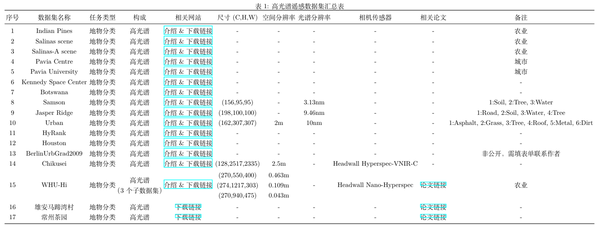
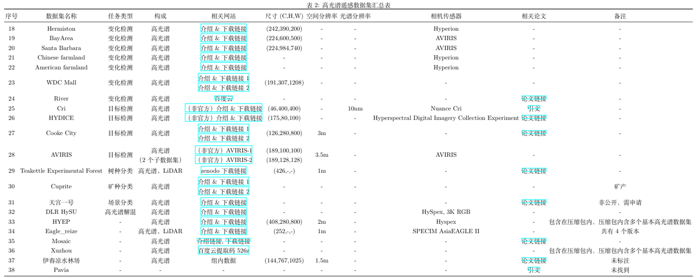

# 数据集网站

- [西班牙巴斯克大学计算智能实验室](https://www.ehu.eus/ccwintco/index.php?title=Hyperspectral_Remote_Sensing_Scenes)
- [伊朗德黑兰大学遥感实验室](https://rslab.ut.ac.ir/data)
- [武大RSIDEA 资源共享](http://rsidea.whu.edu.cn/resource_sharing.htm)
- [武大RSIDEA 高光谱遥感智能处理](http://rsidea.whu.edu.cn/resource_Intelligent_processing_of_hyperspectral_RS.htm)
- [武大RSIDEA 高光谱高空间分辨率遥感观测、处理与应用](http://rsidea.whu.edu.cn/resource_H2.htm)
- [Purdue University's MultiSpec](https://engineering.purdue.edu/~biehl/MultiSpec/hyperspectral.html)
- [西北工业王琦教授个人主页](https://crabwq.github.io)
- [韩国成均馆大学博士后孙乐个人主页](https://lesun.weebly.com/hyperspectral-data-set.html)
- [zenodo](https://zenodo.org/)

# 数据集汇总

| 序号  |          数据集名称           |   任务类型   |            构成            |                     尺寸 (C,H,W)                     |           空间分辨率           | 光谱分辨率 |                     相机传感器                      |                                                                                            相关网站                                                                                             |                                                       相关论文                                                        |                        备注                         |
| :---: | :---------------------------: | :----------: | :------------------------: | :--------------------------------------------------: | :----------------------------: | :--------: | :-------------------------------------------------: | :---------------------------------------------------------------------------------------------------------------------------------------------------------------------------------------------: | :-------------------------------------------------------------------------------------------------------------------: | :-------------------------------------------------: |
|   1   |         Indian Pines          |   地物分类   |           高光谱           |                          -                           |               -                |     -      |                          -                          |                                                [介绍&下载链接](https://www.ehu.eus/ccwintco/index.php?title=Hyperspectral_Remote_Sensing_Scenes)                                                |                                                           -                                                           |                        农业                         |
|   2   |         Salinas scene         |   地物分类   |           高光谱           |                          -                           |               -                |     -      |                          -                          |                                                [介绍&下载链接](https://www.ehu.eus/ccwintco/index.php?title=Hyperspectral_Remote_Sensing_Scenes)                                                |                                                           -                                                           |                        农业                         |
|   3   |        Salinas-A scene        |   地物分类   |           高光谱           |                          -                           |               -                |     -      |                          -                          |                                                [介绍&下载链接](https://www.ehu.eus/ccwintco/index.php?title=Hyperspectral_Remote_Sensing_Scenes)                                                |                                                           -                                                           |                        农业                         |
|   4   |         Pavia Centre          |   地物分类   |           高光谱           |                          -                           |               -                |     -      |                          -                          |                                                [介绍&下载链接](https://www.ehu.eus/ccwintco/index.php?title=Hyperspectral_Remote_Sensing_Scenes)                                                |                                                           -                                                           |                        城市                         |
|   5   |       Pavia University        |   地物分类   |           高光谱           |                          -                           |               -                |     -      |                          -                          |                                                [介绍&下载链接](https://www.ehu.eus/ccwintco/index.php?title=Hyperspectral_Remote_Sensing_Scenes)                                                |                                                           -                                                           |                        城市                         |
|   6   |     Kennedy Space Center      |   地物分类   |           高光谱           |                          -                           |               -                |     -      |                          -                          |                                                [介绍&下载链接](https://www.ehu.eus/ccwintco/index.php?title=Hyperspectral_Remote_Sensing_Scenes)                                                |                                                           -                                                           |                                                     |
|   7   |           Botswana            |   地物分类   |           高光谱           |                          -                           |               -                |     -      |                          -                          |                                                [介绍&下载链接](https://www.ehu.eus/ccwintco/index.php?title=Hyperspectral_Remote_Sensing_Scenes)                                                |                                                           -                                                           |                                                     |
|   8   |            Samson             |   地物分类   |           高光谱           |                     (156,95,95)                      |               -                |   3.13nm   |                          -                          |                                                                          [介绍&下载链接](https://rslab.ut.ac.ir/data)                                                                           |                                                           -                                                           |               1:Soil, 2:Tree, 3:Water               |
|   9   |         Jasper Ridge          |   地物分类   |           高光谱           |                    (198,100,100)                     |               -                |   9.46nm   |                          -                          |                                                                          [介绍&下载链接](https://rslab.ut.ac.ir/data)                                                                           |                                                           -                                                           |           1:Road, 2:Soil, 3:Water, 4:Tree           |
|  10   |             Urban             |   地物分类   |           高光谱           |                    (162,307,307)                     |               2m               |    10nm    |                          -                          |                                                                          [介绍&下载链接](https://rslab.ut.ac.ir/data)                                                                           |                                                           -                                                           | 1:Asphalt, 2:Grass, 3:Tree, 4:Roof, 5:Metal, 6:Dirt |
|  11   |            HyRank             |   地物分类   |           高光谱           |                          -                           |               -                |     -      |                          -                          |                                                                 [介绍&下载链接](https://github.com/YuxiangZhang-BIT/Data-CSHSI)                                                                 |                                                           -                                                           |                                                     |
|  12   |            Houston            |   地物分类   |           高光谱           |                          -                           |               -                |     -      |                          -                          |                                                                 [介绍&下载链接](https://github.com/YuxiangZhang-BIT/Data-CSHSI)                                                                 |                                                           -                                                           |                                                     |
|  13   |       BerlinUrbGrad2009       |   地物分类   |           高光谱           |                          -                           |               -                |     -      |                          -                          |                                                   [介绍&下载链接](https://dataservices.gfz-potsdam.de/enmap/showshort.php?id=escidoc:1480925)                                                   |                                                           -                                                           |                                                     |
|  14   |           Chikusei            |   地物分类   |           高光谱           |                   (128,2517,2335)                    |              2.5m              |     -      |              Headwall Hyperspec-VNIR-C              |                                                                     [介绍&下载链接](https://naotoyokoya.com/Download.html)                                                                      |                                                           -                                                           |                                                     |
|  15   |            WHU-Hi             |   地物分类   | 高光谱  （3个子数据集） | (270,550,400)   (274,1217,303)   (270,940,475) | 0.463m   0.109m   0.043m |     -      |               Headwall Nano-Hyperspec               |                                                              [介绍&下载链接](http://rsidea.whu.edu.cn/resource_WHUHi_sharing.htm)                                                               |                                 [论文链接](https://doi.org/10.1016/j.rse.2020.112012)                                 |                        农业                         |
|  16   |           Toulouse            |   地物分类   |           高光谱           |                          -                           |               -                |     -      |                          -                          |                                                                   [下载链接](https://www.toulouse-hyperspectral-data-set.com)                                                                   |                              [论文链接](https://doi.org/10.1016/j.isprsjprs.2024.05.003)                              |                                                     |
|  16   |         雄安马蹄湾村          |   地物分类   |           高光谱           |                          -                           |               -                |     -      |                          -                          |                                                           [下载链接](http://www.hrs-cas.com/a/share/shujuchanpin/2019/0501/1049.html)                                                           |                                   [论文链接](https://doi.org/10.11834/jrs.20209065)                                   |                                                     |
|  17   |           常州茶园            |   地物分类   |           高光谱           |                          -                           |               -                |     -      |                          -                          |                                                         [下载链接](https://www.geodoi.ac.cn/edoi.aspx?DOI=10.3974/geodb.2017.03.04.V1)                                                          |                                [论文链接](https://doi.org/10.3974/geodb.2017.03.04.V1)                                |                                                     |
|  18   |           WDC Mall            |   地物分类   |           高光谱           |                    (191,307,1208)                    |               -                |     -      |                          -                          | [介绍&下载链接1](https://rslab.ut.ac.ir/data)   [介绍&下载链接2](https://lesun.weebly.com/hyperspectral-data-set.html)   [GT标签下载链接](https://aistudio.baidu.com/datasetdetail/83251) |                                                           -                                                           |                                                     |
|  19   |           Hermiston           |   变化检测   |           高光谱           |                    (242,390,200)                     |               -                |     -      |                      Hyperion                       |                                                        [介绍&下载链接](https://gitlab.citius.gal/hiperespectral/ChangeDetectionDataset)                                                         |                                                           -                                                           |                                                     |
|  20   |            BayArea            |   变化检测   |           高光谱           |                    (224,600,500)                     |               -                |     -      |                       AVIRIS                        |                                                        [介绍&下载链接](https://gitlab.citius.gal/hiperespectral/ChangeDetectionDataset)                                                         |                                                           -                                                           |                                                     |
|  21   |         Santa Barbara         |   变化检测   |           高光谱           |                    (224,984,740)                     |               -                |     -      |                       AVIRIS                        |                                                        [介绍&下载链接](https://gitlab.citius.gal/hiperespectral/ChangeDetectionDataset)                                                         |                                                           -                                                           |                                                     |
|  22   |       Chinese farmland        |   变化检测   |           高光谱           |                          -                           |               -                |     -      |                      Hyperion                       |                                                                          [介绍&下载链接](https://rslab.ut.ac.ir/data)                                                                           |                                                           -                                                           |                                                     |
|  23   |       American farmland       |   变化检测   |           高光谱           |                          -                           |               -                |     -      |                      Hyperion                       |                                                                          [介绍&下载链接](https://rslab.ut.ac.ir/data)                                                                           |                                                           -                                                           |                                                     |
|  24   |             River             |   变化检测   |           高光谱           |                          -                           |               -                |     -      |                          -                          |                                                                    [百度云](https://pan.baidu.com/s/14ht8k5H-8ObzHJS6msYZjQ)                                                                    |                                 [论文链接](https://doi.org/10.1109/TGRS.2018.2849692)                                 |                                                     |
|  25   |              Cri              |   目标检测   |           高光谱           |                     (46,400,400)                     |               -                |    10nm    |                     Nuance Cri                      |                                                                    [（非官方）介绍&下载链接](https://github.com/sxt1996/Cri)                                                                    |                                   [引文](https://doi.org/10.1007/s10618-010-0182-x)                                   |                                                     |
|  26   |            HYDICE             |   目标检测   |           高光谱           |                     (175,80,100)                     |               -                |     -      | Hyperspectral Digital Imagery Collection Experiment |                                                                  [（非官方）介绍&下载链接](https://github.com/sxt1996/HYDICE)                                                                   |                                     [论文链接](https://doi.org/10.1117/12.226807)                                     |                                                     |
|  27   |          Cooke City           |   目标检测   |           高光谱           |                    (126,280,800)                     |               3m               |     -      |                          -                          |                                          [介绍&下载链接1](https://rslab.ut.ac.ir/data)   [介绍&下载链接2](https://dirsapps.cis.rit.edu/blindtest/)                                           |                                [论文链接](https://doi.org/10.1109/IGARSS.2008.4779144)                                |                                                     |
|  28   |            AVIRIS             |   目标检测   | 高光谱  （2个子数据集） |           (189,100,100)   (189,128,128)           |              3.5m              |     -      |                       AVIRIS                        |                                    [（非官方）AVIRIS-1](https://github.com/sxt1996/AVIRIS-1)   [（非官方）AVIRIS-2](https://github.com/sxt1996/AVIRIS-2)                                     |                                                           -                                                           |                                                     |
|  29   | Teakettle Experimental Forest |   树种分类   |       高光谱、LiDAR        |                      (426,-,-)                       |               1m               |     -      |                          -                          |                                                                      [zenodo下载链接](https://zenodo.org/records/3470250)                                                                       |                                    [论文链接](https://doi.org/10.3390/rs11192326)                                     |                                                     |
|  30   |            Cuprite            |   矿种分类   |           高光谱           |                          -                           |               -                |     -      |                          -                          |                      [介绍&下载链接1](https://www.ehu.eus/ccwintco/index.php?title=Hyperspectral_Remote_Sensing_Scenes)   [介绍&下载链接2](https://rslab.ut.ac.ir/data)                      |                                                           -                                                           |                        矿产                         |
|  31   |           天宫一号            |   场景分类   |           高光谱           |                          -                           |               -                |     -      |                          -                          |                                             [介绍&下载链接](https://analysis.msadc.cn/org-portal/CMSDESP/dataset/65b5cd53a0459dcd89b58367/content)                                              |                                   [论文链接](https://doi.org/10.11834/jrs.20209323)                                   |                   非公开，需申请                    |
|  32   |           DLR HySU            |  高光谱解混  |           高光谱           |                          -                           |               -                |     -      |                 HySpex   3K RGB                  |                                                                          [介绍&下载链接](https://rslab.ut.ac.ir/data)                                                                           |                                                           -                                                           |                                                     |
|  33   |           HYPERVIEW           | 土壤参数估计 |           高光谱           |                          -                           |               -                |     -      |                          -                          |                                                         [介绍链接](https://platform.ai4eo.eu/seeing-beyond-the-visible-permanent/data)                                                          | [论文链接](https://doi.org/10.1109/ICIP46576.2022.9897443)   [论文链接](https://doi.org/10.1109/MGRS.2024.3394040) |                                                     |
|  34   |         HyperDehazing         |     去雾     |           高光谱           |                    (512,512,305)                     |               -                |     -      |                          -                          |                                                                                                -                                                                                                |                              [论文链接](https://doi.org/10.1016/j.isprsjprs.2024.09.034)                              |                                                     |
|  35   |              HDD              |     去雾     |           高光谱           |                          -                           |               -                |     -      |                          -                          |                                                                                                -                                                                                                |                                 [论文链接](https://doi.org/10.1109/TGRS.2021.3101491)                                 |                                                     |
|  36   |             HYEP              |      -       |           高光谱           |                    (408,280,800)                     |               2m               |     -      |                       Hyspex                        |                                                                       [介绍&下载链接](https://zenodo.org/records/3611240)                                                                       |                                                           -                                                           |   包含在压缩包内，压缩包内含多个基本高光谱数据集    |
|  37   |          Eagle_reize          |      -       |       高光谱、LiDAR        |                      (252,-,-)                       |               1m               |     -      |                 SPECIM AsiaEAGLE II                 |                                                            [介绍&下载链接](https://figshare.com/articles/dataset/Main_zip/2007723/4)                                                            |                                                           -                                                           |                     共有4个版本                     |
|  38   |            Mosaic             |      -       |           高光谱           |                          -                           |               -                |     -      |                          -                          |                                [介绍链接](https://www.rit.edu/dirs/spectir-hyperspectral-airborne-2012)   [下载链接](https://dirsapps.cis.rit.edu/share2012/)                                |                                    [论文链接](https://doi.org/10.1117/12.2015935)                                     |                                                     |
|  39   |            Xuzhou             |      -       |           高光谱           |                          -                           |               -                |     -      |                          -                          |                                                              [百度云 提取码526z](https://pan.baidu.com/s/1j0dfTfgZDAZcS9KAVnFS2g)                                                               |                                                           -                                                           |   包含在压缩包内，压缩包内含多个基本高光谱数据集    |
|  40   |         伊春凉水林场          |      -       |           高光谱           |                    (144,767,1025)                    |              1.5m              |     -      |                          -                          |                                                                                            组内数据                                                                                             |                             [论文链接](https://doi.org/10.27009/d.cnki.gdblu.2018.000002)                             |                       未标注                        |
|  41   |             Pavia             |      -       |             -              |                          -                           |               -                |     -      |                          -                          |                                                                                                -                                                                                                |                                 [引文](https://doi.org/10.1016/S0167-9473(99)00101-2)                                 |                       未找到                        |

## Indian Pines

该场景由 AVIRIS 传感器在印第安纳州西北部的 Indian Pines 测试场上采集，包含 145\times145 像素和 224 个光谱反射带，波长范围为 0.4–2.5 10^(-6) 米。该场景是更大场景的子集。Indian Pines 场景包含三分之二的农业，三分之一的森林或其他天然多年生植被。有两条主要的双车道高速公路、一条铁路线，以及一些低密度住宅、其他建筑结构和较小的道路。由于该场景是在 6 月拍摄的，因此一些作物（玉米、大豆）处于早期生长阶段，覆盖率不到 5%。可用的地面实况分为十六类，并非全部相互排斥。我们还通过删除覆盖水吸收区域的波段将波段数量减少到 200 个：[104-108]、[150-163]、220。Indian Pines 数据可通过 Pursue 大学的 MultiSpec 网站获取。

## Salinas

## Salinas scene

该场景由加利福尼亚州萨利纳斯山谷的 224 波段 AVIRIS 传感器采集，具有高空间分辨率（3.7 米像素）。覆盖区域包括 512 条线和 217 个样本。与印第安松树场景一样，我们丢弃了 20 个水吸收波段，在本例中为波段：[108-112]、[154-167]、224。该图像仅作为传感器辐射数据提供。它包括蔬菜、裸土和葡萄园田地。萨利纳斯地面实况包含 16 个类别。

## Salinas-A scene

通常还会使用 Salinas 图像的一个小子场景，表示为 Salinas-A。它包含 86*83 个像素，位于同一场景中的 [样本，行] = [591-676, 158-240]，包含六个类别。

## Pavia Centre