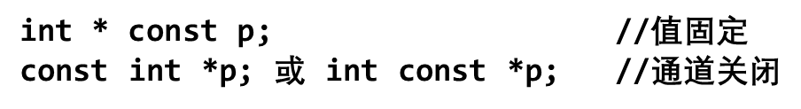

更新时间：2023.7.17

# 一、基础知识

# 二、专题整理

## 1.数组排序

### 冒泡排序

```c
// 数组x[N],中间变量t要与数组类型一致
for (int i = 1; i < N; i++)
{
    int flag = 0;
    for (int j = 0; j < N - i; j++)
    {
        if (x[j] > x[j + 1]) // 从小到大排序
        {
            t = x[j], x[j] = x[j + 1], x[j + 1] = t;
            flag = 1;
        }
    }
    if (flag == 0)
        break;
}
```

### 选择排序

```c
// 数组x[N],中间变量t要与数组类型一致
for (int i = 0; i < N - 1; i++)
{
    int k = i;
    for (int j = i + 1; j < N; j++)
    {
        if (x[j] < x[k]) // 从小到大排序
            k = j;
    }
    if (k != i)
        t = x[k], x[k] = x[i], x[i] = t;
}
```

# 三、错题整理

1. 有一个长度 ≤10 且只包含大写字母的单词。我们在写作时不小心把它写错了，写错的单词与正确的单词中每种字母的个数相同，那么有多少种不同的写错的单词呢？
   Input
   输入一行字符串，长度 ≤10 且只包含大写字母
   Output
   输出一个整数，即答案

   Sample Input
   EYE
   ZZZZZZZZ
   ACCEPT

   Sample Output
   2
   0
   359

   Hint
   写错的单词有两种：YEE、EEY

   ```c
   #include <stdio.h>
   #include <string.h>
   int main()
   {
       int a[100] = {0}, sum, sum1;
       char s[10];
       sum = sum1 = 1;
       gets(s);
       for (int i = 0; i < strlen(s); i++)
       {
           a[s[i]]++; // 用角标标记各个字母
           sum *= i + 1;
       }
       for (int i = 0; i < 100; i++)
       {
           if (a[i] >= 2)
           {
               for (int j = 1; j <= a[i]; j++)
                   sum1 *= j;
           }
       }
       printf("%d", sum / sum1 - 1);
       return 0;
   }
   ```

2. 现在你有一个包含 N 个正整数的数组 Array，你只知道数组中的最小值是 MIN，最大值是 MAX，那么 ∑ ^N^~i=1~{Array[i]}有多少种不同的结果？
   Input
   输入三个正整数 N,MIN,MAX
   1<=N<=10^9^,1<=MIN<=MAX<=10^9^
   Output
   输出一个正整数，即答案

   Sample Input
   2 5 6
   10000000 100 100
   1 100000 100000
   3 1 3

   Sample Output
   1
   1
   1
   3

   ```c
   #include <stdio.h>
   int main()
   {
       long long n, min, max;
       scanf("%lld%lld%lld", &n, &min, &max);
       printf("%lld", (n - 2) * max - (n - 2) * min + 1);
       return 0;
   }
   ```

3. 我们定义 $\varphi (x)$ 为 x 的因子个数，那么 $\varphi (1) = 1$，$\varphi (9) = 3$。如果 $\varphi (x) = 3$，那么我们就认为 x 是一个有趣的数，因此 9 是一个有趣的数。
   给定一个闭区间[1, N]，请你计算：在这个闭区间内有多少个有趣的数？
   输入描述:
   输入一个正整数 N
   $1 \le N \le 10^{12}$
   输出描述:
   输出一个整数，即答案

   示例 1
   输入
   10
   输出
   2
   说明
   [1, 10]内有两个有趣的数：4、9

   ```c
   #include <stdio.h>
   int main()
   {
       long long i, j, n, sum = 0;
       scanf("%lld", &n);
       for (i = 2; i * i <= n; i++)
       {
           for (j = 2; j * j <= i; j++)
           {
               if (i % j == 0)
                   break;
           }
           if (j * j > i)
               sum++;
       }
       printf("%lld", sum);
       return 0;
   }
   ```

4. 现在你有 N 堆硬币，每堆硬币中都有 N 枚硬币。其中 N-1 堆硬币中每枚硬币的重量都为 1g，只有剩下的一堆硬币中每枚硬币的重量为 2g，但你并不知道哪堆硬币中的硬币重量为 2g。
   你有一个能称任意重量的电子秤，在最优策略下，请问最多需要称多少次就能知道哪堆硬币中的硬币重量为 2g？（可以把不同堆的硬币混合在一起称重，只需知道哪堆硬币中的硬币重 2g 即可）
   输入描述:
   输入一个正整数 N
   $1 \le N \le 10^{12}$
   输出描述:
   输出一个整数，即答案

   示例 1
   输入
   2
   输出
   1
   说明
   从一堆硬币中拿出一枚硬币称重，如果重量为 1g，那么另一堆硬币中硬币的重量都为 2g；如果重量为 2g，那么此堆硬币中的硬币重量都为 2g
   示例 2
   输入
   1
   输出
   0

   ```c
   #include <stdio.h>
   int main()
   {
       long n;
       scanf("%d", &n);
       if (n == 1)
           printf("0");
       else
           printf("1");
       return 0;
   }
   ```

# 关于 C 与语言的杂七杂八

1. 标识符构造规则
   - 由字母、数字和下划线组成
   - 数字不能开头
   - 关键字和保留字不能用
2. double 用`%lf`输入`%f`输出
3. 计算时先统一单位制
4. 做加法和乘法时小心溢出
5. `++` `--`的算子为变量
6. 数位`(int)log10(x)+1`
7. `log()`是 ln，`log10()`是 log10
8. 随机数

   - 随机数种子`int srand(unsigned int seed)`seed 默认为 1，取值范围 0~4294967295(32 位)
   - 时间函数`time_t time(time_t *_Time)`返回`long long`，做种子时被截断
   - 若产生 [m,n] 范围内的随机数`rand()%(n-m+1)+m`

     ```cpp
     srand(time(0));
     int a = rand();
     ```

9. unsigned 让变量最高位 1 无效，适用于作纯二进制运算
10. 传入`printf()`时`char`等转为`int`，`float`转为`double`
    - 注：可以看作是强制类型转换
11. 强制类型转换只是计算，不改变变量的值
12. `printf("%.3f",ans)`会四舍五入
13. 函数的大括号必须有！
14. C 语言变量按堆自顶向下存放，故先定义的变量地址数值更大
15. `printf()`多行输出

    ```cpp
    printf("123456894\n"
           "151916169161\n"
           "15fds  sdsfd\n");
    ```

16. `%i`和`%d`
    - `scanf()`中`%i`可接受八进制和十六进制
    - `printf()`中二者相同
17. `++`比`*`优先级高
    - `*p++`取出`p`指向的变量，`p`向后移动一次
    - `(*p)++` `p`指向的变量自增
18. 指针常量
    
19. `int putchar(int_ch)`其他类型变量传入函数会转为`int`，返回值为运行状态
20. 字符串数组的`sizeof(a)`和`strlen(a)`不同！
21. 字符串常用函数

    - 长度`size_t strlen(const char *_Str)`

      ```cpp
      int mylen(const char *s)
      {
          int cnt = 0;
          while (*s++ != '\0')
              cnt++;
          return cnt;
      }
      ```

    - 比较`int strcmp(const char *_Str1, const char *_Str2)`

      ```cpp
      int mycmp(const char *s1, const char *s2)
      {
          while (*s1 == *s2 && *s1 != '\0')
          {
              s1++;
              s2++;
          }
          return *s1 - *s2;
      }
      ```

    - 复制`char * strcpy(char *__restrict__ _Dest, const char *__restrict__ _Source)`restrict 关键字表示 Dest 与 Source 存储地址不能重叠

      ```cpp
      char *mycpy(char *dst, const char *src)
      {
          char *ret = dst;
          while (*dst++ = *src++)
              ;
          return ret;
      }
      ```

    - 连接`char * strcat(char *__restrict__ _Dest, const char *__restrict__ _Source)`

      ```cpp
      char *mycat(char *dst, const char *src)
      {
          char *ret = dst;
          while (*dst++)
              ;
          dst--;
          while (*dst++ = *src++)
              ;
          return ret;
      }
      ```

    - 搜索

      - 字符搜索

        - 自左向右`char * strchr(const char *_Str, int _Val)`
        - 自右向左`char * strrchr(const char *_Str, int _Ch)`
        - 应用

          - 找第 n 个

            ```cpp
            char a[] = "abgcdefghijgklmgn";
            int n;
            cin >> n;
            char *p = strchr(a, 'g');
            for (int i = 1; i < n; i++)
                p = strchr(p + 1, 'g');
            puts(p);
            ```

          - 获取右侧

            ```cpp
            char a[] = "abgcdefghijgklmgn";
            char *p = strchr(a, 'g');
            char *ret = (char *)malloc(strlen(p) + 1);
            strcpy(ret, p);
            puts(ret);
            free(ret);
            ```

          - 获取左侧 将 p 所指改为'\0'来截断字符串

            ```cpp
            char a[] = "abgcdefghijgklmgn";
            char *p = strchr(a, 'g');
            char tmp = *p;
            *p = '\0';
            char *ret = (char *)malloc(strlen(a) + 1);
            strcpy(ret, a);
            puts(ret);
            *p = tmp;
            free(ret);
            ```

      - 字符串搜索
        - 普通`char * strstr(const char *_Str, const char *_SubStr)`

    - 安全版本
      - strcpy()：`char * strncpy(char *__restrict__ _Dest, const char *__restrict__ _Source, size_t _Count)`最多拷贝 count 个字符
      - strcat()：`char * strncat(char *__restrict__ _Dest, const char *__restrict__ _Source, size_t _Count)`最多连接 count 个字符
    - 其他：strncmp()：`int strncmp(const char *_Str1, const char *_Str2, size_t _MaxCount)`只比较前 maxcount 个字符

22. 联合体

    - 定义

      ```cpp
      typedef union
      {
          int i;
          char ch[sizeof(int)];
      } intch;
      ```

    - 应用：`i`和`ch[]`共用一段内存，可用于探查整数`i`内各个字节的储存值

23. 标准头文件格式

    ```cpp
    #ifndef __NAME_H__
    #define __NAME_H__

    #include "max.h"
    double max(double, double);
    typedef struct
    {
        int a;
        double b;
    } sa;

    #endif
    ```

24. qsort()函数

    - 格式：qsort ( 数组名 ，元素个数，元素占用的空间(sizeof)，比较函数)
    - 比较函数 ==从大到小后减前，从小到大前减后==

      ```cpp
      int cmp(const void *a, const void *b)
      {
          return (*(struct sa *)b).score - (*(struct sa *)a).score;
      }
      ```

25. 复数乘法：(a+bi)(c+di)=(ac-bd)+(bc+ad)i
26. 指针类型
    - `int* a;`指向整形的指针
    - `int* a[5];`一维指针数组（存放着 5 个指向整形的指针）`a+i`指向第`i`个指针元素的地址
    - `int (*a)[5];`行指针（指向一个一维数组且一维数组含 5 个元素）`a+i`指向第`i`个一维数组的首地址
    - `int (*a)(int,int);`函数指针（指向`int f(int,int)`类型函数）
27. `int atoi(const char *_Str)`转 string 为 int
28. 二维数组一遍过
    - 单纯指针篇
      - 最高级指针 a a+1 a+2 a+i 行指针
      - 第二层上半（上一层的取星\*）`a[0] a[1] a[2] a[i]` 列指针指向行首元素
      - 第二层下半（上半的另一种形式）`*a *(a+1) *(a+2) *(a+i)` 列指针指向行首元素
      - 第三层上半（上一层列指针的行内平移）`a[i]+1 a[i]+2 a[i]+j` 列指针指向行内第 j 个元素
      - 第三层下半（上半的另一种形式）`*(a+i)+1 *(a+i)+2 *(a+i)+j` 列指针指向行内第 j 个元素
      - 第四层 （元素层，上一层的取星*）`a[i][j] *(\*(a+i)+j)`
    - 存放字符串篇
      - 储存
        - scanf()
          `scanf("%s",a+i);`
          `scanf("%s",a[i]);`
          `scanf("%s",*(a+i));`
          `scanf("%s",&a[i][0]);`
        - gets()
          `gets(a[i]);`
          `gets(*(a+i));`
          `gets(&a[i][0]);`
      - 输出
        `printf("%s",a+i);`
        `printf("%s",a[i]);`
        `printf("%s",*(a+i));`
        `printf("%s",&a[i][0]);`
29. 四舍五入 变量类型一定要是`double`

    ```cpp
    double sum = 0;
    for (int i = 0; i < n; i++)
    {
        sum += data[i];
    }
    int ans = (int)(sum / n + 0.5);
    ```

30. gcd 与 lcm

    ```cpp
    int gcd(int a, int b)
    {
        return b ? gcd(b, a % b) : a;
    }
    int lcm(int a, int b)
    {
        return a / gcd(a, b) * b;
    }
    ```

31. 快速幂

    ```cpp
    ll fastPower(ll base, ll power)
    {
        ll result = 1;
        while (power > 0)
        {
            if (power & 1)
            {
                result = result * base % 1000; // 后三位
            }
            power >>= 1;
            base = (base * base) % 1000; // 后三位
        }
        return result;
    }
    ```

32. 整体

    ```cpp
    #include <math.h>
    #include <time.h>
    #include <stdio.h>
    #include <stdlib.h>
    #include <string.h>
    typedef long long ll;
    int main()
    {

        return 0;
    }
    ```

33. 链表函数

    ```cpp
    typedef struct
    {
        char num[10], name[23], sex;
        double score[3], avg, sum;
    } sa;
    typedef struct node
    {
        sa data;
        struct node *next;
    } LNode;

    LNode *Head = NULL;

    LNode *findPre(LNode *H, LNode *p);
    LNode *createA();                           // n个节点 头插
    LNode *createB();                           // n个节点 尾插
    LNode *LinsertA(LNode *H, LNode *p, sa *x); // 前插
    LNode *LinsertB(LNode *H, LNode *p, sa *x); // 后插
    LNode *LdeleteA(LNode *H, LNode *p);        // 删前
    LNode *LdeleteX(LNode *H, LNode *p);        // 删当前
    LNode *LdeleteB(LNode *H, LNode *p);        // 删后
    LNode *Lfree(LNode *H);                     // 清空链表

    LNode *findPre(LNode *H, LNode *p)
    {
        LNode *pre = H;
        while (pre != NULL && pre->next != p)
            pre = pre->next;
        return pre;
    }

    LNode *createA() // n个节点 头插
    {
        LNode *Head;
        Head = (LNode *)malloc(sizeof(LNode));
        Head->next = NULL;
        int x;
        // for (int i = 0; i < n; i++)
        // {
        //     scanf("%d", &x);
        //     LinsertB(Head, Head, x);
        // }
        return Head;
    }

    LNode *createB() // n个节点 尾插
    {
        LNode *p = Head;
        Head = (LNode *)malloc(sizeof(LNode));
        Head->next = NULL;
        int x;
        // for (int i = 0; i < n; i++)
        // {
        //     scanf("%d", &x);
        //     LinsertB(Head, p, x);
        //     p = p->next;
        // }
        p->next = NULL;
        return Head;
    }

    LNode *LinsertA(LNode *H, LNode *p, sa *x)
    {
        LNode *pre = findPre(H, p);
        LNode *newNode = LinsertB(H, pre, x);
        return newNode;
    }

    LNode *LinsertB(LNode *H, LNode *p, sa *x)
    {
        LNode *newNode = (LNode *)malloc(sizeof(LNode));
        newNode->data = *x;
        newNode->next = p->next;
        p->next = newNode;
        return newNode;
    }

    LNode *LdeleteA(LNode *H, LNode *p)
    {
        LNode *pre = findPre(H, p);
        LNode *ppre = findPre(H, pre);
        LdeleteB(H, ppre);
        return H;
    }

    LNode *LdeleteX(LNode *H, LNode *p)
    {
        LNode *pre = findPre(H, p);
        LdeleteB(H, pre);
        return H;
    }

    LNode *LdeleteB(LNode *H, LNode *p)
    {
        LNode *theNode = p->next;
        p->next = theNode->next;
        free(theNode);
        return H;
    }

    LNode *Lfree(LNode *H)
    {
        LNode *p;
        while (H != NULL)
        {
            p = H->next;
            free(H);
            H = p;
        }
        return NULL;
    }
    ```
