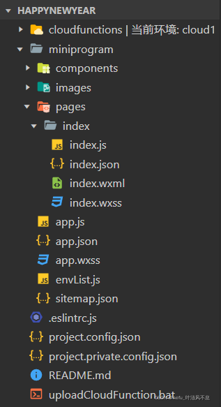
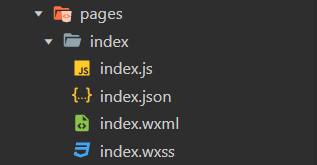
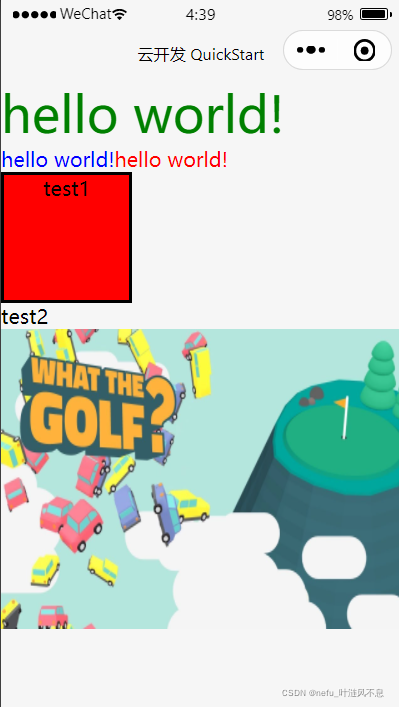
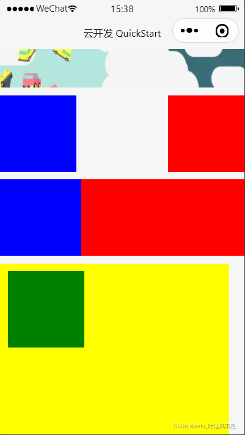

[== >W3school< ==](https://www.w3school.com.cn/)

## 项目文件目录



- `cloudfunctions` 云函数文件夹
- `miniprogram` 小程序文件夹（主要）
  - `components`
  - `images` 图片文件夹
  - `pages` 页面文件夹
  - `app.js`
  - `app.json` 小程序配置文件
  - `app.wxss`

## pages 页面文件夹

创建 `index` 主页面

`json` 配置文件，功能实现
`wxml` 页面内容
`wxss` 页面样式，针对标签调整样式

### index.wxml

1. 标签

    ```html
    <!--
    标签：
    行标签(text)：同一行展示，不嵌套其他标签
    块标签(view)：换行展示，可嵌套其他标签

    标签属性（标签尖括号内）：
    全局属性（可用于任何标签）：class 类名，可相同；id 唯一标识符
    其他属性：src 图像文件的 URL
    -->

    <text class="hello" id="one">hello world!</text>
    <!-- 行标签，放文本 -->

    <view>
        你好
        <!-- 无标签元素，不可用 wxss 控制样式 -->
        <text class="hello" id="two">hello world!</text>
        <text>hello world!</text>
        <view class="test">test1</view>
        <view>test2</view>
    </view>
    <!-- 块标签，嵌套标签使用 -->

    <image src="../../images/what the golf.jpg"></image>
    <!-- src <image>必选属性，图像文件的绝对或相对路径 -->
    ```

    注：**增删 html 标签后形成微信小程序组件**

2. 布局方式

    ```html
    <!-- 
    布局方式：
    浮动（float）
    弹性布局（flex）
    定位（position）
    -->
    <view class="box-content-float">
        <view class="view1-float"></view>
        <view class="view2-float"></view>
    </view>
    <view class="box-content-flex">
        <view class="view1-flex"></view>
        <view class="view2-flex"></view>
    </view>
    <view class="box-content-position">
        <view class="view1-position"></view>
    </view>
    ```

3. 变量使用

    ```html
    <!-- 变量引用基本用双花括号 -->
    <view>{{str}}</view>
    <view>{{str2}}</view>

    <view wx:for="{{arr}}" wx:key="item">数字：{{item}}</view>
    <!-- wx:for标签重复出现 -->

    <view wx:if="((boo))">hello</view>
    <view wx:else>HELLO</view>
    <!-- wx:if标签条件展示 -->
    ```

    `wx:key` ：如果列表中项目的位置会动态改变或者有新的项目添加到列表中，并且希望列表中的项目保持自己的特征和状态（如 input 中的输入内容，switch 的选中状态），需要使用 `wx:key` 来指定列表中项目的唯一的标识符

    `wx:key` 的值以两种形式提供
   - 字符串，代表在 `for` 循环的 `array` 中 `item` 的某个 `property`，该 `property` 的值需要是列表中唯一的字符串或数字，且不能动态改变
   - 保留关键字 `*this` 代表在 `for` 循环中的 `item` 本身，这种表示需要 `item` 本身是一个唯一的字符串或者数字

    当数据改变触发渲染层重新渲染的时候，会校正带有 key 的组件，框架会确保他们被重新排序，而不是重新创建，以确保使组件保持自身的状态，并且提高列表渲染时的效率
    **如不提供 wx:key，会报一个 warning， 如果明确知道该列表是静态，或者不必关注其顺序，可以选择忽略**

### index.wxss

1. CSS选择器

    ```css
    /* 标签选择器，针对所有该标签元素 */
    text {
        color: red;
    }

    /* 类选择器，针对特定类名，加点号 */
    .hello {
        color: blue;
    }

    /* 绘制方形 */
    .test {
        width: 100px;
        height: 100px;
        background-color: red;
        border: solid;
        /* 显示边框 */
        text-align: center;
        /* 文本居中对齐 */
    }

    /* id选择器，针对唯一id，加井号 */
    #one {
        color: green;
        font-size: 40px;
        /* 字号调整为40像素 */
    }
    ```

2. 浮动布局

    ```css
    /* 浮动（float） */
    /* 按文本流依次浮动，到边框后换行撑开，有图片，加盒子模型和外边距 */
    .box-content-float {
        margin-top: 10px;
        /* 上外边距 */
    }

    .view1-float {
        height: 100px;
        width: 100px;
        background-color: blue;
        float: left;
    }

    .view2-float {
        height: 100px;
        width: 100px;
        background-color: red;
        float: right;
    }
    ```

3. 弹性布局

    ```css
    /* 弹性布局（flex） */
    /* 设置弹性盒模型，子元素没有规定 width 值时以 flex-grow 值为比例展示 */
    .box-content-flex {
        margin-top: 10px;
        /* 上外边距 */
        display: flex;
        /* 在父级加弹性布局，以代替子元素的浮动 */
        justify-content: space-between;
        /* 内部元素两端对齐（space-between） */
    }

    .view1-flex {
        height: 100px;
        background-color: blue;
        flex-grow: 1;
    }

    .view2-flex {
        height: 100px;
        background-color: red;
        flex-grow: 2;
    }
    ```

4. 定位布局

    ```css
    /* 定位（position） */
    /* 相对定位 */
    .box-content-position {
        margin-top: 10px;
        height: 300px;
        width: 300px;
        background-color: yellow;
        position: relative;
        /* 父级打个样，但不移动 */
    }

    .view1-position {
        height: 100px;
        width: 100px;
        background-color: green;
        position: absolute;
        /* 相对于最近的定位祖先元素进行定位 */
        left: 10px;
        /* 距离左侧10像素，定位后可用 */
        top: 10px;
        /* 距离上有10像素，定位后可用 */
    }
    ```

### index.js

```js
/**
* 页面的初始数据
*/
// js 数据类型（5基本+2引用）：
// 基本数据类型：字符型 String，数值型 Number，布尔型 Boolean，未初始化 Undefined，空对象 Null
// 引用数据类型：数组 Array，对象 Object

// data存放页面内使用的所有变量，可在 AppData 内查看
data: {
str: "Hello World",
str2: 123,
str3: undefined,
arr: [1, 2, 3, 4, 5, 6],
obj: {
    name: "abc",
    age: 12,
    speak: function () {
    
    }
},
boo: true
},
```

## app.json

```js
{
"pages": [
    "pages/index/index"
],
"window": {
    "backgroundColor": "#F6F6F6",
    "backgroundTextStyle": "light",
    "navigationBarBackgroundColor": "#F6F6F6",
    "navigationBarTitleText": "云开发 QuickStart",
    "navigationBarTextStyle": "black"
},
"sitemapLocation": "sitemap.json",
"style": "v2"
}
```

**注：`pages` 数组自动存放小程序所有页面**

## 效果展示




