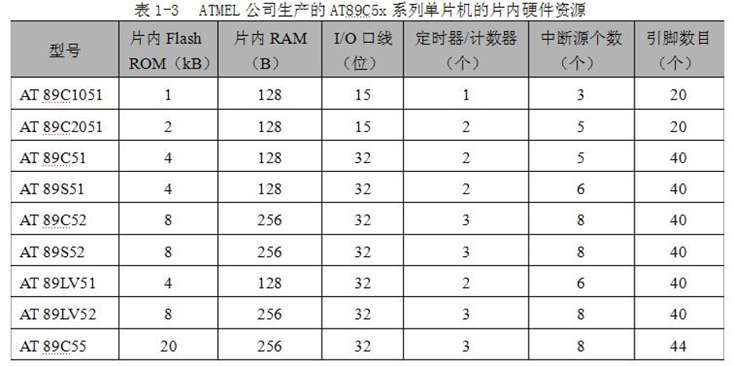

# 第一章 单片机概述


## 单片机的概念

单片机

- 20世纪70年代问世
- 嵌入式控制器
- 微控制器

```
半导体硅片集成
    CPU
    存储器
    并行/串行I/O
    定时器/计数器
    中断系统
    系统时钟电路
    系统总线
属性
    微型计算机
应用
    测控
```

分类

```
按用途
    通用型 可开发资源全部给用户
    专用型 特定用途
按处理二进制位数
    4位
    8位
    16位
    32位
```

## 发展历史

四个阶段

```
第一阶段（1974年 ～ 1976年）
    初级阶段
    莫斯特克公司&仙童公司 -> 8位 F8（8位CPU、64B RAM、2个并行口）
第二阶段（1976年 ～ 1978年）
    低性能单片机阶段
    1976年 Intel -> 8位 MCS-48
    1977年 GI -> PIC1650
第三阶段（1978年 ～ 1983年）
    高性能单片机阶段
    1978年 Zilog -> Z8
    1980年 Intel -> MCS-51
    Mortorola -> 6801
第四阶段（1983年 ～ 现在）
    8位单片机巩固发展，16位、32位单片机推出阶段
    16位 Intel -> MCS-96系列
    20世纪90年代 新型高集成度的单片机
```

## 单片机的特点

- 体积小、价格低、应用方便、稳定可靠
- 集成电路、微型计算机、易嵌入系统
- 增加外围扩展电路，可灵活构成各种应用系统
- 用于工业自动化等

## 单片机的应用

- 工业检测与控制
  - 机电一体化技术
  - 机器人技术
- 仪器仪表
  - 自动化、数字化、智能化、多功能化
- 消费类电子产品
- 通信
- 武器装备
- 终端及计算机外部设备
- 汽车电子设备
- 分布式多机系统

## 单片机的发展趋势

多功能、高性能、高速度、低电压、低功耗、低价格、大容量、外围电路内装化

```
CPU
    数据总线宽度（8 16 32）
    双CPU
存储器
    片内程序存储器 闪存
    加大存储容量
片内I/O
    并行口驱动能力
    特殊串行I/O功能 分布式、网络化系统
低功耗化
    CMOS
    等待状态、睡眠状态、关闭状态
外围电路内装化
    系统单片化
编程、仿真简单化
    在线编程/在系统编程 ISP
    在应用编程 IAP
```

## MCS-51 系列与 AT89C5x 系列单片机

MCS-51 系列

- Intel
- 最早进入我国

```
低功耗型 80C31/80C51/87C51
基本型 8031/8051/8751
    8031
        8位 CPU
        128B RAM
        21个 SFR
        4个8位并行I/O口
        1个全双工串行口
        2个16位定时器/计数器
        5个中断源
        片内无程序存储器，需外扩程序存储器芯片
    8051 4KB ROM 程序存储器
    8751 4KB EPROM 程序存储器
增强型 8032/8052/8752
    8052
        256B RAM
        8KB ROM
        3个16位定时器/计数器
        6个中断源
        5倍串行口通信速率
```




# 第二章 AT89S51 单片机的硬件结构


## 硬件组成


功能部件

```
微处理器 CPU
    8位
    运算器、控制器
    位处理功能
数据存储器 RAM
    128B RAM（52 -> 256B）
    片外 64KB
程序存储器 ROM
    4KB Flash ROM（AT89S52 -> 8KB，AT89C55 -> 20KB）
    片外 64KB
中断系统
    5个中断源、5个中断向量
    2级中断优先权
定时器/计数器
    2个16位、可编程（52 -> 3个）
    4种工作方式
串行口
    通用异步收发传输器（UART）
    1个、全双工、异步
    4种工作方式
    串行通信、扩展并行I/O口、构成多机通信系统
并行I/O口
    4个8位、可编程
    P0口、P1口、P2口、P3口
特殊功能寄存器 SFR
    26个
    管理、控制和监视
    控制寄存器、状态寄存器
    映射片内 RAM 区 80H ～ FFH 内（128B）
看门狗定时器 WDT
    1个
    程序死循环或跑飞时恢复
低功耗模式
    空闲模式
    掉电模式
    掉电状态下的中断恢复模式
3个程序加密锁定位
```

程序跑飞原因

- 意外中断
- 地址溢出
- 死循环
- 堆栈溢出

与AT89C51比的优点

- 在系统编程（ISP）字节和页编程，灵活调试程序
- 2个数据指针，便捷 RAM 访问
- 看门狗定时器，提高抗干扰能力
- 增加断电标志
- 增加掉电状态下的中断恢复模式

特性

- 基本结构
  - 传统微机结构 CPU+外围芯片
- CPU 对功能部件的控制
  - 集中控制方式
  - 特殊功能寄存器

## 引脚功能


40 只引脚双列直插

```
电源引脚
    VCC 40 +5V
    VSS 20 数字地
时钟引脚
    XTAL1 19 外部晶振
        振荡器和时钟输入端
        振荡器 外接石英晶体和微调电容
        外部时钟 外接时钟信号
    XTAL2 18
        振荡器输出端
        振荡器 外接石英晶体和微调电容
        外部时钟 悬空
控制引脚
    RST（RESET）9
        >2个机器周期高电平 -> 复位
        <=0.5V -> 正常工作
        看门狗溢出 -> 输出 96 个时钟振荡周期高电平
    EA*/VPP 31
        EA* 外部程序存储器访问允许
            EA*=1 小内大外
                PC<=0FFFH 读片内 4KB
                PC>0FFFH 读片外 60KB（1000H ~ FFFFH）
            EA*=0 只读外
                读片外 64KB（0000H ~ FFFFH）
                4KB Flash 无效
        VPP 片内 Flash 编程电压（5/12V）
    ALE/PROG* 30
        ALE
            外部存储器低八位地址锁存控制信号
            正常工作 正脉冲输出 f=f(晶振)/6
            访问外部 丢失一个 ALE 脉冲
            禁止位不影响外部存储器访问
        PROG* 片内 Flash 编程脉冲输入
    PSEN* 29
        片外程序存储器读选通信号
        低有效
并行I/O口引脚
    P0口 漏极开路的双向I/O口（不能输出高电平）
        通用I/O口
            准双向口
            外加上拉电阻
            作输入先写1
            8个LS型TTL负载
        外扩存储器 I/O接口芯片
            双向三态I/O口
            低8位地址总线及数据总线
            分时复用（ALE 控制）
    P1口
        通用I/O口
            准双向口
            内有上拉电阻
            作输入先写1
            4个LS型TTL负载
        P1.5/MOSI P1.6/MISO P1.7/SCK
            片内 Flash 串行编程和校验
            串行数据输入 输出 移位脉冲
    P2口
        通用I/O口
            准双向口
            内有上拉电阻
            作输入先写1
            4个LS型TTL负载
        外扩存储器 I/O接口芯片
            高8位地址总线
    P3口
        通用I/O口
            准双向口
            内有上拉电阻
            作输入先写1
            4个LS型TTL负载
        第二功能见表
```


## CPU

运算器

```
ALU
    8位
    算术运算
    逻辑运算
    位操作
累加器 A
    8位
    寄存器
    汇编有时写为 Acc
    ALU 输入输出
    瓶颈堵塞 -> 不经过累加器的传送指令
    Cy
        进位标志
        位处理机位累加器
程序状态寄存器 PSW
    SFR D0H
    Cy Ac F0 RS1 RS0 OV - P
    Cy 进位标志位
        1 进位/借位
        位处理机位累加器
    Ac 辅助进位标志位
        BCD 码（8421 余三码）
        1 D3向D4进位/借位
    F0 用户设定标志位
        自定义 flag
    RS1 RS0 选择工作寄存器区
        共4组
        00H～07H +8*4
    OV 溢出标志位
        1 溢出
    - 保留位
    P 奇偶标志位
        累加器A中1的个数
        1 奇数
        0 偶数
```

控制器

```
任务
    识别指令（指令读入、译码、执行）
    控制功能部件（定时、逻辑）
程序计数器 PC
    16位计数器
    不可直接访问
    复位 -> 0000H
    PC内容变化轨迹
        顺序执行 +1
        转移程序、子程序、中断子程序 =目标地址
    PC计数宽度
        程序存储器 ROM 地址范围
        16位 -> 64KB（2^16B）
```

## 存储器

哈佛结构
    程序存储器与数据存储器分离

存储器空间

```
程序存储器
    片内外访问EA*决定
        1 地址决定内外
        0 只读片外 忽略片内
    片内
        4KB Flash
        0000H ~ 0FFFH
    片外
        扩展至 64KB
        0000H ~ FFFFH
        16位地址线
    中断程序入口（5条跳转指令）
        外部中断0 0003H
        定时器T0 000BH
        外部中断1 0013H
        定时器T1 001BH
        串行口 0023H
    0000H
        PC复位值
        存放主程序入口跳转指令
数据存储器
    片内 00H ~ 7FH
        128B RAM
        00H ~ 1FH
            32字节
            4组通用工作寄存器区
            RS0 RS1选择
        20H ~ 2FH
            16字节
            16*8=128位可位寻址/字节寻址
        30H ~ 7FH
            数据，堆栈
    片外
        扩展至 64KB
        低128B地址相同，访问指令不同
特殊功能寄存器 SFR
    26个
    片内RAM 80H ~ FFH
    比AT89C51新增5个
        DP1L DP1H AUXR AUXR1 WDTRST
    位寻址
        末位0H 8H
        读/写未定义 -> 随机数
    SP 堆栈指针
        指向堆栈顶部在 RAM 中的地址
        复位 07H 一般改为 >60H
        堆栈
            子程序调用
            中断操作
            保护断点和现场
                现场 寄存器内容
    B 乘除 辅助寄存器
        A 乘数 被除数 商
        B 乘数 乘积 除数 余数
    AUXR 辅助寄存器
        - - - WDTDLE DISRTO - - DISALE
        DISALE ALE脉冲控制
      0 ALE发出脉冲
         1 不访问外部存储器时，ALE不输出脉冲信号
     DISRTO WDT溢出时复位输出控制
      0 WDT溢出时，RST输出一个高电平
      1 禁止WDT，RST仅作输入
     WDIDLE WDT空闲模式控制。
       0 计数；
       1 暂停计数
    AUXR1 辅助寄存器
        - - - - - - - DPS
        DPS 数据指针寄存器选择
            0 DPTR0
            1 DPTR1
    DPTR0 DPTR1 数据指针寄存器
        复位 选DPTR0
        作16位/两个8位
    WDT 看门狗寄存器
        14位计数器
        定时器复位寄存器 WDTRST
位地址
    211个可寻址位
        00H ~ FFH
        片内 RAM
            128位 20H ~ 2FH
        SFR
            83位
    RAM 128位 + SFR 83位
```


## 并行I/O端口

P0口
外扩RAM I/O 地址/数据总线
否则 通用I/O

```
复用地址/数据总线
    连接外部扩展的存储器和I/O连接
    输出低8位地址
    输出/输入8位数据
    双向端口
通用I/O
    外加上拉电阻
    准双向口
```

P1口
通用I/O

```
输出口
    不用外加上拉电阻
输入口
    读锁存器 Q
    读引脚 引脚电平
        向锁存器写1
准双向口
```

P2口
双功能口 不可兼用

```
地址总线口
    输出高8位地址
    输出锁存器内容不变
通用I/O
    准双向口
    同P1
```

P3口

```
第二功能
    输出 锁存置1
    输入 锁存和第二功能输出均置1
        读引脚
通用I/O
    输出 第二功能输出置1
    输入 锁存和第二功能输出均置1
        读引脚
```

## 机器周期、指令周期、指令时序

```
时钟周期
    T=1/f(晶振)
机器周期
    T=12*T(时钟)
    CPU基本操作时间
    6个状态 每个两拍
    计数周期
指令周期
    一条指令所需时间
    单双字节指令 单双机器周期
    三字节指令 双机器周期
    乘除指令 4机器周期
```

## 低功耗节电模式

工作模式

```
空闲模式
    关闭CPU时钟信号
    CPU 空闲
    振荡器工作
    外围电路工作
    WDT受WDIDLE控制
    其他寄存器 RAM 保持之前状态
    退出
        响应任一中断
        硬件复位
掉电保持模式
    后备电源供电
    所有部件停止
    WDT停止
    RAM SFR 内容保留
    退出
        硬件复位（复位SFR 不改RAM）
        外部中断
```

PCON 寄存器

```
SMOD - - - GF1 GF0 PD IDL
SMOD 串行波特率选择
GF1 GF0 通用标志位 flag
PD 1 进入掉电保持模式
IDL 1 进入空闲模式
```

@[TOC]

# 第三章 C51语言编程基础


## C51与C差异

```
库函数
数据类型
变量存储模式
数据存储类型
    内部存储区
        data idata bdata
    外部存储区
        xdata pdata
    程序存储区（内外）
        code
中断函数
输入输出
    串口初始化
头文件
不能递归
```

## C51基础

数据类型
    扩展的4种不能用指针

```
bit
    1/0 true/false
    bit bit_name
    不能定义指针和数组
    只能为 data idata
sfr
    sfr地址声明
    sfr sfr_name = sfr_addr
sfr16
    声明两字节sfr
    sfr16 sfr_name = sfr_low_addr
sbit
    声明sfr的可位寻址位
    sbit sbit_name = sfr_name^[0~7]
    sbit sbit_name = sbit_addr
```

存储类型
    缺省用默认

```
data
idata
bdata
xdata
pdata
```


存储模式（编译模式）
    变量传递单一/混合

```
SMALL
    默认 data
COMPACT
    默认 pdata
LARGE
    默认 xdata
```

SFR

```
直接寻址
位定义
    sbit sbit_name sfr_name^index
    sbit sbit_name sfr_addr^index
    sbit sbit_name sbit_addr
```

头文件
    `#include <REGX51.H>`

绝对地址访问

```
绝对宏
    #include <absacc.h>
    CBYTE/WORD
    DBYTE/WORD
    XBYTE/WORD
    PBYTE/WORD
    #define ADDR_NAME ADDR_TYPE[abs_addr]
_at_
    全局变量
    [data_type] type 变量 _at_ abs_addr
    字节/字寻址由 type 决定
    变量可为数组，表示指定起始位置
```

指针

```
基于存储器的指针
    1/2字节 储存地址
    type data_type *[point_data_type] point_name*
    [point_data_type] type data_type *point_name*
    指向 type 类型变量，变量存储类型为 data_type，指针存储类型为 point_data_type
一般指针
    3字节 存储器类型 偏移量高位 偏移量低位
        存储器类型
            idata/data/bdata 0x00
            xdata 0x01
            pdata 0xFE
            code 0xFF
    type *point_name
常数指针
    直接给指针字节赋值
    编译器不检查
    #define XBYTE ((char*)0x10000L)
    指针存储器类型 01
    偏移量高位 00
    偏移量低位 00
```

## 函数

中断服务函数

```
关键字 interrupt
不考虑现场保护/恢复等
fon_type fon_name (形参列表) interrupt n [using m]
    n 0~4 五个中断
    m 0~3 四个工作寄存器组 -> 压栈保护
```

# 第五章 与显示器、开关、键盘接口设计

## 发光二极管

二极管

```
工作电流 1~5mA
内阻 20~100Ω
供电电压 +5V
限流电阻 1~3kΩ
```

连接
    较大驱动能力 -> 低电平输出

```
P1 P2 P3
    低电平驱动
    高电平驱动 -> 驱动电路
```

## 开关

    判断开关状态 -> 读端口电平

## LED 数码管

    共阴极 共阳极（使用）
    字形码/段码
    显示模式
        静态
            同时显示
            各自 a~dp 连接 8个I/O口
            n位 n*8组I/O口
            无闪烁，亮度高，易控制
        动态
            位选 段码
            快速切换位选，暂留同时亮假象

```
// 共阴极：位选低电平（即0）有效，段选为高电平（即1接+5V时）选中各数码段（0~f）
// 共阴段选表，无小数点
unsigned char code seg[16] = {0x3f, 0x06, 0x5b, 0x4f, 0x66, 0x6d, 0x7d, 0x07, 0x7f, 0x6f, 0x77, 0x7c, 0x39, 0x5e, 0x79, 0x71};
// 共阴段选表，有小数点
unsigned char code seg[16] = {0xbf, 0x86, 0xdb, 0xcf, 0xe6, 0xed, 0xfd, 0x87, 0xff, 0xef, 0xf7, 0xfc, 0xb9, 0xde, 0xf9, 0xf1};
// 共阴位选表，8个
unsigned char code idx[8] = {0xfe, 0xfd, 0xfb, 0xf7, 0xef, 0xdF, 0xbF, 0x7F};

// 共阳极：位选高电平（即1）有效, 段选为低电平（即0接地时）选中各数码段（0~f）
// 共阳段选表，无小数点
unsigned char code seg[16] = {0xc0, 0xf9, 0xa4, 0xb0, 0x99, 0x92, 0x82, 0xf8, 0x80, 0x90, 0x88, 0x83, 0xc6, 0xa1, 0x86, 0x8e};
// 共阳段选表，有小数点
unsigned char code seg[16] = {0x40, 0x79, 0x24, 0x30, 0x19, 0x12, 0x02, 0x78, 0x00, 0x10, 0x08, 0x03, 0x46, 0x21, 0x06, 0x0e};
// 共阳位选表，8个
unsigned char code idx[8] = {0x01, 0x02, 0x04, 0x08, 0x10, 0x20, 0x40, 0x80};
```

LED 点阵显示器
    图文 视频

## 键盘

键盘分类
    非编码键盘
        直接与单片机相连
        按键少
        健号由软件获取
        独立式键盘 矩阵式键盘
        键号软件读取
        分类
            独立式键盘
                一个按键一个I/O口
                按下 -> 低电平
                检测
                    查询
                    中断
                        while 循环，响应中断，获得键值，处理函数
            矩阵式键盘
                检测
                    查询
                        行线置0，列线置1
        扫描方式
            查询扫描
            定时扫描
                T<100ms
            中断扫描
                按下 -> 发送中断请求信号
按键开关
分类
    有触点开关键盘
        触摸，按键式
    无触点按键

特点
    按钮两端在行线、列线上

任务
    判断是否有键按下
        检测行线高/低电平
        消除抖动
            软件延时
            接口芯片
    判断哪个键
    进入对应程序

# 第六章 中断系统

## 中断技术概述

中断技术消除查询等待时间，提高效率和实时性

## 中断系统结构

5中断源

```
外部中断
    低电平/负跳变有效
    中断引脚 INT0/INT1
    中断标志 IE0/IE1
定时器/计数器溢出中断
    中断标志
        T0 TF0
        T1 TF1
串行口中断
    中断标志
        发送中断 TI
        接收中断 RI
```

2种优先级
    可嵌套
    同级不打断

中断请求标志寄存器

```
定时器/计数器控制寄存器 TCON
    SFR 88H
    TF1 TR1 TF0 TR0 IE1 IT1 IE0 IT0
    复位时五个中断标志位均为零，无中断
    TF1 定时器/计数器T1溢出中断请求标志
        1 中断
        0 响应中断后硬件/软件清零
    TF0 定时器/计数器T0溢出中断请求标志
    IE1 外部中断请求1中断请求标志位
        1 中断
        0 响应后硬件清零
    IE0 外部中断请求0中断请求标志位
    IT1 外中断请求1触发方式
        0 电平触发？？？？？？？？？？？？？？？？？？？？？？？？？？？？？？？？？？？？？？？？？？？？？？？？？？？？？？？？
        1 负跳变触发
    IT0 外中断请求0触发方式
串行口控制寄存器 SCON
    SFR 98H
    - - - - - - TI RI
    TI 串行口发送中断请求标志
        1 中断 硬件自动置1
            CPU -> 1B数据 -> SBUF -> 发送1帧数据 -> 置TI为1
        0 中断服务程序中指令清零
    RI 串行口接收中断请求标志
        1 中断 硬件自动置1
            接收1帧数据 -> 置RI为1
        0 中断服务程序中指令清零
```

## 中断允许与中断优先级

```
中断允许寄存器 IE
    SFR A8H
    EA - - ES ET1 EX1 ET0 EX0
    复位清零，禁止中断
    EA 总中断开关
        0 屏蔽所有中断请求
        1 开中断
    ES 串行口中断
    ET1 定时器/计数器T1溢出中断
    EX1 外部中断1
    ET0 定时器/计数器T0溢出中断
    EX0 外部中断0
中断优先级寄存器 IP
    SFR B8H
    - - - PS PT1 PX1 PT0 PX0
    复位清零，均为低级
    PS 串行口中断优先级
        0 低级
        1 高级
    PT1 定时器/计数器T1溢出中断优先级
    PX1 外部中断1优先级
    PT0 定时器/计数器T0溢出中断优先级
    PX0 外部中断0优先级
```

同级查询顺序
    外部中断0
    T0溢出
    外部中断1
    T1溢出
    串行口中断

## 中断响应条件

响应的必要条件
    EA=1
    中断标志=1
    中断允许位=1
    无同级或高级中断在处理

中断封锁条件
    有同级或更高级中断在处理
    查询的机器周期是不是最后一个机器周期
    正在执行的指令是RETI或访问IE IP
        RETI 2机器周期
            还原PC
            清除优先级激活触发器
        访问IE IP 中断允许与响应冲突

中断响应
    硬件生成长调用指令
    PC入栈
    PC=中断入口地址 8*n+3
        外部中断0 0003H
        T0溢出 +8
        外部中断1 +8
        T1溢出 +8
        串行口中断 +8

## 中断响应时间

置中断标志位~中断响应
    3~8机器周期

最短 3机器周期
    查询标志位 1
    长调用 2

最长 8机器周期
    RETI或访问IE IP 2
    乘除指令 4
    长调用 2

## 外部中断

电平触发
    低电平有效
    提高响应速度
    中断服务结束前必须撤销
跳沿触发
    负跳变
    负脉冲保持1机器周期

## 中断请求撤销

定时器/计数器
    硬件自动清零，自动撤销
外部中断
    电平方式
        中断标志位自动清零
        修改引脚电平，手动改为高电平
    跳沿方式
        中断标志位清零 IE0 IE1 硬件自动清零
        外中断信号撤销，脉冲结束，自动撤销

## 中断函数

中断服务函数

```
void 函数名() interrupt m using n
    m 中断号 0~4
    n 工作寄存器组 0~3
    不能直接调用
    其调用的函数所用寄存器区应与中断函数不同
```
