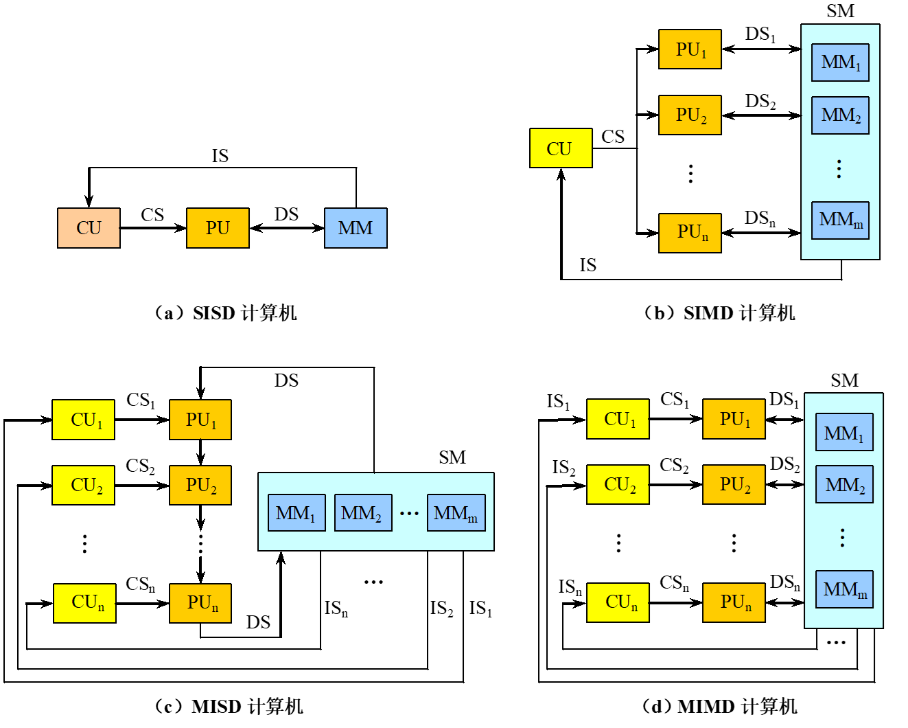
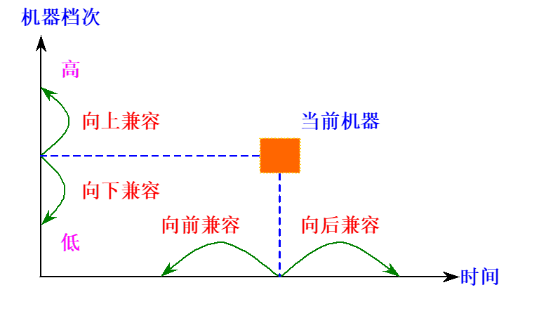
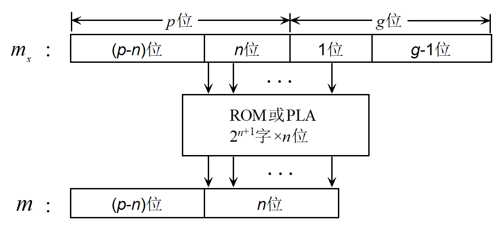
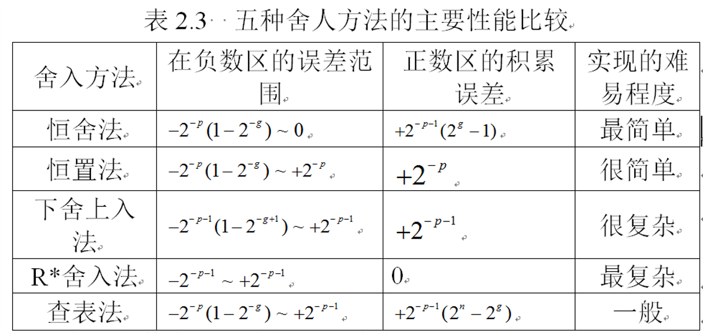
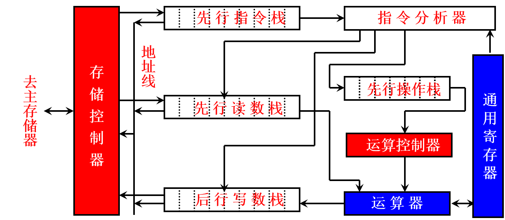
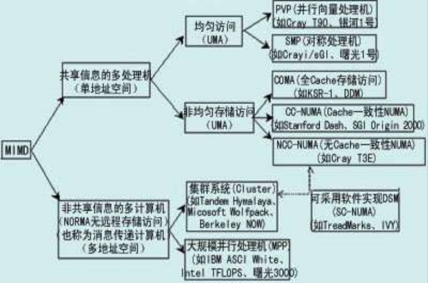

# 第一章 计算机系统结构基本概念

> 课程内容 A I P S N
>
> 工业革命

## 1.1 计算机系统结构的概念

引言

- 第一台通用计算机 1946
- 两个方面：制造技术、体系结构
- 计算机系统结构：architecture
  - 程序员所看到的计算机属性，即概念性结构与功能特性
  - 指令系统结构、组成、硬件
  - 计算机系统结构是程序员所看到的计算机属性，即（硬件子系统的）概念结构及其功能特性，是计算机软硬件的交界面
  - 计算机系统的软、硬件的界面，即机器语言程序员所看到的传统机器级所具有的属性
  - 实质：确定软硬件界面
- 计算机组成：计算机系统结构的逻辑实现
- 研究任务：软硬件功能分配、软硬件界面的确定
- 系列机：相同系统结构，不同组成和实现

层次结构

- 计算机系统 = 硬件/固件 + 软件
  - 固件：具有软件功能的硬件
- 计算机语言角度：把计算机系统按功能划分成多级层次结构，每一层以一种语言为特征
  - 物理机: 由硬件/固件实现
  - 虚拟机：由软件实现，某些操作可以由硬件或固件实现
  - 低层机器属性对高层机器程序员透明
- 机器级的实现：翻译、解释（慢，占用内存少）

分类

- Flynn分类法
  - 分类标准：指令流和数据流的多倍性
    - 多倍性：在系统最受限的部件上，同时处于同一执行阶段的指令或数据的最大数目
  - SISD
  - SIMD
  - MISD
  - MIMD
  - 基本结构
    - IS：指令流
    - DS：数据流
    - CS：控制流
    - CU：控制部件
    - PU：处理部件
    - MM、SM：存储器

- 冯氏分类法
  - 分类标准：最大并行度
    - 最大并行度：计算机系统在单位时间内能够处理的最大的二进制位数（字宽*字数）
    - 平均并行度：取决于系统的运用程度，与应用程序有关
      - 每个时钟周期同时处理的二进制位数为 Pi，T 个时钟周期
        - 平均并行度 $P_{a}=\frac{\sum_{i=1}^{T} P_{i}}{T}$
        - 平均利用率 $\mu=\frac{P_{a}}{P_{m}}=\frac{\sum_{i=1}^{T} P_{i}}{T P_{m}}$
  - 字串位串：n＝1，m＝1 每次只对一个字的一位进行处理，第一代计算机
  - 字串位并：n＞1，m＝1 同时处理单个字的多个位，单处理机，如16位、32位等
  - 字并位串：n＝1，m＞1 同时处理多个字的同一位（位片）
  - 字并位并：n＞1，m＞1 同时处理多个字的多个位

- Handler分类法
  - 分类标准：并行度和流水线
  - t(系统型号) = (k,d,w)
    - k：程序控制部件（PCU）的个数
    - d：算术逻辑部件（ALU）或处理部件（PE）的个数
    - w：每个算术逻辑部件包含基本逻辑线路(ELC)的套数
  - t(系统型号) = (k*k',d*d',w*w')
    - k'：宏流水线中程序控制部件的个数
    - d'：指令流水线中算术逻辑部件的个数
    - w'：操作流水线中基本逻辑线路的套数

## 1.2 计算机体系结构的发展

存储程序计算机体系结构及其发展

- 存储程序原理基本点：指令驱动
- 冯·诺依曼结构
  - 运算器为中心
  - 指令和数据同等对待
  - 存储器是按地址访问
  - 指令的执行是顺序的
  - 指令由操作码和地址码组成
  - 指令和数据均以二进制编码表示，采用二进制运算
- 非诺依曼体系结构
  - 数据驱动
  - 诺依曼瓶颈：中央处理器（ CPU ）和主存之间只有一条每次只能交换一个字的数据通路
  - 优点
    - 支持高度的并行操作
    - VLSI技术
    - 提高软件生产能力
  - 缺点
    - 操作开销过大
    - 不能有效地利用传统诺依曼体系结构计算机已积累起来的丰富的软件资源
- 系统结构改进
  - 输入/输出方式
    - 程序控制：等待、中断
    - DMA：成组传递、周期挪用
    - I/O处理机：通道、外围处理机
  - 并行处理技术
  - 存储器组织结构的发展
  - 指令系统的发展
    - 复杂指令集计算机CISC
    - 精减指令集计算机RISC

软件影响：可移植性

- 统一高级语言
- 系列机：同一厂家、相同系统结构、不同组成和实现
  - 向上（下）兼容
  - 向前（后）兼容：
    - 向后兼容：系列机的根本特征
  - 兼容机：不同厂家、相同系统结构
- 模拟和仿真
  - 在一种系统结构上实现另一种系统结构
  - 在一种机器上实现另一种机器的指令集
  - 模拟：虚拟机
    - 解释实现，速度较慢
  - 仿真：目标机
    - 比模拟快，系统结构差距不大

器件影响

- 系统结构发展的最活跃因素：
- 摩尔定律：集成电路芯片上所集成的晶体管数目每隔18个月就翻一番

应用影响

- 系统结构发展的最根本的动力：应用需求
- 特殊领域需要高性能的系统结构

## 1.3 系统结构中并行性的发展

并行性

- 概念：计算机系统在同一时刻或者同一时间间隔内进行多种运算或操作
  - 同时性：同一时刻
  - 并发性：同一时间间隔
- 并行性等级，由低到高
  - 数据处理
    - 字串位串：每次只对一个字的一位进行处理
    - 字串位并：同时处理单个字的多个位
    - 字并位串：同时处理多个字的同一位（位片）
    - 字并位并（全并行）：同时处理多个字的多个位
  - 执行程序
    - 指令内部并行：单条指令中各微操作之间的并行
    - 指令级并行：并行执行两条或两条以上的指令
    - 线程级并行：并行执行两个或两个以上的线程
    - 任务级或过程级并行：并行执行两个或两个以上的过程或任务（子程序/进程）
    - 作业或程序级并行：并行执行两个或两个以上的作业或程序
- 提高并行性技术途径
  - 时间重叠：处理过程错开，加快硬件周转
  - 资源重复：重复设置硬件资源
  - 资源共享：软件方法，顺序轮流使用同一套硬件设备
- 单机系统的并行性
  - 时间重叠：主导作用，部件功能专用化
  - 资源重复：多体存储器，多操作部件（指令级并行），阵列处理机
  - 资源共享：虚拟机，分时系统
- 多机系统的并行性
  - 分类：同构型多处理机、异构型多处理机、分布式系统
  - 耦合度：多机系统中各机器之间物理连接的紧密程度和交互作用能力的强弱
    - 紧密耦合系统（直接耦合系统）：总线或高速开关互连，共享主存
    - 松散耦合系统（间接耦合系统）：通道或通信线路互连，共享外存
    - 最低耦合：除某种中间介质外，无连接无共享
  - 功能专用化（时间重叠、异构型多处理机）
  - 机间互连（同构型多处理机系统）
- 并行机的发展
  - 并行机的萌芽阶段（1964年～1975年）
  - 向量机的发展和鼎盛阶段（1976年～1990年）
  - MPP出现和蓬勃发展阶段（1990年～1995年）
  - 各种体系结构并存阶段（1995年～2000年）
  - 机群蓬勃发展阶段（2000年以后）

## 1.4 系统结构的设计

任务

- 指令系统的设计、数据表示的设计、功能的组织、逻辑设计以及其物理实现等
- 三个方面
  - 确定用户对计算机系统的功能、价格和性能的要求
  - 软硬件功能分配（平衡）
  - 设计出生命周期长的系统结构（符合发展方向）

主要方法

- “由上往下”（top-down）设计
  - 适合于专用机的设计，而不适合通用机的设计
- “由下往上”（bottom-up）设计
  - 软件技术为被动状态，软硬件脱节，系统效率降低
  - 现在很少使用
- “从中间开始”（middle-out）设计
  - 中间：软硬件的交界面

程序局部性原理

- 时间局部性：即将用到的信息很可能就是目前正在使用的信息
- 空间局部性：即将用到的信息很可能与目前正在使用的信息在空间上相邻或者临近

设计准则

- 以经常性事件为重点（大概率事件优先原则）
  - 优化：分配更多资源

Amdahl 定律

- 系统加速比 $S_n$ ：> 1；改进前与改进后总执行时间之比 $S_n=\frac{T_0}{T_n}=\frac{1}{1-F_e+\frac{F_e}{S_e}}$
  - 可改进比例 $F_e$ ：< 1；改进前，可改进部分执行时间在总执行时间中的占比
  - 部件加速比 $S_e$ ：> 1；可改进部分改进后性能提高的倍数。改进前执行时间与改进后执行时间的比
  - 改进后程序的总执行时间 $T_n$ ：$T_0=(1-F_e+\frac{F_e}{S_e})$
    - $T_0$ 改进前总执行时间
- 如果只对整个任务的一部分做改进，则改进得越多，所得到的总体性能提升就越有限
  - 如果只对整个任务的一部分做改进，则加速比不超过 $\frac{1}{1-F_e}$

## 1.5 定量分析技术基础

性能评测

- 执行时间、吞吐率
- 用户：执行时间（单个程序所花的时间）
- 数据中心管理员：吞吐率（单位时间里能够完成的任务）
- CPU时间
  - CPU执行所给定的程序所花费的时间，不包含I/O等待时间以及运行其它程序的时间
  - 用户CPU时间：用户程序所耗费的CPU时间
  - 系统CPU时间：用户程序运行期间操作系统耗费的CPU时间

基准测试程序

- 最佳选择：真实应用程序
- 简化程序：不可靠
  - 核心测试程序：真实程序的关键代码段
  - 小测试程序：100行以内的小程序
  - 合成的测试程序：按比例合成
- 基准测试程序套件：真实应用程序构成
  - 分类：处理器性能测试程序，图形性能测试程序
  - SPEC系列

评价标准

- 主要性能指标
  - MIPS：每秒百万指令数
    - $MIPS = \frac{CI}{执行时间 \times 10^6} =\frac{1}{CPI \times T \times 10^6} = \frac{f}{CPI \times 10^6}$
  - MFLOPS：每秒百万浮点指令数
    - $MFLOPS = \frac{浮点操作次数}{执行时间 \times 10^6}$
  - 执行时间
    - 总执行时间：执行所有程序时间的加和
    - （加权）平均执行时间：各个测试程序的算术/加权平均值
    - 调和平均值法
      - 加权调和平均值公式
    - 几何平均值法
      - 加权几何平均值

CPU性能

- CPU时间：执行一个程序所需的CPU时间
  - CPU时间 = 执行程序所需的时钟周期数 × 时钟周期时间（系统时钟频率的倒数）
  - CPU时间 = IC × CPI × 时钟周期时间
  - 时钟周期时间：硬件实现、计算机组成
  - CPI：计算机组成、指令系统结构
  - IC：指令系统结构、编译技术
  - 计算机系统有 n 种指令
    - 时钟周期数 = $\sum_{i=1}^{n}(CPI_i \times IC_i)$
    - CPU时间 = $\sum_{i=1}^{n}(CPI_i \times IC_i)$ × 时钟周期时间
    - $CPI = \frac{\sum_{i=1}^{n}(CPI_i \times IC_i)}{IC} = \sum_{i=1}^{n}(CPI_i \times \frac{IC_i}{IC})$
- CPI：指令执行的平均时钟周期数
  - CPI = 执行程序所需的时钟周期数 / IC
- IC：执行的指令条数
@[TOC]

# 第二章 数据表示与指令系统

> 习题2.10

## 2.1 数据表示

基本概念

- 数据类型：计算机系统使用和处理的数据类型，整数、布尔数、字符、文件、图、表、树、阵列、队列、链表、栈、向量、串
- 数据表示：硬件直接识别和引用，有相应运算指令和硬件支持，定点数据表示、逻辑数据表示、浮点数据表示
- 数据结构：带有结构的数据元素的集合，串、队列、栈、向量、阵列、链表、树、图
- 关系
  - $数据表示 \subseteq 数据类型$ $数据结构 \subseteq 数据类型$
  - 数据表示：硬件容易实现的简单数据类型
  - 数据结构：软件实现，转换为数据表示

基本数据表示

- 内容：定点数、浮点数、十进制数、逻辑数、字符等
- 目的：支持数据结构，提高系统性能
- 设计：根据应用需求，设计参数指标

浮点数数据表示

- 浮点数格式
  - $N = m \cdot r_m^e$ 其中 $e = r_e^g$
    - 两数：$m$ 尾数，$e$ 阶码
    - 两基：$r_m$ 尾数基，$r_e$ 阶码基
  - 1 位 $m_f$ | 1 位 $e_f$ | q 位 $e$ | p 位 $m$
    - 两符号：$m_f$ 尾数符号，$e_f$ 阶码符号
    - 两字长：$p$ 尾数字长，$q$ 阶码字长
- $r_m$ 尾数基值选择
  - $r_m$ 加大，表数范围加大。表数个数增多。表数精度变低。运算精度损失变小。运算速度变快
  - 巨/大/中型机 $r_m$ 宜取大，尾数字长较长弥补精度损失
  - 小/微型机 $r_m$ 宜取小，提高精度弥补尾数字长较短
- 尾数下溢处理方法（$p+g$ 位尾数）
  - 截断法（恒舍法）：舍去 g 位
  - 恒置法：p 的最低一位置为 $r_m/2$
  - 下舍上入法：g 位中间值为界，小于舍去，大于等于则入
  - R*舍入法：判断 g 位代码是否为 10…00，再用下舍上入法或恒置法
  - 查表法：见下图
- 警戒位
  - 作用：
    - 左规格化时移入尾数有效字长内
    - 舍入
  - 来源
    - 做加、减法时，因对阶从有效字长内移出去的部分。
    - 做乘法时，双倍字长乘积的低字长部分。
    - 做除法时，因没有除尽而多上商的几位。
    - 右规格化时移出有效字长的那部分。
    - 从十进制实数转换成二进制浮点数时，尾数超出有效字长的那部分。
- 浮点数格式设计
  - 多数机器
    - 尾数：原码、小数、尾数基 $r_m - 2$
    - 阶码：移码、整数、阶数基 $r_e - 2$
  - 规格化浮点数的表数精度最高

高级数据表示

- 内容：堆栈、向量、数组（队列）、记录、自定义数据表示等
- 目的：支持数据结构，提高系统性能
- 问题：高级语言与机器语言存在语义差距
- 解决方法
  - 带标志符的数据表示法
    - 数据格式：标志符+数值
    - 标识符：编译器或其他软件设置，对程序员和用户透明
    - 存储空间分析：数据字长加长，指令字长缩短
    - 优缺点
      - 优点
        - 简化指令系统和程序设计
        - 简化编译程序
        - 便于硬件实现一致性校验
        - 能由硬件自动完成数据类型的变换
        - 为软件调试和应用软件开发提供支持
      - 缺点
        - 数据和指令的长度可能不一致
        - 指令执行速度降低
        - 硬件复杂度增加
  - 数据描述符表示法

## 2.2 指令集结构的分类

分类依据

- CPU中操作数存储方法（主要准则）
  - 堆栈型指令系统
    - 优点：指令长度短，代码密度高，占用存储空间小
    - 缺点：代码效率低，执行效率不高
  - 累加器型指令系统
    - 优点：指令长度短，代码密度高，代码效率高
    - 缺点：执行效率不高
  - 寄存器型指令系统（主流结构：通用寄存器型）
    - 优点：指令简单，执行效率高，对编译程序支持好
    - 缺点：指令长度长
- 指令中显式操作数个数
- 寻址方式
- 操作类型
- 操作数类型和大小

通用寄存器型指令系统

| 指令集结构类型  | 地址，操作数 | 优点                                                           | 缺点                                                                                               |
| --------------- | ------------ | -------------------------------------------------------------- | -------------------------------------------------------------------------------------------------- |
| 寄存器-寄存器型 | 0，3         | 简单，指令字长固定，简单的代码生成模型，指令执行时钟周期数相近 | 和存储器型相比指令条数多，目标代码较大                                                             |
| 寄存器-存储器型 | 1，2         | 直接对存储器操作数访问，容易指令编码，目标代码较小             | 操作数类型不同。一条指令中同时对寄存器和存储器操作数编码，将限制寄存器个数。指令执行时钟周期数不同 |
| 存储器-存储器型 | 3，3         | 最紧密编码方式，无需"浪费"寄存器保存变量                       | 指令字长不同。指令执行时钟周期数不同，存在存储器访问瓶颈                                           |

指令系统选择

- 指令执行效率
- 寄存器个数，操作数个数
- OS 对编译程序的支持

## 2.3 寻址技术

常用寻址方式
| 寻址方式           | 指令实例            | 含义                                                 |
| ------------------ | ------------------- | ---------------------------------------------------- |
| 寄存器寻址         | ADD R1, R2          | Regs[R1]←Regs[R1]+ Regs[R2]                          |
| 立即值寻址         | ADD R1, #3          | Regs[R1]←Regs[R1]+ 3                                 |
| 偏移寻址           | ADD R1, 100(R2)     | Regs[R1] ← Regs[R1]+ Men[100 + Regs[R2]]             |
| 索引寻址           | ADD R1, (R3 + R2)   | Regs[R1]←Regs[R1]+ Men[Regs[R1]+ Regs[R2]]           |
| 寄存器间接寻址     | ADD R1, (R2)        | Regs[R1]←Regs[R1]+ Men[Regs[R2]]                     |
| 直接寻址或绝对寻址 | ADD R1, (1000)      | Regs[R1]←Regs[R1]+ Men[1000]                         |
| 存储器间接寻址     | ADD R1, @(R2)       | Regs[R1]←Regs[R1]+ Men[Men[Regs [R2]]]               |
| 自增寻址           | ADD R1, (R2)+       | Regs[R1]←Regs[R1]+Men[Regs [R2]]Regs[R2]←Regs[R2]+d  |
| 自减寻址           | ADD R1, -(R2)       | Regs[R2]←Regs[R2]-d Regs[R1]←Regs[R1]+Men[Regs [R2]] |
| 缩放寻址           | ADD R1, 100[R2](R3) | Regs[R1] ← Regs[R1]+Men[100+ Regs[R2]+ Regs[R3]*d]   |

寻址方式选择：频度分析法

寻址方式参数选择：频度分析法

定位方式

- 直接定位方式
  - 在程序装入主存储器之前，程序中的指令和数据的主存物理地址就已经确定
- 静态定位方式
  - 在程序装入主存储器的过程中随即进行地址变换，确定指令和数据的主存物理地址
- 动态定位方式
  - 在程序执行过程中，当访问到相应的指令或数据时才进行地址变换，确定指令和数据的主存物理地址

## 2.4 指令格式的优化设计

指令的组成

- 指令：操作码+地址码
  - 操作码：操作种类、操作数类型
  - 地址码：操作数地址、地址附加信息、寻址方式

优化目标

- 节省存储空间
- 指令格式规整，减少硬件译码复杂度

操作码优化

- 评价方法
  - 平均码长：$l = \sum_{i=1}^{n}p_i \cdot l_i$
    - $p_i$ 第 i 种操作码在程序中出现的概率
    - $l_i$ 第 i 种操作码的编码长度
    - $n$ 操作码的总数
  - 信息冗余量：$R = 1-\frac{H}{l}$
    - $H = -\sum_{i=1}^{n}p_i \cdot \log_{2}{p_i}$ 信息熵，理论最短平均码长
- 编码方法
  - 固定长度操作码
    - $n$ 种操作码 $\left \lceil \log_{2}{n} \right \rceil $ 位操作码
    - 特点：规整，硬件译码简单，浪费严重
  - 哈夫曼编码
    - 特点：最优化编码，平均码长最短，信息冗余量最小，不规整
    - 编码方法
      - 从小到大排列概率
      - 最小两个合并，节点值为概率和
      - 最后得到一个概率为 1 的节点
      - 每个节点两个分支，左 0 右 1
      - 从 1 节点到指令节点的路径代码为指令编码
  - 扩展编码法
    - 对哈夫曼编码，根据频率分布，将编码长度扩展成有限几种长度
    - 等长扩展
      - 4-8-12（15/15/15）
      - 4-8-12（8/64/512）
    - 不等长扩展
      - 4-6-10（15/3/16，8/31/16，8/30/32，8/16/256，4/32/256）

地址码优化

- 地址个数
- 优化单个地址码
  - 目的：较短地址码表示较大逻辑地址空间
  - 方法
    - 寄存器间接地址（最有效）
    - 间址寻址
    - 变址寻址

指令字格式优化

- 问题：操作码和地址码优化使得指令字不定长
- 合理结合，长操作码 + 短地址码

## 2.5 指令集结构的功能设计

性能

- 完整性：通用计算机应具备的基本指令种类
- 高效率：执行速度快，使用频度高
- 兼容性：计算机系统的生命力之所在
- 规整性：硬件和软件设计需要
  - 对称性：数据存储设备的使用、操作码的设置要对称
  - 均匀性：不同数据类型、字长、操作种类和数据存储设备，指令同等对待

基本指令系统

- 数据传送类指令
- 运算类指令
- 程序控制指令
- 输入输出指令
- 处理机控制和调试指令

复杂指令系统（CISC）

- 思想：增强原有指令功能，设置复杂指令取代软件子程序的功能，实现软件功能硬化
- 面向目标程序优化
  - 目的：减少程序时空复杂度
  - 指令使用频度
    - 静态使用频度：源代码统计，减少空间复杂度
    - 动态使用频度：运行时统计，减少时间复杂度
    - $指令动态使用频度 \approx 指令静态使用频度$
  - 优化方法
    - 高频率指令：增强功能，加快速度，缩短字长
    - 高频率指令串：新指令替代
    - 低频率指令：取消或合并，考虑兼容性
- 面向高级语言优化
  - 目的：减小高级语言和机器语言的语义差距，精简编译器，缩短编译时间
  - 优化方法
    - 增强对高级语言支持的指令的功能：优化高级语言
    - 增强对编译程序支持的指令的功能
      - 同时面向各种高级语言优化：使指令系统与各高级语言的语义差距共同缩小
      - 动态自适应指令系统：面向各高级语言的多种指令系统和系统结构，动态切换
    - 高级语言计算机：高级语言和机器语言无语义差距
      - 间接执行高级语言机器：高级语言 = 汇编语言 -> 机器语言
      - 直接执行高级语言机器：高级语言 = 机器语言
- 面向操作系统优化
  - 目的：减少操作系统辅助操作时间和存贮空间
  - 优化方法
    - 操作系统常用指令（串）频率统计，分析改造
    - 增设 OS 专用指令
    - 软件子程序改用硬件/固件实现

精简指令系统（RISC）

- CISC 问题
  - 指令系统复杂
  - 执行速度慢
  - 编译程序难优化
  - 80% 指令只在 20% 运行时间用到
- RISC 定义
  - Carnegie -Mellon大学：大多数指令为单周期，LOAD/STORE结构，硬布线控制逻辑，减少指令和寻址方式的种类，固定的指令格式，注重编译优化技术
  - IEEE的Michael Slater：使流水线处理高效率执行，优化编译器并生成优化代码
- RISC 思想：减少 CPI
- RISC 关键技术
  - 硬件为主固件为辅
  - 在CPU中设置数量较大的寄存器组
    - 重叠寄存器窗口技术
      - 目标：缩短 CALL、RETURN 操作时间
      - 方法：设置大量寄存器，分多组和一个全局区，每组分高、本、低三区，相邻组的高、低区重叠，不同过程使用不同组和共享全局区
      - 寄存器设置：嵌套调用不超过 8 层，每层 24 个寄存器（每个区8个寄存器）可基本满足要求，不满足概率为 1% 左右（可使用主存缓冲）
  - 指令流水执行
    - 延时转移技术
      - 两个限制条件
        - 被移动指令移动过程中与所经过的指令无数据相关
        - 被移动指令不破坏条件码，至少不影响后续指令使用条件码
      - 找不到符合条件的指令：转移指令后面插入空操作，分多个流水段则插入多条指令
    - 指令取消技术：找不到适合转移的指令时使用，尽量少取消指令
      - 向后转移：loop结构
        - 能够使指令流水线在绝大多数情况下不断流，因为绝大多数情况下，转移是成功的
      - 向前转移：if-then-else结构
        - 成功与不成功的概率通常各为50%，效果就不明显。用于转移不成功为主的场合
      - 隐含转移：if-then结构
        - 用于转移成功为主的场合
  - 设计和优化编译系统
    - 指令流调整技术
      - 通过调整指令序列，变量重新命名消除数据相关
- RISC 特点
  - 优点
    - 简化指令系统设计，适合VLSI实现
    - 提高执行速度和效率
    - 降低设计成本，提高了系统的可靠性
    - 可以提供直接支持高级语言的能力，简化编译程序的设计
  - 缺点
    - 加重了汇编语言程序员的负担
    - 对浮点运算和虚拟存储器的支持不够理想
    - 相对来说，RISC机器上的编译程序要比CISC机器上的难写

## 综合实例 MIPS 指令集

概述

- MIPS计算机：简单 64bit load-store 系统结构的 RISC 计算机
- 寄存器
  - 整数寄存器：32 个 64bit 通用寄存器（GPR），R0 永远为零
  - 浮点寄存器：32 个 64bit 浮点数寄存器（FPR），F0~F31
  - 特殊寄存器：浮点状态寄存器等
- 数据表示
  - 整数：字节（8bit）半字（16bit）字（32bit）双字（64bit）
  - 浮点数：单精度（32bit）双精度（64bit）
- 寻址方式：字段长度都为 16bit
  - 只有：立即数、偏移寻址
  - 注意：寄存器间接寻址、16bit绝对寻址
- 指令格式
  - 固定长度：32bit
  - 6bit 操作码，包含寻址方式
- 操作
  - ALU 操作
  - 分支与跳转
  - load/store 操作
  - 浮点数操作：加、减、乘、除，后缀S为单精度，后缀D为双精度
@[TOC]

# 第三章 流水线技术

提高计算机性能

- 缩短 CPI：RISC技术
- 提高指令并行度：流水线技术

## 3.1 先行控制技术

指令重叠执行

- 指令执行时间：$T_i = t_取指令+t_分析+t_执行$
- 执行方式（假设三个阶段的 t 相等，一共 N 条指令）
  - 顺序执行：$T = 3Nt$
  - 重叠执行
    - 一次重叠：$T = (1+2N)t$
    - 两次重叠：$T = (2+N)t$

先行控制技术

- 关键：缓冲技术、预处理技术
- 目的：指令流和数据流的预处理和缓冲，使指令分析器和指令执行独立工作，始终忙碌
- 问题
  - 部件独立
    - 独立取指、分析、执行部件，设置对应存储、指令、运算控制器
  - 主存访问冲突
    - 拆分程序和数据总线和存储器/cache（哈佛结构）
      - 结构复杂，数据线多，对汇编、机器程序员不透明
    - 多体交叉存储结构
    - 先行控制技术
  - 分析和执行指令时间不同
    - 先行控制技术
- 先行控制处理机
  - 缓冲栈深度：$D取指栈≥D操作栈≥D读栈≥D写栈$

## 3.2 流水线的基本概念

概念

- 流水线技术：重复过程 -> 若干子过程，子过程由专门部件实现
- 流水线级或段：子过程及其功能部件
- 流水线深度：流水线段数
- 标量流水：取指、译码、执行、访存、写回
- 流水线结构：功能部件+缓冲寄存器
- 时空图：$k$ 段流水线，$n$ 条指令，每段用时 $\triangle t$
  - 填入时间：$k \cdot \triangle t$
  - 填满+排空时间：$(n-1) \cdot \triangle t$
  - 功能部件延时 $\triangle ts$，锁定时间 $\triangle tl$
    - 最高工作频率 $TP_{MAX} = \frac{1}{\triangle ts+\triangle tl}$
    - 延时时间不等，则最高工作频率 $TP_{MAX} = \frac{1}{max(\triangle ts+\triangle tl)}$
- 特点
  - 每段用时 $\triangle t$ 应尽量相等，否则成为瓶颈，影响吞吐率，造成阻塞或断流
    - 分割瓶颈部件工作
    - 重复设置瓶颈部件
  - 满载时每隔 $\triangle t$ 将有一个结果输出

分类

- 按处理机
  - 操作部件级：处理机算术逻辑运算部件分段，如浮点运算，超流水线处理机，子部件+缓冲
  - 处理机级：指令流水线，拆分指令解释执行过程，部件+缓冲
  - 处理机间级：多处理机系统任务调度策略，处理机+缓冲
- 按功能
  - 单功能：一条流水线完成单一任务
  - 多功能：改变部件连接，从而改变流水线功能，标量运算
- 按工作方式
  - 静态流水线：某功能指令全部流出后，才允许改变部件连接，单/多功能
  - 动态流水线：可在任何时候改变连接，多功能
- 按连接方式
  - 线性流水线：没有反馈连接，常用
  - 非线性流水线：通过反馈线使部件重复使用
- 按流入流出顺序
  - 顺序流水线：输出结果与输入次序相同，早期
  - 乱序流水线：打乱次序利于执行，结果恢复原次序，现代、
- 按数据表示方式：标量流水线、向量流水线
- 按控制方法：同步、异步
  - 处理机内：同步
  - 处理机间：异步

性能指标

- 吞吐率：单位时间内完成任务量
  - $TP = \frac{n}{T_k} = \frac{n}{(m+n-1) \triangle t}$
  - $n$ 完成指令条数
  - $T_k$ 完成任务所用时间 $T_k = (m+n-1) \triangle t$（**各级执行时间相等且无气泡时才可用，否则看图说话**）
  - 当 $n \to \infty$ 时 $TP_{max} = \lim_{n \to \infty} \frac{n}{(m+n-1) \triangle t} = \frac{1}{\triangle t}$
  - m 级流水线，n 条指令，各级执行时间不等
    - $TP = \frac{n}{\sum_{i=1}^{m} \triangle t_i+(n-1)\max(\triangle t_1,\dots,\triangle t_m)}$
    - 当 $n \to \infty$ 时 $TP_{max} = \frac{1}{\max(\triangle t_1,\dots,\triangle t_m)}$
- 加速比：同一批任务，不用和采用流水线所用时间之比
  - $S = \frac{T_0}{T_k} = \frac{nm \triangle t}{(m+n-1) \triangle t} = \frac{nm}{m+n-1}$
  - $T_0$ 不用流水线所用时间 $T_0 = nm \triangle t$（**各级执行时间相等可用，否则看条件说话**）
  - $T_k$ 采用流水线所用时间
  - 当 $n \to \infty$ 时 $S_{max} = \lim_{n \to \infty} \frac{nm}{m+n-1} = m$
  - m 级流水线，n 条指令，各级执行时间不等
    - $S = \frac{n \cdot \sum_{i=1}^{m} \triangle t_i}{\sum_{i=1}^{m} \triangle t_i+(n-1)\max(\triangle t_1,\dots,\triangle t_m)}$
- 效率： n 个任务占用的时空区与 m 个功能段总的时空区之比
  - $E = \frac{T_0}{m \cdot T_k} = \frac{nm \triangle t}{m(m+n-1) \triangle t} = \frac{n}{m+n-1}$
  - 当 $n \to \infty$ 时 $E_{max} = \lim_{n \to \infty} \frac{n}{m+n-1} = 1$
  - m 级流水线，n 条指令，各级执行时间不等
    - $E = \frac{n \cdot \sum_{i=1}^{m} \triangle t_i}{m \cdot [\sum_{i=1}^{m} \triangle t_i+(n-1)\max(\triangle t_1,\dots,\triangle t_m)]}$
  - 效率不高的原因
    - 数据相关
    - 任务较少时，填入和排空所占比例较大
    - 静态流水线导致排空拉长
- 关系（各级执行时间相等）：$S = m \cdot E = m \cdot \triangle t \cdot TP$
- 性能价格比
  - $PCR = \frac{TP_{max}}{C} = \frac{1}{\frac{t}{k}+d} \cdot \frac{1}{a+bk}$
  - $TP_{max} = \frac{1}{\triangle t} = \frac{1}{\frac{t}{k}+d}$
    - $t$ 串行执行一个任务所用时间（取指分析执行一条指令所用时间）
    - $\frac{t}{k}+d$ 同等速度在 k 段流水机执行一个任务所用时间
    - $d$ 锁存器延迟时间
  - $C = a+bk$ 流水线总价格
    - $a$ 流水段本身价格总和
    - $b$ 单个锁存器价格
  - 对 k 求导得，PCR 极值时 $K_0 = \sqrt{\frac{ta}{db}}$
  - k >= 8 超流水线，超流水线处理机

若干问题

- 瓶颈问题：流水线各段不均匀，时钟周期取决于瓶颈段延迟时间
- 额外开销：寄存器延迟，时钟偏移开销
- 冲突问题：重要问题

非线性流水线的竞争与调度

- 冲突
  - 启动距离：前一条指令输入开始到下一条指令输入为止的时间差
    - 禁止启动距离：会引起冲突的启动距离
    - 启动循环：任何时间都不会发生冲突的启动距离
- 最优调度方法
  - 根据预约表写出第一条指令的禁止向量 F
    - 对每个部件计算任意两次复用时间差
    - 求所有部件的时间差的集合为禁止向量 F
    - 向量元素为禁止距离
  - 根据禁止向量计算初始冲突向量
    - 为一串二进制串，F 中存在 i 时该位为 0 否则为 1，串长度 $len = \max(F_i)$（len <= 流水段数 m）
    - 第 i 位表示启动距离为 $i \triangle t$ 时的冲突情况，0 不会冲突，1 冲突
  - 根据初始冲突向量推算出全部冲突向量
    - 初始向量右移，高位补零，地位溢出 1 时不做处理，溢出 0 时与**初始向量**相或，结果加入冲突向量集合
    - 再从向量集合中选中一个未操作向量，重复上述步骤，直至冲突向量集合不再扩展
  - 画出表示冲突向量迁移的有向图
    - 将冲突向量高位隐式补充到 n-1 位，n 为预约表最大周期数
    - 冲突向量第 i 位为 0，右移 i 位后与初始向量相或，得到结果向量，用有向边连接冲突向量节点与结果向量节点，边权为 i
    - 保证节点出度 = 冲突向量中 0 的个数
  - 根据冲突向量迁移图写出启动循环
    - 简单循环：有向图中的闭合回路，（1，7）表示第二条在 1 个周期后进入，第三条在 7 个周期后进入，第四条循环为 1 个周期后进入...
    - 平均启动距离（平均间隔时钟周期数）：闭合回路的平均边权，
    - 最小启动循环（最优调度方案）：平均启动距离最小的，且同时考虑奇、偶条指令的情况
    - 最小恒定循环：只有一条边的闭合回路
  - **计算最大吞吐率**
  - 画出功能部件连接图
    - 最后一个到达的功能部件连接输出

## 3.3 流水操作中的相关

相关

- 概念：指令存在依赖关系
- 名相关：两条指令访问相同名称的寄存器/存储器单元，但没有数据流动
  - 反相关：j 写 = i 读
  - 输出相关：j 写 = i 写
  - 换名技术：修改操作数名，一改全改
- 数据相关：
  - 条件（满足其一即是数据相关）
    - j 使用 i 的结果
    - j 与 k 数据相关且 k 与 i 数据相关（传递性）
  - 存储器数据相关考虑其有效地址
- 控制相关：分支指令引起
  - 两个限制
    - 被分支指令控制的指令不能移动到分支指令之前
    - 不被分支指令控制的指令不能移动到分支指令之后

冲突

- 概念：由于相关使得下一条指令不能在指定时钟周期执行
- 结构冲突：同一时间争用同一功能部件
  - 解决方法：暂停一拍，气泡
- 数据冲突：指令重叠执行导致数据访存顺序改变
  - 解决方法：定向传送技术，旁路技术，相关专用通路技术
  - 类型
    - RAW 先读后写
      - 定向传送技术：顺序流动流水线，不一定管用
      - 互锁硬件：检测流水线冲突，插入暂停，直至冲突消失
      - 指令调度：乱序流动流水线，编译调整指令顺序
    - WAR 先写后读，覆盖了真正想读出的原来的内容，乱序流水
    - WAW 写后写，改变写入顺序，乱序流水
- 控制冲突：分支指令引起 PC 值变化
  - 解决办法
    - 尽早计算目标地址，尽早判断转移是否成功
      - 使得目标地址能在 ID 后可知
    - 预测分支失败
      - 失败：正常流动（不浪费周期）
      - 成功：后一条指令做空（浪费 1T）然后执行目标指令
    - 预测分支成功
      - 条件：先知道目标地址，后知道是否成功（同时知道，则没有作用）
    - 延迟分支：“延长”分支指令执行时间
      - 从前调度：不被依赖，总能提高流水线性能
      - 从目标处调度：失败必须保证被调度的指令对程序的执行没有影响，成功时可提高流水线性能
      - 从失败处调度：成功必须保证被调度的指令对程序的执行没有影响，失败时可提高流水线性能

# 第四章 存储系统

例4-2

- $$\begin{aligned}CPU时间&=(CPU执行周期数+存储器停顿周期数)*时钟周期时间\\&=(CPU执行周期数+访存次数*不命中率*不命中开销)*时钟周期时间\\&=IC*(CPI_{execution}+每条指令平均访存次数*不命中率*不命中开销)*时钟周期时间\end{aligned}$$
  - CPU时间增加$\frac{实际CPI}{CPI_{execution}}$倍
- $CPI_{实际}=CPI_{execution}+每条指令平均访存次数*不命中率*不命中开销$
- $CPI_{无Cache}=CPI_{execution}+每条指令平均访存次数*不命中开销$

例4-3

- 根据不命中开销单位确定是否要乘时钟周期

例4-4

- 块增大，不命中开销增大，即传送时间增大

例4-6？？？

- ？？？

例4-10？？？

- 平均停顿时间？？？

例4-11

- 不命中开销L1=命中时间L2+不命中率L2*不命中开销L2
- 命中时间为不整数个周期，向上或向下取整，再进行计算

例4-1

- load和store操作：数据读写操作
- 分离Cache和混合Cache性能计算
  - 分离Cache=75%指令Cache性能+25%数据Cache性能
  - 混合Cache=75%指令操作时（取指令）性能+25%数据操作时（数据读写）性能
- $平均访存时间=指令所占的百分比*(指令命中时间＋指令失效率*失效开销)＋数据所占的百分比*(数据命中时间＋数据失效率*失效开销)$
- 写直达无所谓？？？

例4-5

- 增加组相联，增加命中时间

例4-7

- 用失效率反推Cache容量

例4-9

-

## 4.1 存储系统的基本概念

存储系统层次结构

- 三个指标：容量、速度、价格（相互矛盾）
- 局部性原理：程序所访问的指令和数据在地址上不是均匀分布的，而是相对簇聚的
  - 时间局部性：要用的就是现在使用的
  - 空间局部性：要用的是现在用的地址相邻的
- 多级存储层次：CPU内（通用存储器、缓冲、Cache（SRAM））、主存（DRAM）、辅存
- 性能参数：两级存储层次 M1 M2
  - 存储容量：S=S2
  - 每位价格：$C=\frac{C_1S_1+C_2S_2}{S_1+S_2}$（当S1<<S2时，C=C2）
  - 命中率和不命中率
    - 命中率：在M1找到的概率 $H=\frac{N_1}{N_1+N_2}$（N1 访问M1的次数，N2 访问M2的次数）
    - 不命中率：F=1-H
  - 平均访存时间：$$\begin{aligned}T_A&=HT_1+(1-H)(T_1+T_M)\\&=T_1+(1-H)T_M\\&=命中时间+不命中率*不命中开销\end{aligned}$$
    - T1 命中时访存时间
    - T2 向M2发出访问请求
    - TB 传送一个信息块）
    - TW=T2+TB 不命中开销
    - T1+TW 不命中访存时间
- 三级存储系统：Cache、主存、辅存
  - Cache——主存：弥补主存速度不足、硬件实现、对系统和应用程序员透明、不命中时CPU不切换
  - 主存——辅存：弥补主存容量不足、软件实现（操作系统）、对应用程序员透明、虚拟存储器、不命中时CPU切换到其他进程
  - 注：CPU不可直接访问辅存
- 四个问题：映象规则、查找算法、替换算法、写策略

## 4.2 Cache 基木知识

基本结构和原理

- Cache和主存按块管理、两者块大小相同、信息按块调入Cache
- 主存地址：块地址+块内位移
  - 块地址（块号）：查找块在Cache的位置
  - 块内位移：确定数据在块内位置
- 地址映象：主存块调入Cache并建立主存和Cache地址对应关系
- 地址变换：主存地址变换为Cache地址
- 选择规则：硬件易实现，地址变换速度快，Cache利用率高，冲突概率小
- 

映象规则

- 全相联映象：主存块可在Cache任意位置
  - 空间利用率最高、冲突概率最低、实现最复杂、速度较慢
  - 1组M路
- 直接映象：主存块只能在Cache唯一位置（循环分配）
  - 空间利用率最低、冲突概率最高、实现最简单、速度较快
  - 主存第i块映象到容量为M块的Cache的第j块
    - j=i mod(M)
    - 若M=2^m，则j为i的低m位（索引）
  - M组1路
- 组相联映象：主存块可在Cache唯一组中的任意位置
  - 主存第i块映象到组数为G组的Cache的第k组
    - k=i mod(G)
    - 若G=2^g，则k为i的低g位（索引）
  - n路组相联：每组n块（n=M/G，n<=4）
    - n为相联度，越高则空间利用率越高、冲突概率越低、不命中率越低
  - G组n路

查找算法？？？

- 目录表：主存地址=块地址+块内位移=标识+索引+块内位移
  - 标识：唯一确定主存块？？？

替换算法

- 直接映象无选择
- 随机法：实现简单
- FIFO：实现简单，不符合局部性原理、很少采用
- LRU：最近最少使用，实际选最久未被访问块，命中率较高，实现较困难
  - 小容量Cache：LRU命中率优于随机法
  - 大容量Cache：LRU和随机法命中率差不多

写策略

- 写访问可能使Cache与主存不一致
- 写命中时
  - 写直达法（存直达法）：写操作时写入Cache也写入下一级存储器
    - 优点：易实现，一致性好
    - CPU停顿：CPU等待写操作结束
      - 写缓冲器：CPU写入缓冲器，缓冲器写入主存
  - 写回法（拷回法）：写操作时只写入Cache，被替换时写回主存，修改位标志
    - 优点：速度快，存储器带宽要求低
- 写不命中时
  - 按写分配（写时取）：先调入，再写入
  - 不按写分配（绕写法）：写入下一级存储器，不调块
- 写回法——按写分配
- 写直达法——不按写分配

Cache结构

Cache性能分析

- 不命中率：与硬件速度无关
- 平均访存时间：平均访存时间=命中时间+不命中率*不命中开销
  - 比不命中率更好
- 程序执行时间
  - 比平均访存时间更好
  - $$\begin{aligned}CPU时间&=(CPU执行周期数+存储器停顿周期数)*时钟周期时间\\&=(CPU执行周期数+访存次数*不命中率*不命中开销)*时钟周期时间\\&=IC*(CPI_{execution}+每条指令平均访存次数*不命中率*不命中开销)*时钟周期时间\end{aligned}$$
    - CPU时间增加$\frac{实际CPI}{CPI_{execution}}$倍
  - $CPI_{实际}=CPI_{execution}+每条指令平均访存次数*不命中率*不命中开销$
  - $CPI_{无Cache}=CPI_{execution}+每条指令平均访存次数*不命中开销$
- 改进Cache性能
  - 降低不命中率
  - 减少不命中开销
  - 减少Cache命中时间

## 4.3 降低 Cache 不命中率

三种不命中（3C）

- 强制性不命中（冷启动不命中，首次访问不命中）：首次访问
  - 增加块大小，预取
- 容量不命中：所需块不能全部调入Cache，块被替换后需要重新访问
  - 增加Cache容量
- 冲突不命中（碰撞不命中，干扰不命中）：组相联或直接映象，同组或同块被多块映象，即使Cache不满，被替换后重新访问
  - 提高相联度（理想情况：全相联）
- 降低Cache不命中率可能增加命中时间和不命中开销

增加Cache块大小

- 给定Cache容量，增大块大小，不命中率先减后增
  - 减小强制性不命中，增加冲突不命中
  - 增大不命中开销
  - 下一级存储器高延迟、高带宽：小Cache块
  - 下一级存储器低延迟、低带宽：大Cache块
- 增大Cache容量，使不命中率最小的块大小增大
  - 降低不命中率最直接办法
  - 增加成本，可能增加命中时间
  - 多用于片外Cache

提高相联度

- 相联度>8等效于全相联
- 经验规则：容量为N的直接映象与容量为N/2的两路组相联不命中率差不多
- 提高相联度：使命中时间增加

牺牲Cache

- Cache-牺牲Cache-下一级存储器：存放被替换的块
  - 减少冲突不命中，不影响时钟频率
  - 尤其适用于小容量直接映象Cache

伪相联Cache（列相联Cache）

- 优点：命中时间小，不命中率低
- 缺点：多种命中时间使CPU流水线设计复杂化
- 原理：直接映象分区，先访问主位置，再访问候选位置
- 快速命中（命中主位置），慢速命中（伪命中）
- 常用于远离处理器位置（二级Cache）

硬件预取

- 失效时取两个块，分别放入Cache和缓冲器
- 指令和数据都可预取
- 预取内容可进Cache或缓冲器
- Cache之外的硬件完成
- 利用空闲带宽，不得影响不命中处理
- 预取时处理器继续执行，非阻塞Cache（非绑定Cache）

编译器控制预取

- 编译时加入预取指令，数据使用前发出预取指令
  - 目的：执行指令和读取数据重叠执行
- 按数据终点位置
  - 寄存器预取：取到寄存器
  - Cache预取：取到Cache
- 预取处理方式
  - 故障性预取：虚地址故障，违反保护权限
  - 非故障性预取（非绑定预取）：遇异常则放弃预取，转为空操作
- 主要对象：循环
  - 不命中开销越大，循环体展开越多次

编译器优化

- 软件优化降低不命中率
- 重组代码和数据
  - 对程序过程重新排序，减少冲突不命中
    - 内外循环交换，按主存的存储顺序访问
    - 循环融合，多个循环合为一个，访问同一数组，减少替换
  - 对齐基本快，程序入口与Cache块起点对齐，减少顺序代码不命中
    - 提高Cache块效率
  - 对调分支目标基本快和紧跟基本块，分支指令取反
  - 数据调整顺序
    - 数组变换为同一Cache内操作
    - 数组合并，多个数组变为复合数组，提高局部性
    - 分块，整行整列变为按块执行

## 4.4 减少 Cache 不命中开销

两级Cache

- 第一级Cache（L1）小而快，第二级Cache（L2）容量大且不影响CPU时钟频率
  - L2是否降低CPI平均访存时间部分
  - 成本
- $\begin{aligned}平均访存时间&=命中时间_{L1}+不命中率_{L1}*不命中开销_{L1}\\&=命中时间_{L1}+不命中率_{L1}*(命中时间_{L2}+不命中率_{L2}*不命中开销_{L2})\end{aligned}$
- $局部不命中率=不命中率L2=\frac{该级不命中次数}{到达该级的访问次数}$
- $全局不命中率=\frac{该级不命中次数}{CPU发出访存总次数}$
  - $全局不命中率_{L2}=不命中率_{L1}*不命中率_{L2}$
- $平均访存停顿时间=平均不命中次数_{L1}*命中时间_{L2}+平均不命中次数_{L2}*不命中开销_{L2}$
- L2>>L1s时，全局不命中率和L2做单极Cache的不命中率差不多
- 第二级参数
  - 容量：大于L1，可能没有容量不命中
  - 相联度：高相联度或伪相联
  - 块大小：较大块
  - 多级包容性：第一级Cache数据是否总同时存在于第二级Cache

读失效优先于写

- 读失效，写缓冲器未清空，从主存读取导致错误
  - 推迟读失效处理，等待缓冲器清空，增大失效开销
  - 检查缓冲器有误地址冲突

子块放置技术

- 减少标识位数，可增加块大小，导致失效开销增加
- 子块放置技术:Cache划分为更小子块，每个子块一个有效位，与下一级存储器以子块为单位传送数据，标识以块为单位
  - 命中：标识匹配，字有效位为1
  - 失效调入子块，失效开销减小
  - 可看作又一级寻址

请求字处理技术

- 请求字：Cache块中只有一个字被立即需要
- 措施
  - 尽早重启动：从块其实位置读起，请求字到达立即发送给CPU
  - 请求字优先（回绕读取，关键字优先）：从请求字位置读起，第一个字立即送给CPU，同时调入该块其余部分
- 不适用于：Cache较小，下一条指令在同一个块内

非阻塞Cache技术

- 非阻塞Cache：允许失效下命中
  - 多重失效下命中，失效下失效（存储器能处理多个失效）
- 失效重数越多，平均访问时间越短，浮点程序更显著
- 不影响命中时间

## 4.5 减少命中时间

容量小结构简单Cache

- 硬件越简单，速度越快
- 足够小即可与CPU在同一芯片
  - 标识在片内，数据存储器在片外

虚拟Cache

- 虚拟地址访问Cache，标识和地址监测均使用虚拟地址
- 命中时不用地址转换，不命中时地址转换和访问Cache并行

Cache访问流水化

- 第一级Cache访问流水方式组织
- 访问Cache需要多个周期

踪迹Cache

- 存放CPU执行的动态指令序列，包含分支预测指令，需到取指令时确认是否正确

Cache 优化总结

|优化技术|不命中率|不命中开销|命中时间|硬件复杂度|说明|
|:---:|:---:|:---:|:---:|:---:|:---:|
|增加块大小|+|-||0|实现容易|
|增加Cache容量|+|||1|广泛采用，尤其第二级Cache|
|提高相联度|+||-|1|广泛采用|
|牺牲Cache|+|||2||
|伪相联Cache|+|||2||
|硬件预取|+|||2~3||
|编译器控制预取|+|||3|需要非阻塞Cache|
|编译优化|+|||0|软件实现|
|读不命中优先于写||+|-|1|单处理机实现容易，广泛采用|
|写缓冲归并||+||1|需要写直达，广泛采用|
|尽早重启动和关键字优先||+||2|广泛采用|
|非阻塞Cache||+||3|需要CPU支持乱序执行|
|两级Cache||+||2|硬件代价大，两级Cache块大小不一致时实现困难，广泛采用|
|小且简单Cache|-||+|0|实现容易，广泛采用|
|虚拟地址|||+|2|小容量Cache实现容易，广泛采用|
|流水化访问|||+|1|广泛采用|
|追踪Cache|||+|3||

## 4.6 并行主存系统

- 主要性能指标：延迟，带宽
- 并行主存系统：一个访存周期内并行访问多个存储字
  - 提高带宽
- 单体单字存储器：字长=CPU字长，一次访问一个存储字
  - 带宽$B_M=\frac{W}{T_M}$（TW 访问周期，W 字长）
- 单体m字存储器：一个存储周期读出m个CPU字
  - 带宽$B_M=m*\frac{W}{T_M}$（TW 访问周期，W 字长）
    - 实际带宽小于最大带宽
  - 实现简单，访存效率不高
    - 指令有分支，数据不在一个长存储字中
    - 写入复杂
    - 同一长存储字内无法同一周期内读写
- m体交叉存储器：多个单体多字存储器，有各自地址寄存器、地址译码、读写驱动电路
  - 高位交叉编址：列优先，同一体内的高$\log_{2}{m}$位相同
    - 地址$A=j*n+i$，体号$j=\lfloor\frac{A}{n}\rfloor$（A高$\log_{2}{m}$），体内地址$i=A\bmod{n}$（其余部分）
  - 低位交叉编址：行优先，同一体内的低$\log_{2}{m}$位相同
    - 地址$A=j*m+i$，体号$j=A\bmod{m}$（A低$\log_{2}{m}$），体内地址$i=\lfloor\frac{A}{m}\rfloor$（其余部分）
  - 多个存储体并行运行：一个存储周期，分时启动m个存储体
    - 存储体启动间隔：$t=\frac{T_M}{m}$（TM 每个存储体访问周期）

## 4.7 虚拟存储器

基本原理

- 主存—辅存层次
- 页式
  - 页面：大小相同块，空间划分
- 段式
  - 段：可变长块，按程序逻辑意义
- 段页式：多数采用

快速地址变换技术

- 地址变换缓冲器TLB：快表完成虚实地址转换，高速缓冲器，存放常用页表项，局部性原理，页表的子集的副本
  - 页表大在主存
  - 项：标识+数据
    - 标识：部分虚地址
    - 数据：物理页帧号、有效位、存储保护信息、使用位、修改位等
  - 块表小于Cache标识存储器，更快
    - 保证TLB的读出操作不会使Cache的命中时间延长

# 第六章 多处理机概述

例8-1

- $S_e=\frac{1}{(1-F_e)+\frac{F_e}{S_e}}$

例8-2

- $CPI=\frac{1}{基本IPC}$
- $实际CPI=基本CPI+远程访问率*远程访问开销$

## 6.1 引言

并行性

- 概念：计算机系统在同一时刻或者同一时间间隔内进行多种运算或操作
  - 同时性：同一时刻
  - 并发性：同一时间间隔
- 并行性等级，由低到高
  - 数据处理
    - 字串位串：每次只对一个字的一位进行处理
    - 字串位并：同时处理单个字的多个位
    - 字并位串：同时处理多个字的同一位（位片）
    - 字并位并（全并行）：同时处理多个字的多个位
  - 执行程序
    - 指令内部并行：单条指令中各微操作之间的并行
    - 指令级并行：并行执行两条或两条以上的指令
    - 线程级并行：并行执行两个或两个以上的线程
    - 任务级或过程级并行：并行执行两个或两个以上的过程或任务（子程序/进程）
    - 作业或程序级并行：并行执行两个或两个以上的作业或程序
- 提高并行性技术途径
  - 时间重叠：处理过程错开，加快硬件周转
  - 资源重复：重复设置硬件资源
  - 资源共享：软件方法，顺序轮流使用同一套硬件设备
- 单机系统的并行性
  - 时间重叠：主导作用，部件功能专用化
  - 资源重复：多体存储器，多操作部件（指令级并行），阵列处理机
  - 资源共享：虚拟机，分时系统
- 多机系统的并行性
  - 分类：同构型多处理机、异构型多处理机、分布式系统
  - 耦合度：多机系统中各机器之间物理连接的紧密程度和交互作用能力的强弱
    - 紧密耦合系统（直接耦合系统）：总线或高速开关互连，共享主存
    - 松散耦合系统（间接耦合系统）：通道或通信线路互连，共享外存
    - 最低耦合：除某种中间介质外，无连接无共享
  - 功能专用化（时间重叠、异构型多处理机）
  - 机间互连（同构型多处理机系统）
- 并行机的发展
  - 并行机的萌芽阶段（1964年～1975年）
  - 向量机的发展和鼎盛阶段（1976年～1990年）
  - MPP出现和蓬勃发展阶段（1990年～1995年）
  - 各种体系结构并存阶段（1995年～2000年）
  - 机群蓬勃发展阶段（2000年以后）

并行计算机系统结构分类

- Flynn分类法：SISD、SIMD、MISD、MIMD
- MIMD：多处理机系统结构，机群系统
  - 灵活性，微处理器价格优势
  - 集中式共享存储器结构：几十个处理器，大容量cache和总线，共享一个物理存储器
    - SMP计算机，UMA计算机
  - 分布式存储器结构：每个结点（处理器、存储器、I/O、互联网络接口）
    - 降低存储器和互联网络的带宽要求，局部存储器访问延迟小
    - 处理器通信复杂，处理器之间访问延迟大
    - 簇：超级结点，有2~8个处理器，可用总线等互联技术连接处理器形成簇
  - 分布式存储器结构常优于集中式共享存储器结构
- 

通信模型和存储器的结构模型

- 地址空间的组织方案
  - 共享地址空间：物理分离，逻辑共享编址，不同处理器同一物理地址指向同一存储单元
    - 分布式共享存储器结构（DSM），NUMA机器
  - 独立地址空间：逻辑独立，远程处理器不能直接寻址
    - 集群
- 通信机制
  - 共享地址空间：load、store指令的地址隐含数据通信
    - 优点：与对称式多处理机通信机制兼容，易编程，简化编译器设计，通信量小时通信开销低，带宽利用好，硬件cache减少远程通信频度延迟和共享数据的访问冲突
  - 多个地址空间：处理器间显式传递消息，请求服务
    - 优点：硬件简单，显式通信，明确通信时间和开销，
    - 远程进程调用（RPC）
    - 同步消息传递：发送请求后等到应答结果才继续进行
    - 异步消息传递：不请求，直接发送数据
  - 共享存储器支持消息传递相对简单
  - 消息传递支持共享存储器，os转换存储器访问为消息收发
  - 性能指标
    - 通信带宽：受限于处理器、存储器和互连网络带宽
    - 通信延迟：发送开销＋跨越时间＋传输延迟＋接收开销
    - 通信延迟的隐藏：重叠通信和计算
      - 原则：尽可能隐藏延迟
      - 提高性能，加大OS和程序员负担

并行处理面临的挑战

- 程序并行性有限：加速比有限
  - 并行性更好的算法
- 高通信开销：处理器通信开销100~1000个时钟周期，取决于通信机制、互连网络的种类和计算机的规模
  - 系统结构支持，编程技术
- 影响性能关键因素：应用程序高层特性（数据分配，算法结构，数据时空访问模式）
- 按应用特点，工作负载分为：单个程序在多处理机上的并行工作负载、多个程序在多处理机上的并行工作负载
- 并行程序的计算/通信比率：反应并行程序性能
  - 正比于处理数据规模，反比于处理器数目

多处理机的发展

- 集中式/分布式共享存储器多处理机
  - 分布式共享存储器多处理机：物理分散的本地存储器逻辑统一编址为虚拟地址空间，cache目录表保证分布cache一致性
- 对称多处理机（共享存储多处理机，SMP）
  - UMA：集中式共享存储器体系结构，均匀存储器存取模型
    - 存储器所有处理机均匀共享，所有存储单元存取时间相同
    - 有局部cache
    - 可共享外围设备
  - NUMA：分布式共享存储器体系结构，非均匀存储器存取模型
    - 访问时间不同，本地块，远程慢
  - COMA：只有cache，NUMA的分布存储器换成cache
    - 没有主存，全部cache构成虚拟地址空间
    - 远程cache访问使用分布cache目录
    - 统一寻址空间
- 多向量多处理机
- 并行向量处理机
- 大规模并行处理机（MPP）
  - 3T性能：Teraflops计算能力，Terabyte主存储器，Terabyte/s输入输出频带宽度
  - 关键技术：VLSI，可扩展技术，共享虚拟存储技术
  - 虚拟共享存储器（共享分布存储器）：物理分布，逻辑共享
    - 优点：编程容易，系统结构灵活，可扩充性好，软件移植性好
    - 运行效率比消息传递高
      - 数据块本地缓存（主存、cache）
      - 通信时间分散，提高并行性
      - 扩大存储空间，减少换页操作
    - 实现途径：多数使用硬件、os和库实现
      - 硬件：cache+专用硬件
      - os和库：虚拟存储机制取得共享和一致性，松耦合分布存储多处理机不需要增加硬件
      - 编译实现：共享访问转变为同步和一致原语
- 机群系统（Cluster，NOW，COW）：高速网络，高性能PC，并行程序设计和可视化人机交互集成开发环境支持，统一调度协调处理，高效并行处理系统
  - 非共享信息，分布存储系统
  - 主机和网络可同构可异构
